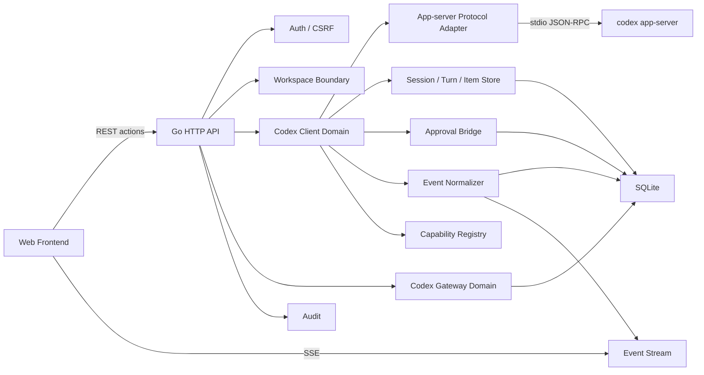

# Codex 完整客户端能力架构方案

文档日期：2026-06-07  
关联文档：

- [personal-web-terminal-product-features.md](./personal-web-terminal-product-features.md)
- [personal-web-terminal-technical-design.md](./personal-web-terminal-technical-design.md)
- [happy-technical-reference.md](./happy-technical-reference.md)
- [codex-openai-gateway-feature-design.md](./codex-openai-gateway-feature-design.md)

公开参考：

- [Codex CLI features](https://developers.openai.com/codex/cli/features)
- [Codex App Server](https://developers.openai.com/codex/app-server)

## 1. 背景

Phantom Lancer 的第一阶段目标是把 Codex CLI Web 化。随着目标升级，Codex 能力域不应只对标 Codex CLI 的命令行能力，而应尽量靠拢 Codex 桌面版客户端的使用体验：项目、线程、并行任务、工作区 / worktree、diff、终端、审批、MCP、skills、review、设置和历史恢复都应有 Web 等价入口。

当前代码已经从单纯的 `codex exec --json` 演进到使用 `codex app-server --stdio` 支持长期会话：

- 创建 Phantom Lancer 会话时启动 Codex thread。
- 保存 `codex_thread_id`。
- 发送 turn 时使用 `turn/start`。
- 活跃 turn 中继续输入时使用 `turn/steer`。
- app-server 断开或重启后使用 `thread/resume`。
- 通过 SSE 把 Codex notification 持久化并推送到前端。

这证明当前技术方向是正确的，但实现仍只是 app-server 能力的一个小切片。如果目标升级为“在 Phantom Lancer 中实现接近 Codex 桌面版客户端的 Web 客户端”，现有 `Codex Manager` 架构过粗，需要调整为更完整的 Codex 客户端能力域。

## 2. 结论

不需要推倒 Phantom Lancer 的平台基座。以下原则仍然成立：

- Go 后端是唯一执行入口。
- SQLite 适合个人单机部署。
- SSE 适合任务事件、状态更新和断线补拉。
- 前端不能直接连接 Codex app-server、shell 或其他系统进程。
- 路径边界、权限、审计和脱敏必须由 Phantom Lancer 控制。

需要调整的是 Codex 能力域。它应从“调用 Codex CLI 的任务执行器”升级为“受控的 Codex app-server Web 客户端”。核心变化：

- 后端必须完整处理 JSON-RPC request、response、notification 和 server request。
- Codex thread、turn、item、settings、usage、approval 都应成为 Phantom Lancer 可恢复的领域对象。
- 前端消费 Phantom Lancer 归一化事件，而不是直接理解所有 Codex 原始事件。
- Codex Client 和 Codex Gateway 必须保持数据模型隔离。
- 产品体验以 Codex 桌面版客户端为标准，而不是以当前 MVP 或 CLI 一次性任务为标准。

## 3. 当前偏差

| 能力面 | 当前实现 | 偏差 |
| --- | --- | --- |
| app-server 通信 | 已支持 `initialize`、`initialized`、client request/response、notification、server request、`Respond` 和 server request 白名单 | 仍需保存 app-server schema/version 摘要并做更细的 feature detection |
| 审批 | 已支持会话 approval policy、pending approval 落库、allow once / allow for session / deny / timeout、未知 server request 默认拒绝、服务重启 pending request 标记 interrupted | `item/tool/requestUserInput` 仍缺少结构化答复 UI；Full Access / `never` 不进入普通交互式 session 表单 |
| 会话状态 | 已保存 model、provider、service tier、approval、reasoning、cwd、runtime roots、instruction sources、token usage 等 | permission profile、reasoning summary 和上游设置字段仍需按新 schema 持续校准 |
| 事件 | 原始 notification 和服务端生成的 Codex session event 都按 session 写入 events，payload 做长度上限和 secret redaction | normalized event 层仍不完整，前端仍消费部分原始 Codex method |
| Items / transcript | 已新增 `codex_items`，前端会话切换后能恢复 item 摘要和最近事件 | 长历史分页、item 搜索、diff/plan 的稳定结构化渲染仍需补齐 |
| 模型切换 | 已支持 `model/list` 和 `thread/settings/update` | turn 级 model override 和 provider 能力提示仍需增强 |
| Token usage | 已接入 `thread/tokenUsage/updated` 并在 inspector 展示 context usage | usage 字段随 app-server schema 演进，需要兼容空值和缺失字段 |
| Review | 已支持 session 内 `review/start`、`/review` 和 Reviews 汇总入口 | review 结果追踪、commit review、base branch review 仍需补齐 |
| Git | 已支持 session scoped status、staged/unstaged diff、stage、unstage、commit 和 audit | revert、push、PR handoff、冲突处理和 worktree scoped Git 仍需后置实现 |
| MCP / Plugins / Skills / Hooks | 已通过 capabilities 页面读取 models、MCP、plugins、skills、hooks、account/rate limit 摘要 | 安装、OAuth、config 写入等高风险写操作仍需独立确认和回滚提示 |
| Gateway | 已有 Codex Gateway 能力 | Gateway 是代理服务，不应与 Codex Client thread 状态混用 |

## 4. 目标与非目标

### 4.1 目标

- 在 Web 中管理 Codex 项目、长期 thread、turn、事件、审批、模型、usage 和上下文。
- 支持接近 Codex 桌面版客户端的 Web 等价体验，包括 project switch、thread search、Local / Worktree 模式、review、diff、rollback、fork、archive、model switch、MCP 状态、plugin/skill 查看、终端和设置入口等。
- 让浏览器刷新、断线、切换会话后仍能恢复当前状态和历史。
- 所有命令、文件写入、网络、MCP elicitation、权限升级都进入 Phantom Lancer 审批和审计。
- 保持个人单机部署复杂度，不引入多租户或复杂集群。

### 4.2 非目标

- 不直接暴露 Codex app-server 到公网。
- 不让前端直接访问 app-server WebSocket 或 stdio。
- 不逐像素复刻 Codex 桌面版客户端的原生窗口、快捷键、主题、浮窗、系统通知和 OS 级交互。
- 不把 `computer use`、`voice`、`floating pop-out` 作为 Phantom Lancer 的主线复刻目标。这些能力依赖桌面 OS、原生窗口管理、音频设备、屏幕/鼠标权限或全局快捷键；Web 控制台只能提供有限等价入口，不应为复刻这些体验牺牲个人服务器控制台的安全边界和架构简洁性。
- 不把 Codex Gateway 的账号池、代理请求日志当作 Codex Client 会话状态。
- 不默认开放 `danger-full-access` 或无审计的 Full Access。
- 不把私有 token、真实服务器地址、个人本机路径、内部代理或私有源写进配置和文档。

## 5. Codex 桌面版能力映射

Codex 桌面版客户端是本能力域的产品基准。Phantom Lancer 的实现方式可以不同，但用户可感知的信息架构和主要任务流应尽量靠拢。

| 桌面版能力 | Phantom Lancer 决策 | 首期优先级 |
| --- | --- | --- |
| 项目管理和线程切换 | 使用已有 Workspace 作为 Project 基础，Codex 页面以 Project + Thread 为主对象 | 高 |
| 搜索历史 thread / 当前 thread 内查找 | 支持 thread list/search 和 thread 内 item 搜索 | 高 |
| Local 模式 | 绑定 workspace root，直接在项目目录运行 | 高 |
| Worktree 模式 | 为 Git workspace 创建受控 worktree，隔离改动和并行任务 | 中高 |
| Cloud 模式 | 不作为本地 Web 客户端首期目标，可后续包装 `codex cloud` | 低 |
| Diff panel | 作为 session 主工作区或右侧 inspector 的核心面板，不只展示 raw event | 高 |
| Git 工具 | 支持 status、diff、stage、unstage、commit；revert、push、PR 入口后置并要求危险操作审批 | 中高 |
| Integrated terminal | 支持 project/worktree scoped terminal，输出可被 Codex 引用；权限和输出上限由后端控制 | 中 |
| Review | 支持 `/review` 式 session 内启动，同时提供 Reviews 汇总页 | 高 |
| Approvals and sandboxing | 实现 approve once / approve for session / deny 等审批桥，默认最小权限 | 高 |
| Model and context status | 展示 model、provider、rate limits、context usage、token usage | 高 |
| MCP support | 读取和管理 MCP 状态，OAuth / config 写入需高风险确认 | 中高 |
| Skills support | 显示、搜索和调用 skills；安装和配置写入需确认 | 中高 |
| Plugins | 显示和管理 plugins，安装 / 卸载需确认 | 中 |
| Automations | 支持 thread automation 作为后续能力，保持同一 thread context | 中 |
| Web search | 按 Codex 配置支持 cached/live/disabled，前端显示搜索事件 | 中 |
| Image input / image generation | 支持 turn 输入图片；生成图片可走 Codex skill 或 Images 模块，但边界要清晰 | 中 |
| Profile / settings | 展示账号、usage、rate limit、config 摘要；写设置需受控 | 中 |
| Browser use / in-app browser | 可后续实现为本地预览和评论能力，不作为首期主线 | 低 |
| Computer use / voice / floating pop-out | 属于桌面 OS 体验，Web 控制台后置或不实现 | 低 |

### 5.1 桌面 OS 体验边界

以下能力在 Codex 桌面版客户端中有合理价值，但不适合作为 Phantom Lancer 的主线复刻目标：

- `computer use`：需要屏幕、鼠标、键盘、窗口焦点和系统权限，风险边界远高于个人服务器 Web 控制台的受控 API / 审批模型。Phantom Lancer 后续最多提供受控浏览器预览、截图、日志、文件和命令能力，不提供默认的整机屏幕控制。
- `voice`：依赖本地麦克风、音频流、实时转写和浏览器权限。Web 端可以后续支持输入框语音转文字或简单 dictation，但不把桌面版实时语音会话作为核心路径。
- `floating pop-out`：依赖原生窗口管理、悬浮置顶、全局唤起和窗口状态记忆。Web 等价物只考虑浏览器内 mini composer、可拖拽浮层、新窗口打开当前 session 或 PWA 独立窗口，不承诺 OS 级悬浮体验。

这些能力如果未来进入路线，应作为独立探索项处理，并先评估权限、审计、浏览器兼容性和实际收益。它们不影响 Local / Worktree、审批、review、diff、Git、MCP、skills、plugins、usage 和 thread 恢复这些主线能力的优先级。

## 6. 能力可实现性评估

| 能力 | 依托 Codex CLI / app-server 可实现性 | 推荐实现路径 |
| --- | --- | --- |
| 长期会话、turn、steer、interrupt | 高 | app-server JSON-RPC |
| thread list/read/search/resume/fork/archive/unarchive | 高 | app-server JSON-RPC |
| Local / Worktree 模式 | 高 | Local 绑定 workspace；Worktree 通过 git worktree + app-server cwd/runtime roots |
| model list、model switch、provider capability | 高 | app-server `model/list`、`thread/settings/update`、turn override |
| context window 和 token usage | 高 | app-server `thread/tokenUsage/updated`，同时落库 |
| diff、patch、file change 展示 | 高 | app-server notifications，Phantom Lancer 归一化 |
| Git stage/unstage/commit/revert/push/PR | 中高 | 后端 Git executor + audit；首期开放 status/diff/stage/unstage/commit，revert/push/PR 后置并要求更强确认 |
| rollback / compact | 高 | app-server thread APIs |
| review | 高 | 优先 app-server `review/start`，必要时包装 `codex review` |
| 审批 | 高，但需要重构 | app-server server request -> Phantom Lancer approval -> JSON-RPC response |
| MCP 状态、OAuth、resource、tool call | 中高 | app-server MCP APIs，必须加权限和脱敏 |
| plugins / skills / hooks | 中高 | app-server APIs，安装/写配置需高风险确认 |
| config / profiles / feature flags | 中 | app-server config APIs 或 CLI 包装，必须区分全局和项目作用域 |
| account login/logout/rate limits | 中 | app-server account APIs，敏感状态只显示摘要 |
| image input | 高 | turn input 支持 `image` / `localImage`，后端需安全存储和路径校验 |
| image generation | 中 | 通过 Codex skill 或现有 Images 模块；两者应保持产品边界清晰 |
| terminal / process / command exec | 中 | app-server command/process APIs 或独立受控 terminal，但需权限和输出上限 |
| thread automations | 中 | Phantom Lancer automation + app-server thread resume |
| remote-control | 中低 | 实验能力，建议后置 |
| realtime voice/audio | 中低 | app-server 有接口，但 Web 端交互、安全和价值需单独评估 |
| Codex cloud | 低到中 | 更适合 CLI 子命令包装，不纳入第一阶段完整客户端 |
| doctor / update / sandbox / completion | 中 | 作为维护工具或设置页动作，不属于会话核心 |

## 7. 目标架构



Codex Client Domain 负责 Web 客户端能力。Codex Gateway Domain 负责 OpenAI-compatible API 代理和账号池。两者可以都属于 Codex 一级导航下的二级页面，但不得共享 session、usage、account routing 或 request log 的领域模型。

## 8. 后端模块调整

### 8.1 `internal/codexprotocol`

负责 app-server JSON-RPC 协议，不包含业务逻辑。

职责：

- 启动和关闭 `codex app-server --stdio`。
- 发送 `initialize` 和 `initialized`。
- 维护 pending client request。
- 区分三类入站消息：
  - response：包含 `id`，且匹配本地 pending request。
  - server request：包含 `id` 和 `method`，但不是本地 response。
  - notification：包含 `method`，不包含 `id`。
- 支持向 app-server 回复 server request。
- 保留原始 JSON，便于调试和兼容升级。
- 提供协议版本、schema 生成版本和 app-server 版本诊断。

接口示意：

```go
type Client interface {
    Call(ctx context.Context, method string, params any, out any) error
    Respond(ctx context.Context, id string, result any, err *RPCError) error
    Notifications() <-chan AppServerNotification
    ServerRequests() <-chan AppServerRequest
    Close() error
}
```

### 8.2 `internal/codexsession`

负责 Phantom Lancer 会话和 Codex thread 的映射。

职责：

- 创建、恢复、读取、归档、反归档、fork、rollback、compact thread。
- 支持 Local / Worktree thread 模式。
- 保存 thread settings。
- 保存 turn、item、diff、plan 和 usage 摘要。
- 处理 app-server 重启后的 loaded thread 同步。
- 控制一个 Phantom Lancer session 是否绑定项目、cwd、workspace roots 和权限 profile。

### 8.3 `internal/codexapproval`

负责 app-server server request 到 Phantom Lancer 审批实体的桥接。

当前本地 app-server schema 显示 server request 只包含以下五类；其他 `id + method` 入站请求必须默认拒绝并记录 session event，不能挂起为 pending approval。

支持的审批类型：

- `item/commandExecution/requestApproval`。
- `item/fileChange/requestApproval`。
- `item/permissions/requestApproval`。
- `item/tool/requestUserInput`。
- `mcpServer/elicitation/request`。

默认策略：

- 未识别审批类型：拒绝并记录 audit。
- 浏览器断开：不自动放行。
- 审批超时：拒绝或标记 expired，不自动放行。
- 服务重启后仍 pending 的请求：标记 interrupted，要求用户重新发起 turn。

### 8.4 `internal/codexevents`

负责 Codex 原始事件归一化。

设计原则：

- `events` 表继续保存原始事件。
- 新增稳定事件类型供前端使用。
- 原始 payload 做长度上限和 secret redaction。
- UI 不直接依赖所有 Codex 原始 method。

示例：

| 原始 method | 归一化事件 |
| --- | --- |
| `thread/started` | `codex.thread.started` |
| `turn/started` | `codex.turn.started` |
| `item/commandExecution/outputDelta` | `codex.command.output_delta` |
| `item/fileChange/patchUpdated` | `codex.file.patch_updated` |
| `thread/tokenUsage/updated` | `codex.usage.updated` |
| server request command approval | `codex.approval.requested` |

### 8.5 `internal/codexcapability`

负责非会话核心能力。

能力分组：

- model：`model/list`、provider capabilities、model verification。
- account：auth status、login、logout、rate limits。
- MCP：server status、OAuth login、resource read、tool call。
- plugins：list、read、install、uninstall、share。
- skills：list、read、extra roots、config write。
- hooks：list 和 trust 状态展示。
- config：read、value write、batch write、requirements。
- review：review start 和 result tracking。
- git：status、diff、stage、unstage、commit；revert、push、PR handoff 后置。
- automation：thread automation 和 project automation 摘要。

所有写操作必须进 audit。涉及配置、插件安装、OAuth、外部工具调用和文件写入时，必须经过高风险确认。

### 8.6 `internal/codexworktree`

负责对齐 Codex 桌面版 Worktree 模式。

职责：

- 为 Git workspace 创建受控 worktree。
- 记录 source branch、worktree path、linked session、状态和清理策略。
- 限制 worktree 必须位于允许根目录或 Phantom Lancer 数据目录下的受控区域。
- 支持归档 session 后提示清理 worktree。
- 避免覆盖用户已有 worktree 或未提交改动。

## 9. 数据模型建议

### 9.1 扩展 `codex_sessions`

```sql
ALTER TABLE codex_sessions ADD COLUMN model TEXT NOT NULL DEFAULT '';
ALTER TABLE codex_sessions ADD COLUMN model_provider TEXT NOT NULL DEFAULT '';
ALTER TABLE codex_sessions ADD COLUMN service_tier TEXT NOT NULL DEFAULT '';
ALTER TABLE codex_sessions ADD COLUMN approval_policy TEXT NOT NULL DEFAULT '';
ALTER TABLE codex_sessions ADD COLUMN approvals_reviewer TEXT NOT NULL DEFAULT '';
ALTER TABLE codex_sessions ADD COLUMN permission_profile TEXT NOT NULL DEFAULT '';
ALTER TABLE codex_sessions ADD COLUMN reasoning_effort TEXT NOT NULL DEFAULT '';
ALTER TABLE codex_sessions ADD COLUMN reasoning_summary TEXT NOT NULL DEFAULT '';
ALTER TABLE codex_sessions ADD COLUMN cwd TEXT NOT NULL DEFAULT '';
ALTER TABLE codex_sessions ADD COLUMN runtime_roots_json TEXT NOT NULL DEFAULT '[]';
ALTER TABLE codex_sessions ADD COLUMN instruction_sources_json TEXT NOT NULL DEFAULT '[]';
ALTER TABLE codex_sessions ADD COLUMN token_usage_json TEXT NOT NULL DEFAULT '{}';
ALTER TABLE codex_sessions ADD COLUMN appserver_source TEXT NOT NULL DEFAULT '';
ALTER TABLE codex_sessions ADD COLUMN run_mode TEXT NOT NULL DEFAULT 'local';
ALTER TABLE codex_sessions ADD COLUMN worktree_id TEXT NOT NULL DEFAULT '';
```

### 9.2 新增 `codex_items`

保存 turn 内的 item 摘要，避免 UI 只能从事件流重建。

```sql
CREATE TABLE IF NOT EXISTS codex_items (
  id TEXT PRIMARY KEY,
  session_id TEXT NOT NULL,
  turn_id TEXT NOT NULL DEFAULT '',
  codex_item_id TEXT NOT NULL DEFAULT '',
  item_type TEXT NOT NULL,
  status TEXT NOT NULL DEFAULT 'running',
  title TEXT NOT NULL DEFAULT '',
  summary TEXT NOT NULL DEFAULT '',
  payload_json TEXT NOT NULL DEFAULT '{}',
  created_at TEXT NOT NULL,
  updated_at TEXT NOT NULL,
  completed_at TEXT NOT NULL DEFAULT ''
);
CREATE UNIQUE INDEX IF NOT EXISTS idx_codex_items_session_item ON codex_items(session_id, codex_item_id) WHERE codex_item_id != '';
CREATE INDEX IF NOT EXISTS idx_codex_items_session_created ON codex_items(session_id, created_at);
```

### 9.3 新增 `codex_approvals`

```sql
CREATE TABLE IF NOT EXISTS codex_approvals (
  id TEXT PRIMARY KEY,
  session_id TEXT NOT NULL,
  turn_id TEXT NOT NULL DEFAULT '',
  request_id TEXT NOT NULL,
  request_type TEXT NOT NULL,
  status TEXT NOT NULL,
  risk_level TEXT NOT NULL DEFAULT '',
  summary TEXT NOT NULL,
  request_json TEXT NOT NULL DEFAULT '{}',
  decision_json TEXT NOT NULL DEFAULT '{}',
  created_at TEXT NOT NULL,
  resolved_at TEXT NOT NULL DEFAULT '',
  expires_at TEXT NOT NULL DEFAULT ''
);
CREATE UNIQUE INDEX IF NOT EXISTS idx_codex_approvals_request ON codex_approvals(request_id);
CREATE INDEX IF NOT EXISTS idx_codex_approvals_pending ON codex_approvals(status, created_at);
```

### 9.4 新增 `codex_worktrees`

```sql
CREATE TABLE IF NOT EXISTS codex_worktrees (
  id TEXT PRIMARY KEY,
  workspace_id TEXT NOT NULL,
  session_id TEXT NOT NULL DEFAULT '',
  source_root TEXT NOT NULL,
  worktree_path TEXT NOT NULL UNIQUE,
  source_branch TEXT NOT NULL DEFAULT '',
  worktree_branch TEXT NOT NULL DEFAULT '',
  status TEXT NOT NULL,
  created_at TEXT NOT NULL,
  updated_at TEXT NOT NULL,
  archived_at TEXT NOT NULL DEFAULT '',
  last_error TEXT NOT NULL DEFAULT ''
);
CREATE INDEX IF NOT EXISTS idx_codex_worktrees_workspace ON codex_worktrees(workspace_id, status, updated_at);
```

### 9.5 新增能力缓存表

```sql
CREATE TABLE IF NOT EXISTS codex_capability_cache (
  key TEXT PRIMARY KEY,
  payload_json TEXT NOT NULL,
  updated_at TEXT NOT NULL
);
```

可缓存：

- model list。
- permission profiles。
- MCP server status。
- plugin list。
- skill list。
- hook list。
- account/rate limit 摘要。

## 10. API 设计

当前代码沿用既有 `/api/codex/*` 路由，本文中的 `/api/codex/client/*` 表示未来如果需要进一步区分 Client 和 Gateway 时的命名空间方向；不是必须立即迁移的路径。

### 10.1 会话 API

| 方法 | 路径 | 说明 |
| --- | --- | --- |
| `GET` | `/api/codex/client/sessions` | 列出 Phantom Lancer 管理的 Codex sessions |
| `POST` | `/api/codex/client/sessions` | 创建 thread，支持 model、sandbox、approval、permission profile |
| `GET` | `/api/codex/client/sessions/{id}` | 读取 session、settings、usage、workspace、turn 摘要 |
| `PATCH` | `/api/codex/client/sessions/{id}/settings` | 更新 model、approval、sandbox、reasoning 等 |
| `POST` | `/api/codex/client/sessions/{id}/turns` | 启动 turn，支持 text、image、mention、skill |
| `POST` | `/api/codex/client/sessions/{id}/turns/{turnId}/steer` | steer active turn |
| `POST` | `/api/codex/client/sessions/{id}/interrupt` | interrupt active turn |
| `POST` | `/api/codex/client/sessions/{id}/archive` | archive |
| `POST` | `/api/codex/client/sessions/{id}/unarchive` | unarchive |
| `POST` | `/api/codex/client/sessions/{id}/fork` | fork thread |
| `POST` | `/api/codex/client/sessions/{id}/rollback` | rollback thread |
| `POST` | `/api/codex/client/sessions/{id}/compact` | compact context |

### 10.2 Worktree API

| 方法 | 路径 | 说明 |
| --- | --- | --- |
| `GET` | `/api/codex/client/worktrees` | 列出受控 worktrees |
| `POST` | `/api/codex/client/worktrees` | 为 workspace 创建 worktree |
| `POST` | `/api/codex/client/worktrees/{id}/archive` | 归档 worktree |
| `DELETE` | `/api/codex/client/worktrees/{id}` | 清理已归档 worktree，必须确认 |

### 10.3 审批 API

| 方法 | 路径 | 说明 |
| --- | --- | --- |
| `GET` | `/api/codex/client/approvals` | pending approvals |
| `GET` | `/api/codex/client/approvals/{id}` | approval detail |
| `POST` | `/api/codex/client/approvals/{id}/resolve` | allow / deny / answer |

`resolve` 必须带 CSRF。危险操作可要求近期 re-auth。

### 10.4 能力 API

| 方法 | 路径 | 说明 |
| --- | --- | --- |
| `GET` | `/api/codex/client/models` | Codex app-server model list |
| `GET` | `/api/codex/client/account` | account 摘要和 rate limit |
| `POST` | `/api/codex/client/account/login/start` | 启动登录流程 |
| `POST` | `/api/codex/client/account/logout` | 退出 Codex 登录 |
| `GET` | `/api/codex/client/mcp/status` | MCP server status |
| `GET` | `/api/codex/client/plugins` | plugin list |
| `GET` | `/api/codex/client/skills` | skill list |
| `GET` | `/api/codex/client/hooks` | hook list |
| `GET` | `/api/codex/client/config` | 安全配置摘要 |
| `POST` | `/api/codex/client/reviews` | 启动 review |
| `GET` | `/api/codex/sessions/{id}/git` | 当前 session workspace/worktree Git 状态和 staged/unstaged diff |
| `POST` | `/api/codex/sessions/{id}/git/actions` | stage / unstage / commit；revert / push / PR 后置 |
| `GET` | `/api/codex/client/automations` | thread/project automations 摘要 |

### 10.5 Gateway API 保持独立

现有 `/api/codex-gateway/*` 不迁入 `/api/codex/client/*`。Gateway 是 OpenAI-compatible 代理，Client 是 Codex app-server 客户端。两者可以在 UI 中相邻，但不能共享 API 命名和数据表。

## 11. 前端信息架构

Codex 一级导航下建议拆成二级区域：

- `Sessions`：长期会话、turn、事件、usage、审批。
- `Projects`：Codex projects、Local / Worktree 模式和 workspace 绑定。
- `Reviews`：本地 diff review、commit review、base branch review。
- `Capabilities`：models、account、MCP、plugins、skills、hooks、config 摘要。
- `Automations`：thread automation 和 project automation。
- `Gateway`：保持现有 Codex Gateway，但视觉上标注为代理能力，不混入 Client 会话状态。
- `Activity`：Codex Client 和 Gateway 的审计摘要可以同页筛选，但事件来源要区分。

Session 页面建议采用 Quiet Agent Workbench 布局：

- 左列：project + session/thread 列表，可搜索、过滤 archived、显示 mode/model/status/usage 摘要。
- 中间：turn transcript、plan、diff、command output。
- 右侧 inspector：workspace/worktree、sandbox、permission profile、model、context usage、instruction sources、pending approvals、recent file changes、Git status。
- 底部 composer：支持 text、image、mention、skill、queued next turn。

为了靠拢桌面版客户端，Web 端也应提供低噪音的 command palette / slash command 入口，但不要求复制桌面快捷键。`/status`、`/review`、`/mcp`、`/plan`、`/goal` 应优先实现为 composer command。

## 12. 事件与恢复

### 12.1 事件分层

- Raw event：保存 Codex 原始 method 和 payload。
- Normalized event：前端稳定消费。
- Audit event：owner 操作、安全决策、权限变更和高风险摘要。

### 12.2 恢复策略

- 前端进入 session 时先拉取 session detail、turns、items 和最近 normalized events。
- SSE 使用 sequence 补拉缺失事件。
- 长历史分页读取，不固定只拉 300 条。
- app-server 重启后：
  - 重新 initialize。
  - 对活跃 session 调 `thread/resume` 或 `thread/read`。
  - 未完成 turn 标记为 unknown / interrupted，不能伪装 completed。
  - pending approval 标记 interrupted，需要重新发起。

## 13. 权限和安全

### 13.1 Phantom Lancer 边界优先

Codex 自身 sandbox 不能替代 Phantom Lancer 权限。所有操作仍需先经过：

- owner auth。
- CSRF。
- workspace root whitelist。
- workspace write flag。
- command/file/network approval policy。
- audit。

### 13.2 Approval policy 映射

| UI 模式 | Codex 参数 | Phantom Lancer 行为 |
| --- | --- | --- |
| 只读 | read-only + on-request | 文件写入不可用，命令和权限升级进入 Phantom Lancer 审批 |
| 工作区写入 | workspace-write + on-request | 只允许已授权 workspace root，命令、文件写入和权限请求仍走审批桥 |
| 不信任模式 | untrusted | 更保守的 Codex 侧审批策略，仍叠加 Phantom Lancer workspace/audit 边界 |
| 受限写入 | permission profile | 后续能力；使用预设 profile 限制文件和网络 |
| Full Access | danger-full-access / never | 后续高级模式，普通 session 表单不暴露；启用、进入和每次 session 使用都必须二次确认和强审计 |

`on-failure` 在当前 Codex 文档中已属于旧策略，不作为 Phantom Lancer Web 客户端选项。`never` 只可作为未来 Full Access gated 能力的一部分，不能作为默认或普通交互式客户端策略。

### 13.3 脱敏

禁止写入日志、events、audit 的内容：

- API Key、Authorization、cookie、session token、CSRF token。
- password、secret、私钥正文。
- 完整 presigned URL query。
- 图片 base64 或 data URL。
- 子进程完整 stderr 中的敏感值。

可写入：

- session id、thread id、turn id、item id。
- workspace id。
- 操作类型、状态、duration。
- 裁剪后的错误摘要。
- 文件路径摘要。

## 14. 产品决策

以下问题以“尽量靠拢 Codex 桌面版客户端”为标准，不再作为待确认项。

| 问题 | 决策 |
| --- | --- |
| 是否把 Codex Client 完整能力作为下一阶段主线 | 是。下一阶段主线是 Codex 桌面版客户端的 Web 等价能力，但按协议/审批/模型/usage/转录/diff/review/capabilities 分阶段实现。 |
| 是否允许 Web 管理 `$CODEX_HOME` 下的 plugins、skills、MCP 和 config | 允许，但分级实现：先读和状态展示，再开放写；所有写入必须有 diff/摘要、CSRF、近期 re-auth、高风险 audit，可通过全局设置关闭。 |
| 是否支持 Full Access | 支持但默认禁用。只有 owner 在全局设置中启用后，session 才能选择；每次进入 Full Access 都需要近期密码确认，且不能绕过 Phantom Lancer audit。 |
| Review 做成 session 内 turn 还是单独页面 | 两者都做。`/review` 在当前 session 内启动 review，`Reviews` 二级页负责历史、筛选和对比。 |
| 无项目 session 是否允许 web search 和 MCP | 允许，但只能作为无文件工作区的咨询 thread。web search/MCP 按 Codex 配置和 Phantom Lancer capability policy 控制；无项目 session 不允许 workspace-write。 |
| 是否从已有 Codex CLI 本地历史导入 | 支持显式导入，不自动全量导入。通过 app-server `thread/list/read/search` 发现本地 thread，仅允许导入 cwd 落在 allowed roots 内的 thread，并保留 imported/source 标记。 |
| Local / Worktree / Cloud 如何处理 | Local 和 Worktree 对齐桌面版作为核心模式；Cloud 后置，只作为 CLI 包装或外部入口，不影响本地客户端主线。 |
| Git stage/revert/commit/push 是否进入范围 | 进入范围。它们是桌面版核心工作流，但必须走受控 Git executor、确认和 audit；当前先开放 status、diff、stage、unstage、commit，revert、push、PR 后置。 |
| Automations 是否进入范围 | 进入范围，但后置。优先 thread automation，因为它能保持同一 thread context。 |
| Browser use / computer use / voice / floating pop-out 是否进入范围 | Browser preview/comment 可后置实现；computer use、voice、floating pop-out 属于桌面 OS 体验，不作为 Web 控制台主线。Web 端只保留 mini composer、独立浏览器窗口、PWA 窗口、语音转文字等有限等价探索。 |

## 15. 实施路线

### Phase 0：文档和协议基线

- 固化本设计。
- 生成并保存当前 Codex app-server schema 的开发参考，不提交包含个人路径的生成产物。
- 更新主技术方案中 Codex Module 的描述。
- 明确 Gateway 与 Client 的边界。
- 将 Codex 桌面版客户端能力映射作为产品验收清单。

### Phase 1：Protocol Adapter 和审批桥

- 已重构 app-server client，支持 server request、`Respond` 和 notification 持久化。
- 已建立 `codex_approvals`。
- 已接入 command/file/permission/tool user input/MCP elicitation 审批，并对未知 server request 默认拒绝。
- 已在服务重启、关闭或配置切换时把 pending approvals 标记为 interrupted。
- 已实现 pending approvals 和 session 内审批卡片。
- 已移除普通交互式 session 对 `never` / `on-failure` 的暴露，首期只开放 `on-request` 和 `untrusted`。

### Phase 2：Session Settings、Model 和 Usage

- 扩展 session 数据模型。
- 支持 model list、thread settings read/update。
- 接 `thread/tokenUsage/updated`。
- 右侧 inspector 展示 model、provider、context window、total/last token usage。
- 支持 turn 级 model override。
- 支持 `/status`。

### Phase 3：Transcript、Items、Diff、Git 和 Review

- 已保存 codex items，并在 session detail 与右侧 inspector 中恢复 item 摘要。
- 已支持 command output、file change、plan、diff 的事件渲染；稳定结构化 diff/plan 面板仍需继续完善。
- 已支持 review/start、`/review`、rollback、fork、compact。
- 已支持 Git status、staged/unstaged diff、stage、unstage、commit 的受控入口和 audit。
- 待补齐：revert、push、PR handoff、commit review、base branch review、Local / Worktree 模式完整管理。

### Phase 4：Capabilities

- MCP status、OAuth、resource read。
- Plugin/skill/hook list 和 read。
- Config read 和受控 write。
- Account status 和 rate limit。
- 支持 `/mcp`、`/review`、`/plan`、`/goal` 等 composer command。

### Phase 5：Automations 和高级能力

- 图片输入。
- 文件浏览和 watch。
- command/process PTY。
- Thread automations。
- Browser preview/comment。
- remote-control。
- `computer use`、`voice`、`floating pop-out` 仅作为探索项，不纳入主线复刻。
- Codex cloud CLI 包装。

## 16. 风险

- app-server 协议仍包含实验字段，需通过 schema 版本和 feature detection 降低升级风险。
- server request 如果处理不完整，会造成 turn 卡住或错误放行，是最高优先级风险。
- 长会话事件量可能增长很快，需要分页、压缩和上限。
- 插件、MCP 和 config 写入会修改 `$CODEX_HOME`，必须有明确审计和回滚提示。
- Codex Client 和 Gateway 若混用模型/usage，会导致用户误解账单、上下文和账号状态。
- Full Access 模式与个人服务器控制台的安全目标冲突，必须默认关闭，并允许全局禁用。
- Worktree 模式如果清理策略不清晰，可能留下大量目录或误删用户改动。
- Git commit/push/PR 是高影响操作，必须先展示 diff 和目标分支。
