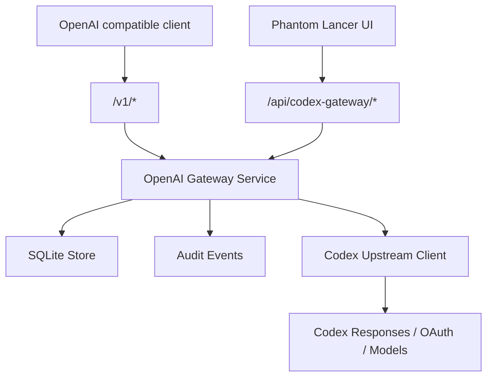

# OpenAI 兼容 Gateway 模块功能设计

文档日期：2026-06-05
来源服务：本地 `codex-proxyv2` 参考实现
关联文档：

- [personal-web-terminal-product-features.md](./personal-web-terminal-product-features.md)
- [personal-web-terminal-technical-design.md](./personal-web-terminal-technical-design.md)
- [codex-cli-client-feature-design.md](./codex-cli-client-feature-design.md)

## 1. Design Read

Reading this as: 个人服务器控制台里的 Codex API gateway，面向单 owner 技术用户，采用 Quiet Agent Workbench / Quiet DevOps Control Plane 语言，强调账号状态、公开 API key、模型目录、请求路由、错误归因和低噪音请求日志。

本模块不是营销页，也不是把 `codex-proxyv2` 作为 sidecar 服务嵌入。迁移方式是功能搬迁和架构重构，不做源码拷贝，不保留原服务的独立登录页、独立前端、独立配置文件、打包脚本或 V2Ray 代理能力。

本模块是独立能力域，并与新版 Codex CLI Client 并列。Codex CLI Client 负责 Web 会话、workspace、sandbox、approval 和 transcript；Gateway 只负责 OpenAI-compatible `/v1/*` API、上游账号、模型目录、public API key 和请求日志。两者不共享数据库表、HTTP API 前缀或执行链路。

## 2. 迁移目标

将 `codex-proxyv2` 中“Codex 订阅能力转换为 OpenAI 兼容 HTTP API”的功能整合进 Phantom Lancer，作为受控模块提供给外部 OpenAI 兼容客户端使用。

保留的核心能力：

- 暴露 OpenAI 兼容 `/v1/models`、`/v1/chat/completions` 和 `/v1/responses`。
- 将 Chat Completions 请求转换为 Codex Responses 上游请求。
- 对 Responses 请求做最小归一化后转发到 Codex 上游。
- 支持 SSE streaming，保持下游 OpenAI 兼容流式语义。
- 管理 Codex 账号 access token、refresh token、过期时间、plan 和健康状态。
- 支持 OAuth PKCE 登录导入 Codex 账号，也支持手动 token 导入。
- 支持 access token 过期前刷新，以及上游 401/403 后刷新重试。
- 支持多账号轮转、按模型/plan 选择账号，并在特定上游错误下切换账号重试。
- 支持模型目录静态兜底、上游刷新和 plan 到 model 的映射。
- 支持独立的公开 API bearer token，不复用 Phantom Lancer owner 登录态。
- 记录请求日志摘要，包括模型、账号、状态、错误分类、耗时、streamed、usage 摘要。
- 提供管理 UI 和管理 API，用于账号、模型、API key、请求日志和连通性测试。

明确不迁移的能力：

- 不迁移 V2Ray 订阅、节点解析、节点健康检查、账号代理分配和 outbound proxy 路由。
- 不迁移内嵌 V2Ray outbound runtime，也不为本模块引入 V2Ray 相关依赖。
- 不迁移原服务的代理设置页、代理订阅页、代理节点页和代理诊断视图。
- 不迁移原服务的独立 dashboard token 登录。管理面复用 Phantom Lancer owner session 和 CSRF。
- 不迁移原服务的独立前端工程、CSS、构建脚本、Linux 打包脚本和环境变量命名体系。
- 不扩展到 Anthropic、Gemini、Ollama、多 provider 路由或 Codex app-server 桥接。

## 3. 源服务功能梳理

### 3.1 服务形态

`codex-proxyv2` 是一个 Go + React 的独立 Web 服务，后端使用标准库 `net/http`，存储使用 SQLite，前端使用 React 管理控制台。

已实现能力可以分成四组：

- OpenAI 兼容公开 API：模型列表、Chat Completions、Responses。
- Codex 上游访问：OAuth 登录、token 刷新、Responses 调用、模型目录获取、用量/账号检查。
- 管理控制台：账号、模型、设置、请求日志、chat test。
- V2Ray 代理：订阅、节点、健康检查、代理选择、内嵌 V2Ray outbound。

本次只迁移前三组中与 Codex/OpenAI 转换直接相关的能力。第四组全部排除。

### 3.2 OpenAI 兼容公开 API

源服务提供：

- `GET /v1/models`
- `GET /v1/models/{model}`
- `POST /v1/chat/completions`
- `POST /v1/responses`

所有 `/v1/*` 请求都要求 `Authorization: Bearer <public-api-token>`。公开 API token 与管理登录 token 分离，服务端只保存 hash，不在响应中回显明文。

公开 API 错误返回 OpenAI 兼容结构：

```json
{
  "error": {
    "message": "请求参数不合法",
    "type": "invalid_request_error",
    "code": "invalid_request"
  }
}
```

### 3.3 Chat Completions 转换

源服务的 `/v1/chat/completions` 实际执行流程：

1. 校验 public bearer token。
2. 解析 OpenAI Chat Completions 请求。
3. 校验 `model` 非空、`messages` 非空、message role 在允许集合内。
4. 将 Chat Completions request 转成 Codex Responses payload。
5. 选择可用 Codex 账号。
6. 刷新即将过期或已过期的 access token。
7. 调用 Codex Responses 上游。
8. 如果上游返回 401/403 且账号有 refresh token，则刷新 token 后重试一次。
9. 如果上游返回可切换账号的错误，尝试其他账号。
10. 将 Codex Responses 响应转回 OpenAI Chat Completions 响应。
11. 记录请求日志摘要。

字段转换行为：

| Chat Completions 字段 | Codex Responses 字段 | 迁移判断 |
| --- | --- | --- |
| `model` | `model` | 保留 |
| `messages` 中 `system`、`developer` | `instructions` | 合并为双换行分隔；为空时使用默认 instructions |
| `messages` 中其他 role | `input` | 转为 Responses input item |
| `stream` | 上游 `stream` | 源服务对 chat 上游总是使用 streaming，再按下游要求收集或转发 |
| `temperature` | `temperature` | 保留 |
| `top_p` | `top_p` | 保留 |
| `tools` | `tools` | 原样 JSON 解析后传递 |
| `functions` | `tools` | 转成 legacy function tool |
| `tool_choice` | `tool_choice` | 原样 JSON 解析后传递 |
| `response_format` | `text.format` | JSON schema 会补充 object 的 `additionalProperties: false` |
| `reasoning_effort` | `reasoning.effort` | 同时设置 reasoning summary 为 auto |
| `service_tier` | `service_tier` | 保留 |
| `max_completion_tokens` | `max_output_tokens` | 优先于 `max_tokens` |
| `max_tokens` | `max_output_tokens` | 仅在未设置 `max_completion_tokens` 时使用 |
| `parallel_tool_calls` | `parallel_tool_calls` | 保留 |
| `user` | `user` | 保留 |

内容转换行为：

- 字符串 content 直接作为文本。
- 多段文本 content 会合并为文本。
- `image_url` content part 会转成 Responses `input_image`。
- assistant tool calls 会转成 Responses `function_call`。
- tool/function role message 会转成 Responses `function_call_output`。
- 没有有效输入时补一个空 user input，避免上游 payload 为空。

流式响应转换行为：

- 上游 `response.output_text.delta` 转为 OpenAI `chat.completion.chunk` delta。
- 上游 `response.completed` 用于提取 usage；如果前面没有 delta，会从 completed event 提取完整 output text。
- 下游结束时发送 final chunk 和 `data: [DONE]`。
- 上游 `response.failed` 或 `error` 转为 stream error。

非流式响应转换行为：

- 源服务仍以 streaming 方式请求 Codex 上游。
- 后端收集 SSE 中的文本和 usage。
- 返回 OpenAI `chat.completion` 对象，`choices[0].message.role = assistant`，finish reason 为 `stop`。

### 3.4 Responses 转发

源服务的 `/v1/responses` 更接近透传，但仍做这些归一化：

- `model` 必填并 trim。
- `instructions` 非字符串时归一为空字符串。
- `input` 允许字符串或数组；字符串转为单条 user input。
- `store` 强制为 `false`。
- `stream` 从请求体读取。
- 源实现会删除 `max_output_tokens`，迁移时需要单独确认是否继续保留该兼容行为。

流式 Responses：

- 下游保持 `text/event-stream`。
- 上游 event 和 data 逐条 relay。
- 同时从 event payload 中捕获 usage 摘要。
- 下游断开时关闭上游 body 并取消 context。

非流式 Responses：

- 后端保留上游 content type。
- 响应体直接复制给下游。
- 复制过程中最多缓存一段响应内容用于 usage 捕获，避免请求日志丢失 token 摘要。

### 3.5 Codex 上游客户端

源服务 Codex client 负责：

- 构造 OAuth authorization URL，使用 PKCE code verifier/challenge。
- 用 authorization code 换取 access token 和 refresh token。
- 用 refresh token 刷新 access token。
- 调用 Codex Responses endpoint。
- 获取模型目录。
- 调用 usage endpoint 检查账号健康和 plan。

上游请求特征：

- 所有请求使用 context timeout。
- Responses 请求带 `Authorization: Bearer <account-access-token>`。
- Streaming 请求使用 `Accept: text/event-stream`。
- 非 streaming 请求接受 JSON 或 SSE。
- 请求带 client request id 和安装 id，便于上游关联。
- 请求 payload 会补充 client metadata。

迁移后应保留这些协议行为，但配置项改用 Phantom Lancer 模块设置，不沿用源服务环境变量名。

### 3.6 账号管理和路由

源服务账号字段：

- `label`
- `status`：`active`、`disabled`、`invalid`、`rate_limited`
- `access_token`
- `refresh_token`
- `expires_at`
- `plan`
- `last_used_at`
- `last_checked_at`
- `last_error`

管理能力：

- 账号列表、创建、编辑、删除。
- 手动刷新 token。
- 检查账号健康状态。
- OAuth 登录导入账号。
- 粘贴 callback URL 完成 OAuth code relay。
- 导入账号 JSON、导出账号 JSON。
- 账号响应只返回 token 是否存在，不回显明文 token。

路由策略：

- 默认选择 `active` 且有 access token 或 refresh token 的账号。
- 优先选择最久未使用的账号。
- 如果模型有 plan 映射，优先选择 plan 支持该模型的账号。
- 如果账号没有 plan 或该 plan 没有模型映射，则默认允许使用。
- 显式选择账号的 admin chat test 必须校验该账号 active 且支持模型。

token 刷新策略：

- access token 缺失但 refresh token 存在时，先刷新再调用上游。
- access token 即将过期时，按配置的 refresh margin 提前刷新。
- access token 已过期且刷新失败时，标记账号 invalid 或 rate_limited。
- 上游 401/403 后，如果账号有 refresh token，则刷新并重试一次。
- refresh token 返回为空时，继续保留旧 refresh token。

跨账号重试策略：

- 非显式账号请求最多尝试多个账号。
- 429、402、401/403、模型不支持、5xx 等错误允许换账号重试。
- 换账号前会记录失败账号 last_error，并按错误类型更新账号状态。

### 3.7 模型目录

源服务支持两类模型：

- 静态兜底模型：服务启动时 seed 到 SQLite。
- 上游动态模型：通过 active Codex 账号拉取后 upsert。

模型字段：

- `id`
- `display_name`
- `owned_by`
- `source`：`static` 或 `upstream`
- `plans`

模型刷新行为：

- 遍历 active 账号。
- 对每个账号通过 Codex 上游拉取模型目录。
- 如果账号有 plan，将模型和该 plan 建立映射。
- 管理接口返回刷新成功状态、参与账号数、plan 计数、错误 map 和当前模型列表。

模型公开接口行为：

- `/v1/models` 返回 OpenAI model list。
- `/v1/models/{model}` 找不到时返回 OpenAI 兼容 404。

### 3.8 请求日志和错误归因

源服务对公开请求和 admin chat test 记录 request log，不记录完整 prompt、完整响应体或 token 明文。

日志字段：

- `request_id`
- `api_kind`
- `model`
- `account_id`
- `source_ip`
- `status_code`
- `error_code`
- `error_source`：`client`、`account`、`openai`、`service`，源服务还包含 `proxy`
- `error_message`
- `latency_ms`
- `streamed`
- `input_tokens`
- `output_tokens`
- `created_at`

迁移后删除或废弃 proxy 相关字段：

- `proxy_node_id`
- `proxy_node_name`
- `error_source = proxy`

错误消息处理：

- 从结构化错误里提取 `error.message`、`message`、`detail` 等摘要。
- 对 Authorization bearer、access token、refresh token、API key、password、secret 做 redaction。
- 限制错误摘要长度。
- 公共 API 返回 OpenAI 错误结构，管理 API 返回 Phantom Lancer 统一错误结构。

## 4. Phantom Lancer 产品边界

### 4.1 模块定位

本能力建议命名为 `OpenAI Gateway` 或 `Codex Gateway`，中文可显示为 `OpenAI 网关` 或 `Codex 网关`。产品信息架构中它是独立能力域，不放在 Codex CLI Client 下。

它与新版 `Codex` 会话能力的区别：

- Codex CLI Client 模块：面向 owner 在 Web 控制台内运行本机 `codex` CLI，会话绑定 workspace、sandbox、事件和审批。
- Codex Gateway 模块：面向外部 OpenAI 兼容客户端，通过 HTTP API 调用 Codex 订阅能力，不绑定 workspace，不执行 shell，不修改文件。

信息架构建议：

- MVP 放在独立一级导航 `Gateway` 或 `OpenAI Gateway`。
- Dashboard 只展示摘要：enabled、public API key 状态、active accounts、最近失败、今日请求数。
- Gateway 内部使用二级视图管理账号、模型、日志、API key 和测试，不把这些对象拆成多个全局一级导航。
- 如果未来扩展为多 provider API gateway，可以将显示名调整为 `API Gateway`，但仍保持独立能力域。

### 4.2 MVP 范围

- `Gateway > Overview`：状态摘要、base URL、公开 API key 状态、最近失败。
- `Gateway > Accounts`：账号列表、添加、编辑、禁用、删除、刷新、检查、OAuth 导入。
- `Gateway > Models`：模型列表、source、plan 映射、手动刷新。
- `Gateway > API Keys`：公开 API key 创建、轮换、禁用、最近使用。
- `Gateway > Logs`：最近请求日志、错误分类、usage 摘要。
- `Gateway > Test`：使用指定账号和模型发起 streaming chat test。
- 公开 `/v1/*` OpenAI 兼容 API。
- 管理操作进入 audit。

### 4.3 非目标

- 不通过本模块代理普通网络流量。
- 不支持 V2Ray outbound、HTTP proxy、SOCKS proxy 或代理节点选择。
- 不把公开 API 请求写成审计事件。公开 API 请求进入 request logs，只有高风险配置和账号操作进入 audit。
- 不提供多租户、团队 API key、按用户额度计费或公开注册。
- 不负责购买、创建或登录 OpenAI/Codex 账号，只提供 owner 导入凭据的受控入口。
- 不把 Codex Gateway 请求自动关联到 workspace 权限、文件系统权限或 Codex CLI sandbox。

## 5. 用户流程

### 5.1 首次启用

1. Owner 打开 `Gateway`。
2. 页面显示模块未启用、public API key 未配置、没有 active Codex 账号。
3. Owner 创建或轮换 public API key。
4. Owner 通过 OAuth 或手动 token 导入 Codex 账号。
5. 后端检查账号健康状态，刷新 token，获取 plan 和模型目录。
6. 页面显示 OpenAI compatible base URL 和模型列表。
7. Owner 将 base URL 与 public API key 配置到外部客户端。

### 5.2 OAuth 导入账号

1. Owner 点击 `导入 Codex 账号`。
2. 后端创建 PKCE session，返回 authorization URL、state、过期时间。
3. Owner 在浏览器完成授权。
4. 对远程服务器部署，优先使用 `callback URL relay`：用户将回调 URL 粘贴回控制台。
5. 如果部署环境允许同源 callback，也可以走后端 callback endpoint。
6. 后端用 authorization code 换 token，创建账号。
7. 响应只返回账号 masked 状态，不返回明文 token。

### 5.3 外部客户端调用 Chat Completions

1. 外部客户端请求 `POST /v1/chat/completions`，携带 public bearer token。
2. 后端校验 token。
3. 后端转换 request payload。
4. 后端选择 active 账号并按需刷新 token。
5. 后端调用 Codex Responses 上游。
6. 后端将结果转换为 OpenAI Chat Completions 响应。
7. 后端记录 request log 摘要。

### 5.4 排查失败请求

1. Owner 打开 `Gateway > Logs`。
2. 按模型、账号、状态码或错误来源过滤。
3. 选中请求后右侧 inspector 展示错误摘要、耗时、是否 streamed、usage、账号状态变化。
4. Owner 可以直接跳到账号详情执行 refresh/check。

## 6. API 设计

### 6.1 公开 OpenAI 兼容 API

公开 API 保持 OpenAI 兼容路径，便于现有客户端只修改 base URL：

- `GET /v1/models`
- `GET /v1/models/{model}`
- `POST /v1/chat/completions`
- `POST /v1/responses`

鉴权：

- 必须携带 `Authorization: Bearer <public-api-key>`。
- public API key 与 owner session 分离。
- 未配置 public API key 或模块 disabled 时返回 OpenAI 兼容错误。

CSRF：

- `/v1/*` 不使用浏览器 session，不要求 CSRF。
- 管理 API 写操作必须使用 owner session + CSRF。

### 6.2 管理 API

建议管理 API 放在 `/api/codex-gateway/*` 下，避免与 Codex CLI Client 的 `/api/codex/*` 会话接口混淆。该路径前缀是实现兼容命名，不表示 Gateway 是 Codex Client 的下属模块。

状态和设置：

- `GET /api/codex-gateway/status`
- `GET /api/codex-gateway/settings`
- `PUT /api/codex-gateway/settings`

API key：

- `GET /api/codex-gateway/api-keys`
- `POST /api/codex-gateway/api-keys`
- `POST /api/codex-gateway/api-keys/{id}/rotate`
- `PATCH /api/codex-gateway/api-keys/{id}`
- `DELETE /api/codex-gateway/api-keys/{id}`

账号：

- `GET /api/codex-gateway/accounts`
- `POST /api/codex-gateway/accounts`
- `PATCH /api/codex-gateway/accounts/{id}`
- `DELETE /api/codex-gateway/accounts/{id}`
- `POST /api/codex-gateway/accounts/{id}/refresh`
- `POST /api/codex-gateway/accounts/{id}/check`
- `POST /api/codex-gateway/accounts/oauth/start`
- `POST /api/codex-gateway/accounts/oauth/relay`
- `GET /api/codex-gateway/accounts/oauth/callback`
- `GET /api/codex-gateway/accounts/export`
- `POST /api/codex-gateway/accounts/import`

模型：

- `GET /api/codex-gateway/models`
- `POST /api/codex-gateway/models/refresh`

测试和日志：

- `POST /api/codex-gateway/chat-test`
- `GET /api/codex-gateway/request-logs`

不再提供的管理 API：

- proxy subscriptions
- proxy nodes
- proxy assignments
- proxy health checks
- proxy default policy
- direct fallback
- managed v2ray runtime

## 7. 后端模块设计

建议继续使用 `internal/codexgateway`，并与后续 `internal/codexclient` CLI 会话模块隔离。

模块职责：

- `Service`：公开 API 编排、账号路由、token 生命周期、模型刷新、请求日志。
- `OpenAICompat`：OpenAI request/response 类型、Chat 到 Responses 转换、SSE 转换。
- `CodexUpstreamClient`：OAuth、Responses、usage、models endpoint 调用。
- `AccountRegistry`：账号增删改查、secret 读取、状态更新。
- `ModelCatalog`：静态模型 seed、上游模型刷新、plan 映射。
- `RequestLogger`：请求摘要记录、错误分类、敏感信息脱敏。
- `Settings`：base URL、OAuth endpoint、timeout、refresh margin、module enabled。

与现有模块关系：



实现约束：

- 不依赖源服务 package、文件、构建脚本或前端资产。
- 不新增 V2Ray outbound 依赖。
- 所有外部请求必须带 context timeout。
- 所有响应体读取必须有 size limit。
- Streaming 必须在下游断开后取消上游请求。
- 请求日志只写摘要，不写 prompt、完整响应、Authorization、token 或 cookie。

## 8. 数据模型

建议新增表名使用 `codex_gateway_` 前缀，避免与新版 `codex_cli_` 表和旧版 Codex 残留表混淆。

### 8.1 `codex_gateway_accounts`

- `id`
- `label`
- `status`
- `access_token_secret`
- `refresh_token_secret`
- `expires_at`
- `plan`
- `last_used_at`
- `last_checked_at`
- `last_error`
- `created_at`
- `updated_at`

API 响应只返回：

- token presence flags
- masked status
- expires_at
- plan
- last error summary

### 8.2 `codex_gateway_api_keys`

- `id`
- `name`
- `key_hash`
- `status`
- `last_used_at`
- `created_at`
- `updated_at`

约束：

- public API key 明文只在创建或轮换响应中返回一次。
- 数据库只保存 hash。
- key scope 固定为 `codex_gateway_public_api`，不与 owner session 共用。

### 8.3 `codex_gateway_models`

- `id`
- `display_name`
- `owned_by`
- `source`
- `last_seen_at`
- `updated_at`

### 8.4 `codex_gateway_model_plans`

- `plan`
- `model_id`
- `last_seen_at`

### 8.5 `codex_gateway_request_logs`

- `id`
- `request_id`
- `api_kind`
- `model`
- `account_id`
- `source_ip_summary`
- `status_code`
- `error_code`
- `error_source`
- `error_message`
- `latency_ms`
- `streamed`
- `input_tokens`
- `output_tokens`
- `created_at`

日志生命周期：

- 默认只在 UI 查询最近 50 条。
- 查询 limit 最大 200。
- SQLite request log 表保留最新 5000 条。
- 每次写入 request log 后清理超出上限的早期记录。
- 不记录 prompt、完整 request body、完整 response body。

### 8.6 `settings`

模块设置可以继续放入现有 settings 表，key 使用 `codex_gateway.*` 前缀：

- `codex_gateway.enabled`
- `codex_gateway.base_url`
- `codex_gateway.oauth_auth_url`
- `codex_gateway.oauth_token_url`
- `codex_gateway.oauth_client_id`
- `codex_gateway.oauth_redirect_uri`
- `codex_gateway.request_timeout_seconds`
- `codex_gateway.refresh_margin_seconds`
- `codex_gateway.default_instructions`
- `codex_gateway.installation_id`

## 9. 安全、审计和日志

### 9.1 鉴权边界

- 管理 API：复用 Phantom Lancer owner session。
- 管理写操作：必须校验 CSRF。
- 公开 `/v1/*`：只接受 codex gateway public API key。
- public API key 不允许调用管理 API。
- owner session 不自动等价于 public API key。

### 9.2 Secret 边界

- 不在 API 响应中回显 access token、refresh token、public API key、Authorization header。
- 账号导出包含 token material，必须要求 owner 已登录且通过二次确认；后续可要求重新输入 owner 密码。
- request log、audit、service log 都不能记录 token 明文。
- 源服务使用 `ciphertext` 命名但实际未实现加密，迁移时字段命名不要制造已加密假象。若当前阶段只能明文落 SQLite，应明确标记为 secret column，并在后续 Secret Store 中补加密。

### 9.3 审计事件

建议审计事件：

- `codex_gateway.enabled`
- `codex_gateway.disabled`
- `codex_gateway.settings.updated`
- `codex_gateway.api_key.created`
- `codex_gateway.api_key.rotated`
- `codex_gateway.api_key.disabled`
- `codex_gateway.account.created`
- `codex_gateway.account.updated`
- `codex_gateway.account.deleted`
- `codex_gateway.account.oauth_started`
- `codex_gateway.account.oauth_imported`
- `codex_gateway.account.refresh_requested`
- `codex_gateway.account.check_requested`
- `codex_gateway.models.refresh_requested`
- `codex_gateway.accounts.exported`
- `codex_gateway.accounts.imported`

审计 payload 只记录：

- account id
- key id
- model id
- status
- count
- error summary
- masked source

不记录：

- token 明文
- 完整 callback URL
- 完整 Authorization header
- 完整 prompt
- 完整上游错误 body

### 9.4 服务日志

服务 `slog` 只记录关键异常摘要：

- Codex upstream transport failure 摘要。
- token refresh 失败摘要。
- model refresh 失败摘要。
- request log 写入失败。
- panic。

不要记录：

- 每个成功 `/v1/*` 请求。
- 每个 SSE event。
- prompt 或完整 response body。
- token、cookie、API key。

## 10. UI 设计

Codex Gateway UI 应保持 Quiet Agent Workbench 风格：

- 低噪音浅色工作台。
- 小字号、高密度表格和稳定 inspector。
- 状态 badge 使用语义色：active/success 绿色，rate limited/warning 橙色，invalid/danger 红色。
- API key 创建、账号导入、token 编辑使用 dialog。
- 请求日志详情使用右侧 inspector 或 drawer。
- 不使用营销 hero、渐变背景、装饰插画或大 CTA。

页面结构：

- `Overview`：模块 enabled、base URL、public API key、active accounts、models、recent failures。
- `Accounts`：账号表格、状态、plan、expires、last used、last checked、last error、actions。
- `Models`：模型表格、source、plans、last seen、refresh action。
- `API Keys`：key name、status、last used、created、rotate/disable。
- `Logs`：请求日志表格和 inspector。
- `Test`：选择账号、模型、输入 prompt，查看 streaming 输出。

## 11. 实施顺序

1. 生成本功能文档并确认边界。
2. 新增 `internal/codexgateway` 的纯转换逻辑和单元测试。
3. 新增 SQLite migration 和 store 方法。
4. 新增 Codex upstream client，先用 `httptest` 覆盖 OAuth refresh、Responses、models。
5. 新增公开 `/v1/*` handler，接入 public API key。
6. 新增账号路由、token refresh、跨账号 retry。
7. 新增 request logs 和错误归因。
8. 新增管理 API。
9. 新增独立 Gateway 页面和二级视图 UI。
10. 补齐审计事件和服务日志红线。
11. 回归测试，确保没有引入 V2Ray outbound 或源服务源码拷贝。

## 12. 测试策略

后端单元测试：

- Chat request validation。
- Chat messages 到 Responses input/instructions 转换。
- tool calls、legacy functions、image_url content part 转换。
- response_format JSON schema additionalProperties 注入。
- Responses payload 归一化。
- SSE scan、Chat stream chunk 转换、Responses stream relay。
- usage 提取。
- OpenAI error mapping。
- secret redaction。

后端集成测试：

- `/v1/models` 需要 public API key。
- `/v1/chat/completions` 路由到 Codex upstream。
- 非流式 chat 收集 SSE 并返回 chat completion。
- 流式 chat 输出 chunk 和 `[DONE]`。
- access token 过期前刷新。
- 上游 401/403 后刷新并重试。
- 429、quota、model unsupported 时切换账号。
- 按 plan 选择支持模型的账号。
- request log 写入模型、账号、状态、usage、错误来源。
- 管理 API 写操作要求 owner session + CSRF。

不再保留的测试：

- V2Ray subscription parser。
- V2Ray embedded runner。
- proxy route default/auto/fixed。
- proxy node health check。
- account to proxy assignment。

## 13. 待确认问题

- `POST /v1/responses` 是否继续删除 `max_output_tokens`。源服务当前会删除该字段，但这可能限制外部客户端控制输出长度。
- 账号导出是否进入 MVP。若进入，应要求二次确认，并在 UI 明确这是包含 secret 的备份文件。
- public API key 是否支持多个同时 active。建议支持多个，便于轮换。
- OAuth callback 在远程部署时优先采用 code relay，还是配置为 Phantom Lancer 自身公开 callback endpoint。
- 模块默认是否 disabled。建议默认 disabled，直到 owner 配置 public API key 和至少一个 active Codex 账号。
- 模型静态兜底列表应作为配置还是代码内置。建议代码内置最小兜底，同时允许上游刷新覆盖。
