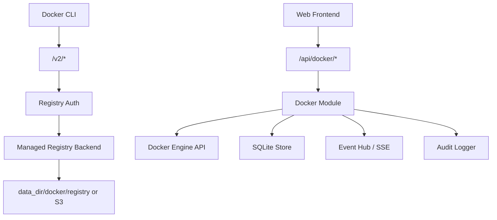

# Docker Registry 与 Docker Host 控制面功能设计

文档日期：2026-06-09  
关联文档：

- [personal-web-terminal-product-features.md](./personal-web-terminal-product-features.md)
- [personal-web-terminal-technical-design.md](./personal-web-terminal-technical-design.md)
- [log-center-feature-design.md](./log-center-feature-design.md)
- [happy-technical-reference.md](./happy-technical-reference.md)

官方协议参考：

- [Docker Registry HTTP API V2](https://docs.docker.com/reference/api/registry/latest/)
- [Docker Registry Authentication](https://docs.docker.com/reference/api/registry/auth/)
- [Docker Engine API](https://docs.docker.com/reference/api/engine/)
- [OCI Distribution Specification](https://github.com/opencontainers/distribution-spec)

## 1. Design Read

Reading this as: 个人服务器控制台里的 Docker 私有镜像仓库与宿主机容器控制面，面向单 owner 技术用户，采用 Quiet Agent Workbench / Quiet DevOps Control Plane 语言，强调可推送、可恢复、可审计、权限边界清晰和低噪音诊断。

本功能不是 DockerHub 克隆、团队镜像平台、企业容器云或 Kubernetes 控制台。它应像个人服务器上的 Docker 工作台：Owner 可以把镜像推到自己的服务器，查看镜像、容器、日志和运行状态，并对少量明确操作进行受控执行。

## 2. 功能定位

目标是在 Phantom Lancer 中新增一个 `Docker` 能力域，覆盖两个互相关联但边界不同的子能力：

1. `Private Registry`：提供一个兼容 Docker/OCI client 的私有镜像仓库。Owner 可以通过 `docker login`、`docker tag`、`docker push`、`docker pull` 把镜像存到 Phantom Lancer 管理的服务器上。
2. `Docker Host`：提供轻量 Docker Desktop-like 控制面。Owner 可以在 Web 上查看本机 Docker daemon 的 images、containers、volumes、networks、events 和受控日志，并执行有限控制动作。

产品命名建议使用 `Docker` 或 `Registry`，不要在 UI 中命名为 `DockerHub`。DockerHub 是 Docker 官方 SaaS/品牌语义，也暗示组织、团队、公开仓库、商业镜像市场等不属于本项目边界的功能。

本功能继续遵循本项目既有原则：

- 单 owner，不做多租户。
- Go 后端是唯一执行入口。
- 前端不直接访问 Docker socket，不拼接 shell 命令。
- SQLite 只存元数据、设置、事件和审计，不存镜像 blob。
- 实时状态和长任务输出通过事件/SSE 恢复。
- 关键操作必须可审计，默认脱敏。

## 3. 产品边界

### 3.1 MVP 范围

Private Registry：

- 启用或停用本机私有 registry。
- 支持 Docker/OCI Registry HTTP API V2 的 push、pull、manifest 查询和 digest-based delete。
- 支持 `docker login <registry-host>` 认证。
- 支持为 registry 创建、禁用、轮换和删除访问凭据。
- 支持 repository 列表、tag 列表、manifest digest、media type、size、last pushed、last pulled。
- 支持删除 tag 或 manifest，删除前必须二次确认。
- 支持本地文件系统作为 registry 存储目录。
- 支持后续扩展 S3-compatible object storage，但 MVP 可以只实现本地存储。
- 支持 registry 存储配额、repository/tag 数量限制和垃圾回收提示。
- 支持 Dashboard 摘要和 Registry 事件审计。

Docker Host：

- 探测 Docker daemon 是否可用、版本、API version、rootless/rootful、storage driver、Docker root dir 摘要。
- 通过 Docker Engine API 查询 images、containers、volumes、networks、daemon info 和 events。
- 支持容器 start、stop、restart、kill 的受控操作。
- 支持容器 logs bounded tail，不一次性读取全量日志。
- 支持容器 stats 当前快照或短窗口采样。
- 支持 image pull、image remove、container remove 的危险操作确认。
- 支持按 label 或名称筛选 Phantom Lancer 管理的容器。
- 支持 Docker events 映射到 Phantom Lancer events，并通过 SSE 展示。
- 支持操作审计和错误摘要。

### 3.2 非目标

- 不做 DockerHub 全量功能，例如公开主页、star、团队组织、namespace 购买、镜像市场、官方镜像同步、Webhooks marketplace。
- 不做多用户 repository 权限系统；MVP 只面向单 owner，可用 credential scope 表达 read/write/admin。
- 不在 MVP 提供任意 `docker run` 表单。
- 不在 MVP 提供容器内 exec shell。
- 不在 MVP 提供任意 host path mount、privileged container、host network 创建。
- 不默认修改 Docker daemon 配置、systemd unit、防火墙、反向代理或公网 TLS 证书。
- 不替代完整 Docker Desktop、Portainer、Harbor、Rancher 或 Kubernetes 控制面。
- 不扫描镜像漏洞，不做 SBOM、签名验证、策略准入；后续可作为安全扩展。
- 不自动清理外部 Docker 资源，除非资源明确由 Phantom Lancer 创建或 Owner 显式确认。

## 4. 信息架构

`Docker` 应作为一级导航能力域存在，不放入通用 `设置`，也不塞进 `日志` 或 `Images`。它包含完整任务流：推送镜像、查看仓库、管理本机容器和运行事件。

建议二级结构：

- `Overview`：Docker daemon、registry、存储、最近事件和风险摘要。
- `Registry`：repositories、tags、manifests、push/pull 说明、credential 管理入口。
- `Images`：本机 Docker images 列表、pull/remove、关联容器。
- `Containers`：容器列表、状态、端口、日志、stats、start/stop/restart/remove。
- `Volumes`：volume 列表、挂载摘要、只读查看，删除后置。
- `Networks`：network 列表、容器连接关系，只读为主。
- `Events`：Docker events、registry events、operation jobs。
- `Settings`：Docker socket、registry listen、storage、TLS、凭据策略、保留策略。

Dashboard 只展示摘要：

- Docker daemon connected / unavailable。
- Registry enabled / disabled。
- 本机 running containers 数量。
- registry storage used / quota。
- 最近失败操作或安全风险。

Dashboard 不展开 registry 设置表单，也不直接提供 destructive 操作。

## 5. 用户流程

### 5.1 首次启用 Docker Host

1. Owner 打开 `Docker > Overview`。
2. 后端探测 Docker daemon：默认检查 `unix:///var/run/docker.sock`，也允许配置 rootless socket。
3. 如果 daemon 不可用，页面展示原因：socket 不存在、权限不足、daemon 未运行或 API 不兼容。
4. 如果 daemon 可用，页面展示版本、API version、storage driver、rootless/rootful 和风险提示。
5. Owner 在 `Settings` 中启用 Docker Host 控制面。
6. 系统写入 audit：`docker.host.enabled`，payload 只包含 socket 摘要和 Docker version，不包含敏感环境变量。

### 5.2 启用 Private Registry

1. Owner 打开 `Docker > Registry`。
2. 页面显示当前 registry disabled 状态、推荐 listen 地址和存储目录。
3. Owner 配置 registry public URL、listen addr、storage dir、quota 和 TLS 策略。
4. Owner 创建一个 registry credential，例如 `personal-laptop`，选择 `pull,push` scope。
5. 后端生成一次性显示的 secret，保存 hash，不保存明文。
6. Owner 使用 Docker CLI 登录：

```bash
docker login registry.example.com
```

7. 登录成功后，Owner 可以推送镜像：

```bash
docker tag my-app:latest registry.example.com/personal/my-app:latest
docker push registry.example.com/personal/my-app:latest
```

8. Registry 模块记录 repository/tag/manifest 元数据和 audit。

### 5.3 推送镜像到本服务

Docker client 对 registry 的访问不是浏览器 API，而是标准 Registry HTTP API V2：

1. Client 请求 `GET /v2/`。
2. 如果需要认证，registry 返回 `401 Unauthorized` 和 `WWW-Authenticate` challenge。
3. Client 使用 `docker login` 保存的凭据向 token service 换取 Bearer token，或使用 Basic auth。
4. Client 上传 blobs 和 manifest。
5. Registry 写入底层 blob store。
6. 后端记录 manifest digest、tag、size、created_at、pushed_by credential id 摘要。

注意：Docker image reference 只支持 registry host 加 repository path，不支持把 registry 放在普通 Web path 下。例如 `registry.example.com/personal/my-app:latest` 中的 `personal/my-app` 是 repository name，不是 `/personal` 反向代理前缀。服务端必须能处理 registry 根路径下的 `/v2/*`。

### 5.4 管理本机容器

1. Owner 打开 `Docker > Containers`。
2. 页面列出容器名称、image、status、ports、created、health、labels 摘要。
3. 选择某个容器后，右侧 inspector 展示 inspect 摘要、端口、mounts、networks、recent events。
4. Owner 可以执行 `Start`、`Stop`、`Restart`。
5. 每个控制动作由后端调用 Docker Engine API，成功或失败都写 audit 和 event。
6. `Remove`、`Kill` 等危险操作必须二次确认。

### 5.5 查看容器日志

1. Owner 在容器详情打开 `Logs`。
2. 默认加载最近 200 行或 256KB，二者取更小。
3. 可开启 live tail，使用 SSE 转发 bounded stream。
4. 后端对日志内容做 secret redaction、长度裁剪和 ANSI 安全处理。
5. 不把完整日志写入服务 `slog`，只在失败时写错误摘要。

## 6. 协议与部署模型

### 6.1 Registry API

Registry 必须支持标准 `/v2/` API。MVP 推荐两种部署模式，按复杂度从低到高：

1. `managed distribution`：Phantom Lancer 管理一个 CNCF Distribution / Docker Registry 后端进程或容器，Go 服务负责配置、认证、状态、审计和 UI。
2. `embedded/proxy registry`：Go 服务直接处理 `/v2/*` 或反向代理到内部 registry，同时拦截认证和关键事件。

MVP 优先选择 `managed distribution`，原因是 Registry HTTP API 涉及 resumable blob upload、range、cross-repository mount、manifest media type、delete 和 garbage collection，自己完整实现容易引入协议兼容问题。

Registry 路由建议：

- Web/API：`https://console.example.com/api/docker/*`
- Registry：`https://registry.example.com/v2/*` 或 `https://console.example.com/v2/*`
- Token service：`https://console.example.com/api/docker/registry/token`

如果 registry 和控制台共用 host，必须保证 `/v2/*` 不需要浏览器 session cookie，也不走 CSRF；它使用 Docker registry auth。普通 Web 管理接口仍必须登录和 CSRF。

### 6.2 Registry Auth

Registry client 认证不能复用 Phantom Lancer browser session。需要单独 credential：

- `RegistryCredential`
  - `id`
  - `name`
  - `status`
  - `key_hash`
  - `scopes`
  - `repository_prefix`
  - `last_used_at`
  - `created_at`
  - `rotated_at`
  - `revoked_at`

Scope 建议：

- `registry.pull`
- `registry.push`
- `registry.delete`
- `registry.admin`

Repository scope：

- MVP 默认允许 `personal/*`。
- 后续支持 credential 绑定到 repository prefix，例如 `apps/*`、`base/*`。
- 禁止空 prefix 的匿名 push。

Auth 策略：

- 默认关闭 anonymous pull。
- `docker login` 使用 credential secret。
- token response 使用短 TTL。
- token payload 不包含明文 secret。
- 删除和 admin scope 必须单独授予。
- Credential 创建、轮换、禁用、删除写 audit。

### 6.3 Docker Engine API

Docker Host 控制面通过 Docker Engine API 访问本机 daemon。默认使用 Unix socket：

- rootful：`unix:///var/run/docker.sock`
- rootless：`unix:///run/user/<uid>/docker.sock`，实际路径必须由配置或探测得到，不提交个人路径。

实现可选：

1. 使用 Docker Go SDK，并启用 API version negotiation。
2. 使用 Go `net/http` + Unix socket transport 直接调用 Engine API。

MVP 建议使用 Docker Go SDK 或极小封装的 direct HTTP，不通过 shell 调 `docker` CLI。无论哪种方式，都必须把 Docker socket 访问封装在 `internal/docker` 模块中，前端只能调用受控 API。

Docker socket 风险很高。拥有 Docker socket 控制权通常等价于可以通过容器挂载、特权模式或 daemon API 影响宿主机。因此 MVP 必须先实现 allowlist 操作，而不是暴露完整 Engine API proxy。

## 7. 安全模型

### 7.1 权限能力

新增 capability 建议：

- `docker.read`：查看 Docker host 和 registry 状态。
- `docker.registry.read`：查看 repositories、tags、manifest metadata。
- `docker.registry.write`：push/pull credential 管理和写入 registry。
- `docker.registry.delete`：删除 tag/manifest、执行 GC。
- `docker.host.read`：查看 images、containers、volumes、networks、events。
- `docker.container.control`：start/stop/restart/kill。
- `docker.image.write`：pull image。
- `docker.image.delete`：remove image。
- `docker.volume.delete`：delete volume，MVP 默认关闭。
- `docker.settings.manage`：修改 Docker settings。

个人模式下这些 capability 不分配给不同用户，但仍用于策略判断、危险操作确认和 audit risk level。

### 7.2 TLS 与公网暴露

Registry 面向 Docker client，通常会被远程机器访问。要求：

- 公网 registry 必须使用 HTTPS。
- HTTP registry 只允许绑定 `127.0.0.1` 或明确标记为 insecure，并在 UI 中持续显示 warning。
- 不自动修改 Docker client 的 insecure registries 配置。
- 不在文档中写真实域名、IP、token 或私有 endpoint；示例使用 `registry.example.com`。
- `publicUrl` 必须校验 scheme、host、port，不保存带 token query 的 URL。

### 7.3 Docker Host 操作边界

MVP 允许：

- list/inspect images、containers、volumes、networks。
- container start/stop/restart。
- bounded logs tail。
- image pull。
- image remove 和 container remove，但必须确认。

MVP 禁止：

- 任意 container create/run。
- privileged mode。
- host network 创建。
- mount 任意 host path。
- container exec。
- copy archive in/out。
- system prune 一键清理。
- plugin、swarm、secret、config、node 管理。

后续如果加入 `run` 或 compose，必须先设计 allowlist：

- 只允许指定 image repository prefix。
- 只允许指定 network。
- 只允许命名 volume，不允许任意 host path。
- 不允许 privileged。
- 不允许 `--pid=host`、`--ipc=host`、`--uts=host`。
- 环境变量中 secret 默认 masked，UI 不回显。

### 7.4 日志与脱敏

禁止记录：

- Registry credential secret。
- Docker auth header。
- image push/pull Authorization token。
- container env 明文。
- secret-looking labels。
- 完整 remote URL query。
- 完整 UUID、session token、cookie、CSRF token。
- 容器日志中的高置信 API key、password、private key。

可以记录：

- repository name。
- tag。
- digest 前 16 位摘要。
- credential id。
- operation。
- status。
- duration。
- bytes summary。
- error code 和裁剪后的 error summary。

## 8. 数据与存储模型

### 8.1 SQLite 元数据

建议新增表前缀 `docker_`，避免和 Images 模块冲突。

核心表：

- `docker_settings`
- `docker_registry_credentials`
- `docker_registry_repositories`
- `docker_registry_manifests`
- `docker_registry_tags`
- `docker_registry_events`
- `docker_host_snapshots`
- `docker_operation_jobs`

示意模型：

```go
type DockerSettings struct {
    ID                    string
    HostEnabled           bool
    EngineEndpoint        string
    RegistryEnabled       bool
    RegistryMode          string // managed_distribution, embedded_proxy
    RegistryListen        string
    RegistryPublicURL     string
    RegistryStorageDir    string
    RegistryQuotaBytes    int64
    RequireTLS            bool
    AllowAnonymousPull    bool
    CreatedAt             string
    UpdatedAt             string
}

type DockerRegistryRepository struct {
    ID          string
    Name        string
    Tags        int
    SizeBytes   int64
    LastPushedAt string
    LastPulledAt string
    CreatedAt   string
    UpdatedAt   string
}

type DockerOperationJob struct {
    ID           string
    Kind         string // image_pull, container_restart, registry_gc
    Target       string
    Status       string
    StartedAt    string
    CompletedAt  string
    ErrorSummary string
}
```

SQLite 不保存 blob。Registry blob 存放在：

- 默认：`data_dir/docker/registry`
- 后续：S3-compatible object storage

### 8.2 Registry Blob Storage

本地存储要求：

- 所有路径必须落在 `data_dir/docker/registry` 或配置的允许目录中。
- 不允许跟 workspace 任意目录混用。
- 不允许跟 SQLite DB、service logs、private images storage 共用同一目录。
- 支持计算当前 usage。
- 支持 quota exceeded 时拒绝新上传。
- 删除 manifest 后不立即删除所有 blob，必须通过 registry GC 处理 unreferenced blobs。

S3 扩展要求：

- 复用 Images 对象存储设计经验，但 Docker Registry storage 是独立配置，不放在 Images Settings。
- S3 bucket 可以私有。
- 不在 object metadata 中保存 credential secret、完整 env 或私有 URL。
- S3 失败只记录摘要和 object key 摘要。

### 8.3 保留与清理

MVP 建议：

- registry metadata 永久保留，除非 repository/tag 被删除。
- registry events 保留 30 天或每 repository 5000 条。
- Docker host snapshots 只保留最近一次和短窗口历史。
- operation jobs 保留 30 天。
- audit events 按全局 audit retention。

危险清理：

- `Delete tag`：删除 tag 引用，不一定释放 blob。
- `Delete manifest`：digest-based delete，必须确认。
- `Garbage collect`：必须停写或进入 maintenance mode，执行前显示影响范围。
- `Image remove`：只删除本机 Docker image，不删除 registry 中的 image。
- `Container remove`：不删除 named volume，除非未来显式支持并确认。

## 9. 后端模块设计

新增模块建议命名为 `internal/dockercontrol` 或 `internal/docker`。如果使用 `internal/docker`，注意不要和第三方 Docker package import 混淆。

职责拆分：

- `Service`：聚合 Registry 和 Host 状态，提供 Dashboard summary。
- `EngineClient`：封装 Docker Engine API / SDK，禁止透传任意 endpoint。
- `EngineProbe`：探测 socket、version、rootless/rootful、API negotiation。
- `RegistryManager`：管理 registry 后端进程/容器、配置文件、健康检查。
- `RegistryAuth`：处理 credential、token、scope、repository prefix。
- `RegistryCatalog`：同步 repository/tag/manifest metadata。
- `RegistryProxy`：可选，处理或代理 `/v2/*`。
- `OperationRunner`：执行 image pull、container control、registry GC 等长操作。
- `EventMapper`：把 Docker events / registry events 归一化为 Phantom Lancer events。
- `Redactor`：日志、inspect、env、labels 脱敏。
- `Validator`：校验 repository name、tag、digest、listen addr、storage dir、public URL。

与现有模块关系：



## 10. API 设计

Web 管理 API 都在 `/api/docker/*` 下，必须登录。写操作必须 CSRF。

状态：

- `GET /api/docker/status`
- `GET /api/docker/overview`
- `GET /api/docker/settings`
- `PUT /api/docker/settings`
- `POST /api/docker/probe`

Registry：

- `GET /api/docker/registry/status`
- `GET /api/docker/registry/repositories`
- `GET /api/docker/registry/repositories/{name}`
- `GET /api/docker/registry/repositories/{name}/tags`
- `GET /api/docker/registry/repositories/{name}/manifests/{reference}`
- `DELETE /api/docker/registry/repositories/{name}/tags/{tag}`
- `DELETE /api/docker/registry/repositories/{name}/manifests/{digest}`
- `POST /api/docker/registry/gc`
- `GET /api/docker/registry/credentials`
- `POST /api/docker/registry/credentials`
- `PATCH /api/docker/registry/credentials/{id}`
- `POST /api/docker/registry/credentials/{id}/rotate`
- `DELETE /api/docker/registry/credentials/{id}`

Registry native protocol：

- `GET /v2/`
- `HEAD /v2/{name}/manifests/{reference}`
- `GET /v2/{name}/manifests/{reference}`
- `PUT /v2/{name}/manifests/{reference}`
- `DELETE /v2/{name}/manifests/{digest}`
- `GET /v2/{name}/blobs/{digest}`
- `POST /v2/{name}/blobs/uploads/`
- `PATCH /v2/{name}/blobs/uploads/{uuid}`
- `PUT /v2/{name}/blobs/uploads/{uuid}`
- `DELETE /v2/{name}/blobs/uploads/{uuid}`

Docker Host：

- `GET /api/docker/host/info`
- `GET /api/docker/host/events`
- `GET /api/docker/images`
- `POST /api/docker/images/pull`
- `DELETE /api/docker/images/{id}`
- `GET /api/docker/containers`
- `GET /api/docker/containers/{id}`
- `POST /api/docker/containers/{id}/start`
- `POST /api/docker/containers/{id}/stop`
- `POST /api/docker/containers/{id}/restart`
- `POST /api/docker/containers/{id}/kill`
- `DELETE /api/docker/containers/{id}`
- `GET /api/docker/containers/{id}/logs`
- `GET /api/docker/containers/{id}/stats`
- `GET /api/docker/volumes`
- `GET /api/docker/networks`

长操作使用 job：

- `POST /api/docker/jobs`
- `GET /api/docker/jobs/{id}`
- `POST /api/docker/jobs/{id}/cancel`

MVP 可先不实现通用 job create，而是在 pull、restart、gc 等接口内部创建 job。

## 11. 事件与审计

事件类型建议：

- `docker.host.probed`
- `docker.host.unavailable`
- `docker.registry.started`
- `docker.registry.stopped`
- `docker.registry.health_changed`
- `docker.registry.credential.created`
- `docker.registry.credential.rotated`
- `docker.registry.credential.revoked`
- `docker.registry.manifest.pushed`
- `docker.registry.manifest.pulled`
- `docker.registry.manifest.deleted`
- `docker.registry.gc.started`
- `docker.registry.gc.completed`
- `docker.registry.gc.failed`
- `docker.image.pull.started`
- `docker.image.pull.completed`
- `docker.image.pull.failed`
- `docker.image.removed`
- `docker.container.started`
- `docker.container.stopped`
- `docker.container.restarted`
- `docker.container.killed`
- `docker.container.removed`
- `docker.container.health_changed`

Audit risk level：

- `low`：只读 probe、list、inspect summary。
- `medium`：registry credential create/rotate、image pull、container start/stop/restart。
- `high`：container kill、container remove、image remove、tag/manifest delete。
- `critical`：registry GC、volume delete、未来的 run/create/exec/privileged 操作。

Registry push/pull 是 Docker client 发起，不经过浏览器 UI。仍应写 audit，但 payload 应只包含 credential id、repository、tag、digest 摘要、bytes、duration、source IP 摘要和结果。

## 12. 前端设计

### 12.1 页面语言

本模块遵循 Quiet Agent Workbench / Quiet DevOps Control Plane：

- 左侧仍使用全局导航，`Docker` 作为一级能力域。
- Docker 内部使用低噪音二级 tab。
- 主区围绕当前对象展开：repository、image、container、volume、network 或 job。
- 右侧 inspector 常驻，展示 digest、ports、mounts、labels、risk、recent events。
- 不使用营销 hero、插画、渐变背景、玻璃拟态、AI 紫蓝光或大卡片 dashboard。
- 技术值如 image id、digest、container id、ports、paths、labels 使用 monospace。
- 状态色有语义：绿色 running/available，橙色 stale/warning，红色 danger/error。

### 12.2 Overview

布局：

- 顶部状态条：Docker daemon、Registry、storage usage、recent failures。
- 左侧摘要列表：running containers、recent pushes、recent container actions。
- 中间工作区：风险和下一步，例如 `Enable registry`、`Create credential`、`Fix Docker socket permission`。
- 右侧 inspector：daemon version、API version、rootless/rootful、socket summary、registry public URL。

空状态：

- Docker daemon 不可用时，显示短说明和 `Probe again`。
- Registry 未启用时，显示 `Enable registry` 和最小配置入口。
- 不展示大欢迎区。

### 12.3 Registry

主视图：

- Repository table：name、tags、size、last pushed、last pulled、visibility、actions。
- 选中 repository 后，右侧 inspector 显示 tags、latest digest、storage、recent events。
- `Push instructions` 以 compact command block 展示，使用 placeholder host。

交互：

- `Create credential` 打开 modal。
- Secret 只在创建或 rotate 成功后显示一次。
- Delete tag/manifest 使用 confirmation dialog。
- GC 使用 maintenance warning dialog。

### 12.4 Containers

主视图：

- Container table：name、image、status、health、ports、created、CPU/memory snapshot。
- 支持状态筛选：all/running/stopped/unhealthy。
- 支持名称、image、label 搜索。
- 选中容器后 inspector 展示 inspect 摘要和最近事件。

操作：

- Start / Stop / Restart 使用常规按钮。
- Kill / Remove 使用 danger。
- Logs 在详情区域或 inspector 二级 tab 中打开，不作为全局一级入口。

移动端：

- Table 降为可扫描列表。
- Inspector 收进 drawer。
- destructive 操作仍必须确认。

## 13. 配置模型

TOML 文件只保存启动期默认值，运行期设置进 SQLite。

示例配置使用占位值，不提交真实域名、路径或 token：

```toml
[docker]
host_enabled = false
engine_endpoint = "unix:///var/run/docker.sock"

[docker.registry]
enabled = false
listen = "127.0.0.1:5443"
public_url = "https://registry.example.com"
storage_dir = ""
quota_bytes = 10737418240
require_tls = true
allow_anonymous_pull = false
```

运行期设置校验：

- `engine_endpoint` 只允许 `unix://`，MVP 不允许 remote TCP daemon。
- `registry.listen` 必须是 host:port。
- `registry.public_url` 必须是 http/https URL，不允许包含 username、password、query token。
- `storage_dir` 为空时使用 `data_dir/docker/registry`。
- 非空 `storage_dir` 必须规范化，并落在允许写入边界中。
- `quota_bytes` 必须大于 0，且低于可配置上限。

## 14. 日志治理

服务 `slog` 只记录：

- Docker probe 失败摘要。
- Registry backend start/stop 失败。
- Registry auth/token 关键失败摘要。
- Engine API 操作失败摘要。
- Registry GC 失败。
- Docker event stream 断开或恢复摘要。

不记录：

- 每个成功 push chunk。
- 每个成功 pull blob。
- 每个 Docker events 原始 JSON。
- 容器 stdout/stderr 全量内容。
- Docker inspect 全量 payload。
- Container env 明文。

容器日志、pull progress、GC progress 应进入受控 events/job output，并设置上限。

## 15. 实现阶段

### P0：设计与依赖 spike

- 新增本设计文档。
- 确认 Docker Go SDK 或 direct HTTP 封装方案。
- 确认 managed distribution 的运行方式：外部 binary、容器或 embedded library。
- 确认 registry `/v2/*` route 和 token service 模式。
- 确认测试环境是否可依赖 Docker daemon。

### P1：Docker Host 只读

- 新增 `internal/dockercontrol` 基础模块。
- 探测 Docker daemon。
- Web 显示 daemon info、images、containers、volumes、networks。
- 加 status API、前端 Docker 一级导航和 Overview。
- 加基础脱敏、审计和测试。

### P2：Docker Host 受控操作

- 容器 start/stop/restart。
- 容器 bounded logs。
- image pull/remove。
- container remove。
- operation jobs 和 SSE。
- 完整危险操作确认。

### P3：Private Registry MVP

- managed registry backend。
- registry settings。
- credential create/rotate/revoke。
- `/v2/*` proxy 或 registry endpoint。
- push/pull 成功路径。
- repository/tag metadata 同步。
- registry event/audit。

### P4：Registry 管理能力

- repository/tag UI。
- manifest delete。
- storage usage/quota。
- GC maintenance mode。
- retention 和 cleanup。

### P5：高级能力

- S3-compatible registry storage。
- Compose 项目查看和受控 restart。
- Image build job。
- Container create/run allowlist。
- 镜像签名、SBOM、漏洞扫描或策略检查。

## 16. 测试策略

单元测试：

- repository name、tag、digest validation。
- public URL、listen addr、storage dir validation。
- credential hashing、scope matching、repository prefix matching。
- registry token 生成和过期。
- Docker inspect/env/label/log redaction。
- audit payload 裁剪。

集成测试：

- Docker daemon 不可用时 status 降级。
- Engine API list containers/images。
- container action API 的权限和错误处理。
- Registry auth challenge。
- push/pull 一个小测试镜像。
- delete tag/manifest。
- quota exceeded。

测试环境要求：

- 默认单元测试不要求本机 Docker daemon。
- Docker 集成测试使用环境变量显式开启，例如 `PL_DOCKER_INTEGRATION=1`。
- CI 默认跳过 Docker daemon 依赖测试，除非 workflow 明确提供服务。

## 17. 风险与取舍

主要风险：

- Docker socket 是高权限边界，不能暴露成通用 proxy。
- Registry 协议兼容复杂，自己实现完整 V2 容易不稳定。
- 镜像 layer 可能包含 secret，registry 存储需要 owner 自行管理风险。
- Public registry URL 和 TLS 配置错误会导致 push/pull 失败。
- Registry GC 如果处理不当可能误删仍被引用的 blobs。
- 容器日志可能泄露 token，必须双层脱敏。

关键取舍：

- MVP 先做 Docker Host 只读，再做控制动作，最后做 registry。
- Registry 优先托管成熟后端，不手写完整协议。
- SQLite 只存 metadata，不存 blob。
- 默认禁止 run/create/exec，避免把个人控制台变成裸 Docker socket Web 代理。
- 所有破坏性操作都需要显式确认和 audit。

## 18. 待确认问题

- Registry 是否使用独立 host/port，还是复用 Phantom Lancer 主服务的 `/v2/*`。
- 生产部署是否由用户自行配置 TLS/reverse proxy，还是 Phantom Lancer 未来提供 certificate helper。
- Registry backend 采用外部 `registry:2` 容器、distribution binary，还是 embedded distribution library。
- Docker Host 是否只支持本机 Unix socket，还是未来允许远程 Docker context。
- 是否允许 anonymous pull；如果允许，是否只对指定 repository prefix 开启。
- Registry storage 是否第一版就接入 S3-compatible backend，还是先本地存储。
- 是否需要 repository 命名策略，例如强制 `personal/*` 或允许任意 name。
- 是否要支持 Compose 项目作为二级视图，还是放到后续 `Apps/Services` 能力域。
