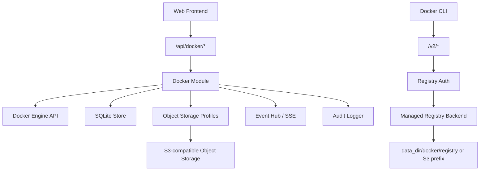

# Docker Registry 与 Docker Host 控制面功能设计

文档日期：2026-06-09  
关联文档：

- [personal-web-terminal-product-features.md](./personal-web-terminal-product-features.md)
- [personal-web-terminal-technical-design.md](./personal-web-terminal-technical-design.md)
- [log-center-feature-design.md](./log-center-feature-design.md)

官方协议参考：

- [Docker Registry HTTP API V2](https://docs.docker.com/reference/api/registry/latest/)
- [Docker Registry Authentication](https://docs.docker.com/reference/api/registry/auth/)
- [Docker Engine API](https://docs.docker.com/reference/api/engine/)
- [OCI Distribution Specification](https://github.com/opencontainers/distribution-spec)

## 1. Design Read

Reading this as: 个人服务器控制台里的 Docker 私有镜像仓库与宿主机容器控制面，面向单 owner 技术用户，采用 Quiet Agent Workbench / Quiet DevOps Control Plane 语言，强调可推送、可恢复、可审计、权限边界清晰和低噪音诊断。

本功能不是 DockerHub 克隆、团队镜像平台、企业容器云或 Kubernetes 控制台。它应像个人服务器上的 Docker 工作台：Owner 可以把镜像推到自己的服务器，查看镜像、容器、日志和运行状态，并对少量明确操作进行受控执行。

## 2. 功能定位

目标是在 Phantom Lancer 中新增一个 `Docker` 能力域，覆盖两个互相关联但边界不同的子能力：

1. `Private Registry`：提供一个兼容 Docker/OCI client 的私有镜像仓库。Owner 可以通过 `docker login`、`docker tag`、`docker push`、`docker pull` 把镜像存到 Phantom Lancer 管理的服务器上。
2. `Docker Host`：提供轻量 Docker Desktop-like 控制面。Owner 可以在 Web 上查看本机 Docker daemon 的 images、containers、volumes、networks、events 和受控日志，并执行有限控制动作。

产品命名建议使用 `Docker` 或 `Registry`，不要在 UI 中命名为 `DockerHub`。DockerHub 是 Docker 官方 SaaS/品牌语义，也暗示组织、团队、公开仓库、商业镜像市场等不属于本项目边界的功能。

本功能继续遵循本项目既有原则：

- 单 owner，不做多租户。
- Go 后端是唯一执行入口。
- 前端不直接访问 Docker socket，不拼接 shell 命令。
- SQLite 只存元数据、设置、事件和审计，不存镜像 blob。
- 实时状态和长任务输出通过事件/SSE 恢复。
- 关键操作必须可审计，默认脱敏。

## 3. 产品边界

### 3.1 MVP 范围

Private Registry：

- 启用或停用本机私有 registry。
- 支持 Docker/OCI Registry HTTP API V2 的 push、pull、manifest 查询和 digest-based delete。
- 支持 `docker login <registry-host>` 认证。
- 支持为 registry 创建、禁用、轮换和删除访问凭据。
- 支持 repository 列表、tag 列表、manifest digest、media type、size、last pushed、last pulled。
- 支持删除 tag 或 manifest，删除前必须二次确认。
- 支持本地文件系统作为 registry 存储目录。
- 支持后续扩展 S3-compatible object storage，但 MVP 可以只实现本地存储。
- 支持 registry 存储配额、repository/tag 数量限制和垃圾回收提示。
- 支持 Dashboard 摘要和 Registry 事件审计。

Docker Host：

- 探测 Docker daemon 是否可用、版本、API version、rootless/rootful、storage driver、Docker root dir 摘要。
- 通过 Docker Engine API 查询 images、containers、volumes、networks、daemon info 和 events。
- 支持容器 start、stop、restart、kill 的受控操作。
- 支持容器 logs bounded tail，不一次性读取全量日志。
- 支持容器 stats 当前快照或短窗口采样。
- 支持 image pull、image remove、container remove 的危险操作确认。
- 支持按 label 或名称筛选 Phantom Lancer 管理的容器。
- 支持 Docker 操作 job 与 Registry 事件映射到 Phantom Lancer events，并通过 SSE 展示；原始 Docker daemon events 作为后续增强，不进入当前交付范围。
- 支持操作审计和错误摘要。

### 3.2 非目标

- 不做 DockerHub 全量功能，例如公开主页、star、团队组织、namespace 购买、镜像市场、官方镜像同步、Webhooks marketplace。
- 不做多用户 repository 权限系统；MVP 只面向单 owner，可用 credential scope 表达 read/write/admin。
- 不在 MVP 提供任意 `docker run` 表单。
- 不在 MVP 提供容器内 exec shell。
- 不在 MVP 提供任意 host path mount、privileged container、host network 创建。
- 不默认修改 Docker daemon 配置、systemd unit、防火墙、反向代理或公网 TLS 证书。
- 不替代完整 Docker Desktop、Portainer、Harbor、Rancher 或 Kubernetes 控制面。
- 不扫描镜像漏洞，不做 SBOM、签名验证、策略准入；后续可作为安全扩展。
- 不自动清理外部 Docker 资源，除非资源明确由 Phantom Lancer 创建或 Owner 显式确认。

### 3.3 高权限扩展能力（分阶段、默认关闭）

除上述 MVP 外，本设计规划三项**系统侵入性更强的扩展能力**。它们都不属于 MVP，必须各自作为独立受控能力实现：默认关闭、需在 Settings 显式开启、需声明授权方式、审计 risk level 为 `critical`、操作前强制二次确认。它们和 MVP 的「容器级控制」有本质区别——后者只调 Engine API，前者会改变本机软件安装或系统服务状态。

1. `一键安装 Docker daemon`：当本机未安装 Docker 时，从官方公开源安装并启用 daemon。属于装机/初始化运维动作，是解锁 Docker Host（容器管理）的前提，但不是 Registry 的前提（内嵌 Registry 不依赖本机 dockerd）。详见 §6.5。
2. `Docker daemon 启停`：通过 systemd 启停/重启整个 Docker 服务，而非单个容器。daemon 停止后 Engine API 不可用，必须改走 systemctl 子进程。详见 §6.6。
3. `docker run / 创建容器`：从控制台创建并运行新容器，必须基于模板化 allowlist，而不是自由表单。详见 §7.3 与 §6.7。

边界说明：

- 容器级 `start/stop/restart/kill/remove` 属于 MVP（§3.1 Docker Host），只依赖 Engine API，不在本节高权限范围内。
- 上述三项扩展能力默认对普通运行身份不可用；权限不满足时只读提示，不尝试执行。
- 不提供「一键卸载 Docker」，避免误删宿主机 Docker 环境。
- 这三项与 §3.2 中「不默认修改 daemon 配置/systemd unit」「不在 MVP 提供任意 docker run」并不冲突：MVP 仍保持上述非目标，这些能力只有在 Owner 显式开启对应扩展后才可用。

## 4. 信息架构

`Docker` 应作为一级导航能力域存在，不放入通用 `设置`，也不塞进 `日志` 或 `Images`。它包含完整任务流：推送镜像、查看仓库、管理本机容器和运行事件。

建议二级结构：

- `Overview`：Docker daemon、registry、存储、最近事件和风险摘要。
- `Registry`：repositories、tags、manifests、push/pull 说明、credential 管理入口。
- `Images`：本机 Docker images 列表、pull/remove、关联容器。
- `Containers`：容器列表、状态、端口、日志、stats、start/stop/restart/remove。
- `Volumes`：volume 列表、挂载摘要、只读查看，删除后置。
- `Networks`：network 列表、容器连接关系，只读为主。
- `Events`：registry events、operation jobs；原始 Docker daemon events 后续增强。
- `Settings`：Docker socket、registry storage、TLS/public URL、凭据策略、保留策略。

Dashboard 只展示摘要：

- Docker daemon connected / unavailable。
- Registry enabled / disabled。
- 本机 running containers 数量。
- registry storage used / quota。
- 最近失败操作或安全风险。

Dashboard 不展开 registry 设置表单，也不直接提供 destructive 操作。

## 5. 用户流程

### 5.1 首次启用 Docker Host

1. Owner 打开 `Docker > Overview`。
2. 后端探测 Docker daemon：默认检查 `unix:///var/run/docker.sock`，也允许配置 rootless socket。
3. 如果 daemon 不可用，页面展示原因：socket 不存在、权限不足、daemon 未运行、未安装或 API 不兼容。
   - 当判定为「未安装」时，若已开启并授权安装能力，提供「一键安装 Docker daemon」入口（见 §6.5）；否则只给出手动安装指引。
4. 如果 daemon 可用，页面展示版本、API version、storage driver、rootless/rootful 和风险提示。
5. Owner 在 `Settings` 中启用 Docker Host 控制面。
6. 系统写入 audit：`docker.host.enabled`，payload 只包含 socket 摘要和 Docker version，不包含敏感环境变量。

### 5.2 启用 Private Registry

1. Owner 打开 `Docker > Registry`。
2. 页面显示当前 registry disabled 状态、推荐 public URL 和存储目录。
3. Owner 配置 registry public URL、storage dir、quota、storage backend 和 TLS 策略。
4. Owner 创建一个 registry credential，例如 `personal-laptop`，选择 `pull,push` scope。
5. 后端生成一次性显示的 secret；保存 hash 用于 Registry Basic Auth 校验，同时保存 keywrap 加密后的 secret，供 owner 在 Web 控制面触发本机 Docker daemon 拉取本服务 Registry 镜像时生成 `RegistryAuth`。不保存明文。
6. Owner 使用 Docker CLI 登录：

```bash
docker login registry.example.com
```

7. 登录成功后，Owner 可以推送镜像：

```bash
docker tag my-app:latest registry.example.com/project/app:latest
docker push registry.example.com/project/app:latest
```

8. Registry 模块记录 repository/tag/manifest 元数据和 audit。

### 5.3 推送镜像到本服务

Docker client 对 registry 的访问不是浏览器 API，而是标准 Registry HTTP API V2：

1. Client 请求 `GET /v2/`。
2. 如果需要认证，registry 返回 `401 Unauthorized` 和 `WWW-Authenticate` challenge。
3. 当前实现使用 `docker login` 保存的 Basic auth 凭据；Bearer token service 作为后续 Distribution 兼容增强。
4. Client 上传 blobs 和 manifest。
5. Registry 写入底层 blob store。
6. 后端记录 manifest digest、tag、size、created_at、pushed_by credential id 摘要。

注意：Docker image reference 只支持 registry host 加 repository path，不支持把 registry 放在普通 Web path 下。例如 `registry.example.com/project/app:latest` 中的 `project/app` 是 repository name，不是 `/project` 反向代理前缀。服务端必须能处理 registry 根路径下的 `/v2/*`。

### 5.4 管理本机容器

1. Owner 打开 `Docker > Containers`。
2. 页面列出容器名称、image、status、ports、created、health、labels 摘要。
3. 选择某个容器后，右侧 inspector 展示 inspect 摘要、端口、mounts、networks、recent events。
4. Owner 可以执行 `Start`、`Stop`、`Restart`。
5. 每个控制动作由后端调用 Docker Engine API，成功或失败都写 audit 和 event。
6. `Remove`、`Kill` 等危险操作必须二次确认。

### 5.5 查看容器日志

1. Owner 在容器详情打开 `Logs`。
2. 默认加载最近 200 行或 256KB，二者取更小。
3. 可开启 live tail，使用 SSE 转发 bounded stream。
4. 后端对日志内容做 secret redaction、长度裁剪和 ANSI 安全处理。
5. 不把完整日志写入服务 `slog`，只在失败时写错误摘要。

## 6. 协议与部署模型

### 6.1 Registry API

Registry 必须支持标准 `/v2/` API。Registry HTTP API 涉及 resumable blob upload、range、manifest media type、delete 和 garbage collection，完整兼容 Docker Distribution 的全部行为复杂度较高。P0/P4 实现决策如下：

1. 当前实现采用 **in-process lightweight registry endpoint**：Phantom Lancer 主进程直接暴露 `/v2/*`，实现单 owner 场景所需的 Basic auth、blob upload/download、manifest put/get/head/delete、repository/tag metadata 同步、本地存储与 S3-compatible object storage backend。
2. 该实现不启动外部 registry 进程，不依赖本机 dockerd，不需要管理 distribution binary/container 生命周期。
3. 若未来需要 cross-repository mount、完整 Docker Distribution token service、复杂 GC、兼容性测试矩阵或高并发生产 registry 行为，再升级为 CNCF `distribution/distribution` embedded library 或 managed external binary。

可选承载方式按推荐程度从高到低：

1. `embedded distribution library`（推荐）：把 `distribution/distribution` 作为 Go 依赖内嵌，在 Phantom Lancer 进程内运行，由 Go 服务注入配置（storage、auth、TLS），并对外暴露独立端口的 `/v2/*`。生命周期与 v2ray 内嵌 core 完全同构（`Start/Stop/Restart/Close`，见 `internal/v2ray`）。
2. `managed external binary`：Phantom Lancer 以子进程方式托管一个 distribution binary，参考 Codex app-server supervisor 的子进程管理（`internal/codexclient/appserver_supervisor.go`）。仅在内嵌库不可行时采用，并必须补齐 §9.1 的子进程生命周期要求。
3. `managed container`：以 `registry:2` 容器运行。最不推荐，因为它会引入「Docker Host 控制面依赖 Docker、Registry 又依赖 Docker」的循环依赖，首次启用门槛和故障面都更大。

当前 P4/P6 选择 `in-process lightweight registry endpoint`，理由：

- 单 owner 私有 registry 的第一阶段只需要 push/pull 成功路径、Basic auth、metadata、delete、quota 和 object storage backend。
- 进程内 endpoint 可彻底规避外部子进程的孤儿回收、SIGKILL 半写、就绪探测、stderr 解析等复杂度（见 §9.1）。
- 单机裸部署模型下，每多一个被托管的外部进程就多一份运维与故障面，内嵌库最契合本项目部署模型。

如果后续确认 lightweight endpoint 无法满足兼容性，再升级到 `embedded distribution library` 或回退到 `managed external binary`，并强制实现 §9.1 的子进程管理清单。

Registry 路由建议：

- Web/API：`https://console.example.com/api/docker/*`
- Registry：`https://registry.example.com/v2/*` 或 `https://console.example.com/v2/*`
- Token service：当前实现不单独暴露 token service，使用 Docker Basic auth；未来如切换 Distribution token auth，再增加 `https://console.example.com/api/docker/registry/token`。

如果 registry 和控制台共用 host，必须保证 `/v2/*` 不需要浏览器 session cookie，也不走 CSRF；它使用 Docker registry auth。普通 Web 管理接口仍必须登录和 CSRF。

### 6.2 Registry Auth

Registry client 认证不能复用 Phantom Lancer browser session。需要单独 credential：

- `RegistryCredential`
  - `id`
  - `name`
  - `status`
  - `key_hash`
  - `secret_ciphertext`
  - `scopes`
  - `repository_prefix`
  - `last_used_at`
  - `created_at`
  - `rotated_at`
  - `revoked_at`

Scope 建议：

- `registry.pull`
- `registry.push`
- `registry.delete`
- `registry.admin`

Repository scope：

- Credential 可以绑定到 repository prefix，例如 `personal/*`、`apps/*`、`base/*`。
- Web 控制面创建容器时不强制固定 `personal/*` 命名空间；只要镜像引用来自当前 Registry public URL 的同一 registry host，即视为受控来源。实际拉取鉴权仍按 credential repository prefix 匹配。
- 禁止空 prefix 的匿名 push。

Auth 策略：

- 默认关闭 anonymous pull。
- `docker login` 使用 credential secret。
- Web 控制面执行 `image pull` 且目标属于本服务 Registry public URL 时，后端可使用 active、具备 `registry.pull` 或 `registry.admin`、repository prefix 匹配且有可解密 `secret_ciphertext` 的 credential，为 Docker Engine API 生成一次性 `RegistryAuth`；旧版只保存 hash 的 credential 仍可服务外部 `docker login/push/pull`，但需要轮换或新建后才能用于 Web 自动拉取。
- 当前实现不签发 Registry token，使用 Basic auth；未来如启用 Bearer token service，token response 必须使用短 TTL 且 payload 不包含明文 secret。
- 删除和 admin scope 必须单独授予。
- Credential 创建、轮换、禁用、删除写 audit。

### 6.3 Docker Engine API

Docker Host 控制面通过 Docker Engine API 访问本机 daemon。默认使用 Unix socket：

- rootful：`unix:///var/run/docker.sock`
- rootless：`unix:///run/user/<uid>/docker.sock`，实际路径必须由配置或探测得到，不提交个人路径。

实现可选：

1. 使用 Docker Go SDK，并启用 API version negotiation。
2. 使用 Go `net/http` + Unix socket transport 直接调用 Engine API。

MVP 建议使用 Docker Go SDK 或极小封装的 direct HTTP，不通过 shell 调 `docker` CLI。无论哪种方式，都必须把 Docker socket 访问封装在 `internal/docker` 模块中，前端只能调用受控 API。

Docker socket 风险很高。拥有 Docker socket 控制权通常等价于可以通过容器挂载、特权模式或 daemon API 影响宿主机。因此 MVP 必须先实现 allowlist 操作，而不是暴露完整 Engine API proxy。

### 6.4 进程与生命周期边界

明确两类对象的生命周期归属，避免误解 Phantom Lancer 重启的影响：

- Docker Host 控制面是 Docker daemon 的 API 客户端，不是容器的父进程。容器进程由 `dockerd` / `containerd-shim` 维护，其生命周期独立于 Phantom Lancer。
  - Phantom Lancer 重启、崩溃或停止，不会重启、停止或影响机器上正在运行的其他 Docker 容器；只是暂时断开控制面与 daemon 的连接，恢复后重新探测即可。
  - Docker Host 子能力依赖外部已部署并运行的 Docker daemon。daemon 不可用时，控制面只展示 unavailable 与原因，不具备容器管理能力（见 §5.1）。Phantom Lancer 不内置、不替代、不托管 dockerd。
- 内嵌 Registry（§6.1 推荐方式）跑在 Phantom Lancer 进程内，其生命周期跟随 Phantom Lancer。
  - Phantom Lancer 重启会中断 registry 的 push/pull，但不影响任何普通 Docker 容器。
  - 内嵌 Registry 不依赖本机 dockerd，即使机器未安装 Docker，registry 仍可独立提供 push/pull。
  - 因此 registry 重启窗口必须配合就绪探测与优雅停止（见 §9.1），尽量缩短 push/pull 不可用时间。

### 6.5 一键安装 Docker daemon（扩展能力）

当 §5.1 探测到本机未安装 Docker 时，在「未安装」分支下提供受控的一键安装入口。它是装机/初始化运维动作，默认关闭，需显式开启与授权。

授权与前提：

- 安装软件包并 `systemctl enable --now docker` 必须 root / sudo。Phantom Lancer 以普通身份运行时默认不可用，需部署方显式授权（sudoers / polkit / 或以特权身份运行）。
- 启用前必须确认授权方式；不满足时只读提示并给出手动安装指引，不尝试执行。

平台适配：

- 安装方式因发行版而异，MVP 优先支持目标发行版（RHEL / OpenCloudOS 系用 `dnf/yum` + 官方源；Debian/Ubuntu 用 `apt` + 官方源）。
- 其余发行版标记「不支持自动安装」，只提供手动安装指引。
- 可选封装官方便捷脚本，但必须来自官方公开地址，且需说明其不可控性。

来源与安全：

- 仅使用官方公开源 / 官方脚本，遵循公开依赖与信息边界，不写私有源、不提交真实私有地址。
- 校验来源可信，避免供应链风险。
- 安装失败不自动重试系统级安装，给出原因与手动安装指引。

执行模型：

- 安装是分步长任务（探测 → 加源 → 装包 → 启用服务 → 再探测），必须走 job + SSE，每步可观测。
- 安装前做幂等探测：已安装/已运行则跳过；允许选择 rootful / rootless。
- stderr 进脱敏 + 有上限的 ring buffer，仅失败时写错误摘要到 `slog`。
- 安装完成后自动触发一次 daemon 探测，ready 才算成功。
- 审计 risk level 为 `critical`，记录发行版、安装来源、版本与结果，不记录敏感环境。
- 不提供一键卸载 Docker。

### 6.6 Docker daemon 启停（扩展能力）

区别于容器级控制，这里启停的是整个 Docker 服务，默认关闭，需显式开启与授权。

- daemon 停止后 Engine API 不可用，必须改走 `systemctl start|stop|restart docker`（或 `docker.socket`）的高权限子进程，而不是 Engine API。
- 权限要求与 §6.5 相同（root / sudo / polkit），不满足只读提示。
- 状态探测需结合 systemd unit active 状态，而非只看 socket 是否存在。
- 自我影响风险：若 Registry 或 Phantom Lancer 自身跑在容器中，停 daemon 会自我中断；内嵌 Registry 方案可规避（§6.1）。UI 必须持续显示「会影响本机所有容器」的警告。
- 审计 risk level 为 `critical`，强制二次确认。

### 6.7 docker run / 创建容器（扩展能力）

从控制台创建并运行新容器，必须是受约束的模板化创建，而不是自由表单 run。具体 allowlist 约束见 §7.3。

- 通过 Engine API 创建/启动容器，但参数必须经过 allowlist 校验后再下发。
- 禁止任意 host path mount、privileged、host network、`--pid/ipc/uts=host`（详见 §7.3）。
- 配错单个参数即可能交出宿主机，因此该能力默认关闭，审计 risk level 为 `critical`，强制二次确认。

## 7. 安全模型

### 7.1 权限能力

新增 capability 建议：

- `docker.read`：查看 Docker host 和 registry 状态。
- `docker.registry.read`：查看 repositories、tags、manifest metadata。
- `docker.registry.write`：push/pull credential 管理和写入 registry。
- `docker.registry.delete`：删除 tag/manifest、执行 GC。
- `docker.host.read`：查看 images、containers、volumes、networks、events。
- `docker.container.control`：start/stop/restart/kill。
- `docker.image.write`：pull image。
- `docker.image.delete`：remove image。
- `docker.volume.delete`：delete volume，MVP 默认关闭。
- `docker.settings.manage`：修改 Docker settings。
- `docker.daemon.install`：一键安装 Docker daemon，默认关闭，需显式授权（见 §6.5）。
- `docker.daemon.control`：启停 Docker daemon 服务，默认关闭，需显式授权（见 §6.6）。
- `docker.container.create`：模板化 allowlist 创建/运行容器，默认关闭（见 §6.7 / §7.3）。

个人模式下这些 capability 不分配给不同用户，但仍用于策略判断、危险操作确认和 audit risk level。其中 `docker.daemon.install`、`docker.daemon.control`、`docker.container.create` 属于高权限扩展能力，默认关闭，需要 Owner 在 Settings 显式开启并满足授权前提（root / sudo / polkit），对应操作 audit risk level 为 `critical`。

### 7.2 TLS 与公网暴露

Registry 面向 Docker client，通常会被远程机器访问。要求：

- 公网 registry 必须使用 HTTPS。
- 当前 lightweight endpoint 与 Phantom Lancer 主 HTTP 服务共享 listener；TLS 通常由主服务或反向代理终止。`require_tls` 用于校验 `public_url` 必须是 `https://`，不单独管理 registry cert/key 文件。
- HTTP registry 仅允许 `localhost` / `127.0.0.1` public URL，并且必须显式开启 insecure local 标记；UI 持续显示 warning。
- 不自动修改 Docker client 的 insecure registries 配置。
- 不在文档中写真实域名、IP、token 或私有 endpoint；示例使用 `registry.example.com`。
- `publicUrl` 必须校验 scheme、host、port，不保存带 token query 的 URL。

### 7.3 Docker Host 操作边界

MVP 允许：

- list/inspect images、containers、volumes、networks。
- container start/stop/restart。
- bounded logs tail。
- image pull。
- image remove 和 container remove，但必须确认。

MVP 禁止：

- 任意 container create/run。
- privileged mode。
- host network 创建。
- mount 任意 host path。
- container exec。
- copy archive in/out。
- system prune 一键清理。
- plugin、swarm、secret、config、node 管理。

后续如果加入 `run` 或 compose，必须先设计 allowlist：

- 只允许当前受控 Registry 主机下的镜像，或显式配置的 image repository prefix。
- 只允许指定 network。
- 只允许命名 volume，不允许任意 host path。
- 不允许 privileged。
- 不允许 `--pid=host`、`--ipc=host`、`--uts=host`。
- 环境变量中 secret 默认 masked，UI 不回显。

### 7.4 日志与脱敏

禁止记录：

- Registry credential secret。
- Docker auth header。
- image push/pull Authorization token。
- container env 明文。
- secret-looking labels。
- 完整 remote URL query。
- 完整 UUID、session token、cookie、CSRF token。
- 容器日志中的高置信 API key、password、private key。

可以记录：

- repository name。
- tag。
- digest 前 16 位摘要。
- credential id。
- operation。
- status。
- duration。
- bytes summary。
- error code 和裁剪后的 error summary。

## 8. 数据与存储模型

### 8.1 SQLite 元数据

建议新增表前缀 `docker_`，避免和 Images 模块冲突。

全局对象存储表：

- `object_storage_profiles`

Docker 核心表：

- `docker_settings`
- `docker_registry_credentials`
- `docker_registry_repositories`
- `docker_registry_manifests`
- `docker_registry_tags`
- `docker_registry_events`
- `docker_host_snapshots`
- `docker_operation_jobs`

示意模型：

```go
type ObjectStorageProfile struct {
    ID                string
    Name              string
    ProviderLabel     string
    Bucket            string
    Region            string
    Endpoint          string
    ForcePathStyle    bool
    AccessKeyID       string
    SecretAccessKey   string
    SessionToken      string
    Status            string
    LastTestedAt      string
    LastError         string
    CreatedAt         string
    UpdatedAt         string
}

type DockerSettings struct {
    ID                    string
    HostEnabled           bool
    EngineEndpoint        string
    RegistryEnabled       bool
    RegistryMode          string // managed_distribution, embedded_proxy
    RegistryListen        string
    RegistryPublicURL     string
    RegistryStorageDir    string
    RegistryStorageBackend string // local, object_storage
    RegistryStorageProfileID string
    RegistryObjectPrefix  string
    RegistryQuotaBytes    int64
    RequireTLS            bool
    AllowAnonymousPull    bool
    CreatedAt             string
    UpdatedAt             string
}

type DockerRegistryRepository struct {
    ID          string
    Name        string
    Tags        int
    SizeBytes   int64
    LastPushedAt string
    LastPulledAt string
    CreatedAt   string
    UpdatedAt   string
}

type DockerOperationJob struct {
    ID           string
    Kind         string // image_pull, container_restart, registry_gc
    Target       string
    Status       string
    StartedAt    string
    CompletedAt  string
    ErrorSummary string
}
```

SQLite 不保存 blob。Registry blob 存放在：

- 默认：`data_dir/docker/registry`
- 后续：引用 `object_storage_profiles` 的 S3-compatible object storage，并使用 Docker Registry 独立 prefix。

### 8.2 Registry Blob Storage

本地存储要求：

- 所有路径必须落在 `data_dir/docker/registry` 或配置的允许目录中。
- 不允许跟 workspace 任意目录混用。
- 不允许跟 SQLite DB、service logs、private images storage 共用同一目录。
- 支持计算当前 usage。
- 支持 quota exceeded 时拒绝新上传。
- 删除 manifest 后不立即删除所有 blob，必须通过 registry GC 处理 unreferenced blobs。

S3 / object storage 扩展要求：

- 复用 Images 对象存储设计经验，但不能直接复用 `image_storage_settings` 作为 Docker Registry storage 配置。
- S3 连接能力上移到全局 `object_storage_profiles`，Docker Registry 只引用 profile id。
- Docker Registry storage 策略仍归属于 Docker 模块，不放在 Images Settings，也不放进通用 Images storage panel。
- 即使 Images 和 Docker 使用同一个 object storage profile，也必须使用不同 prefix。
- Docker 默认 prefix：`phantom-lancer/docker-registry`。
- Images 默认 prefix：`phantom-lancer/images`。
- S3 bucket 可以私有。
- 不在 object metadata 中保存 credential secret、完整 env 或私有 URL。
- S3 失败只记录摘要和 object key 摘要。
- Registry 不允许 S3 失败时静默 fallback 到 local；push 过程中 storage backend 必须稳定，失败应中止当前 upload。

### 8.3 Object Storage Profiles 与 Images 迁移策略

当前项目已经有 Images 模块下的 S3-compatible 对象存储能力，但它不是一个可直接共享给 Docker Registry 的通用对象存储层：

- `image_storage_settings` 是单例设置，字段和语义全部绑定 Images，例如 `backend`、`s3_prefix`、`s3_access_mode`、`fallback_to_local`。
- `internal/images/s3store.go` 的 `Put/Get/Delete/Test` 面向图片资产，`Get` 会一次性读入内存，并受图片大小上限约束。
- Images 允许 S3 上传失败后 fallback 到 local，避免生成结果丢失；Docker Registry push 不适合这种行为。
- Images asset 记录了 bucket/key，但读取时仍使用当前 Images storage settings 创建 client。若后续修改 endpoint 或 bucket，旧 S3 图片可能需要兼容处理；Docker Registry 不能依赖这种当前单例设置。
- Docker layer 需要大对象流式读写、range、digest 校验、resumable upload、manifest 引用和 GC，这些都超出 Images S3 store 的职责。

因此建议的抽象不是“把 Images 存储设置整体挪到全局”，而是拆成两层：

1. 全局 `Object Storage Profiles`：只管理 S3-compatible 连接、凭据、测试和脱敏。
2. 模块级 storage policy：Images 和 Docker 分别决定是否使用对象存储、使用哪个 profile、使用哪个 prefix、是否允许 fallback、如何读取和清理。

推荐数据结构：

```text
object_storage_profiles
  id
  name
  provider_label
  bucket
  region
  endpoint
  force_path_style
  access_key_id
  secret_access_key
  session_token
  status
  last_tested_at
  last_error
  created_at
  updated_at

image_storage_settings
  backend = local | object_storage
  object_storage_profile_id
  object_prefix = phantom-lancer/images
  access_mode = proxy | presigned
  fallback_to_local = true

docker_registry_storage_settings
  backend = local | object_storage
  object_storage_profile_id
  object_prefix = phantom-lancer/docker-registry
  quota_bytes
  gc_mode
  fallback_to_local = false
```

实现建议：

- 新增 `internal/objectstore`，封装 profile normalization、S3 client 创建、连接测试、secret masking、safe endpoint label 和基础 `Put/Get/Delete/Head/List` 能力。
- Images 继续保留 `internal/images` 中的图片资产校验、尺寸限制、checksum、私密访问、fallback 和归档逻辑，只把 S3 client 创建切到 `internal/objectstore`。
- Docker Registry 不调用 Images 的 `S3ObjectStore`。它应引用 object storage profile，并把 profile 转为 managed registry backend 的 S3 配置，或使用支持 stream/range 的 registry storage adapter。
- object key 仍由各模块生成。前端不能提交任意 key、bucket 或 endpoint。
- Object Storage Profiles 可以放在全局 `设置 > Object Storage` 下；Images 和 Docker 的 Settings 只选择 profile 并配置本模块 prefix/策略。
- 如果只有 Images 使用对象存储，UI 不应强迫用户理解 Docker registry storage；反之亦然。

迁移策略：

1. 新增 `object_storage_profiles` 表和通用 objectstore 服务，不删除 `image_storage_settings`。
2. 如果现有 `image_storage_settings.backend = 's3'` 且包含 bucket/endpoint/credentials，则在迁移时创建一个默认 profile，例如 `Images default object storage`。
3. Images settings 迁移为引用该 profile，并保留原 prefix、access mode 和 fallback 策略。
4. 旧字段短期保留兼容读取，避免破坏已有 S3 图片资产。
5. 新增 Docker Registry storage 时只引用 profile，不读取 Images settings。
6. 后续确认兼容期结束后，再考虑清理 Images 旧 S3 字段或标记为 deprecated。

安全边界：

- Object Storage profile secret 不进入前端 response、audit 明文或服务日志。
- Profile 删除前必须检查 Images/Docker 是否仍在引用。
- 同一个 profile 可被多个模块共享，但不同模块必须使用不同 prefix。
- Docker Registry GC 只能处理 Docker prefix 下的对象，不能扫描或删除 Images prefix。
- Profile 连接测试只能写入 profile 下的短测试对象，测试完成后删除。

### 8.4 保留与清理

MVP 建议：

- registry metadata 永久保留，除非 repository/tag 被删除。
- registry events 保留 30 天或每 repository 5000 条。
- Docker host snapshots 只保留最近一次和短窗口历史。
- operation jobs 保留 30 天。
- audit events 按全局 audit retention。

危险清理：

- `Delete tag`：删除 tag 引用，不一定释放 blob。
- `Delete manifest`：digest-based delete，必须确认。
- `Garbage collect`：必须停写或进入 maintenance mode，执行前显示影响范围。
- `Image remove`：只删除本机 Docker image，不删除 registry 中的 image。
- `Container remove`：不删除 named volume，除非未来显式支持并确认。

## 9. 后端模块设计

新增模块建议命名为 `internal/dockercontrol` 或 `internal/docker`。如果使用 `internal/docker`，注意不要和第三方 Docker package import 混淆。

职责拆分：

- `Service`：聚合 Registry 和 Host 状态，提供 Dashboard summary。
- `EngineClient`：封装 Docker Engine API / SDK，禁止透传任意 endpoint。
- `EngineProbe`：探测 socket、version、rootless/rootful、API negotiation。
- `RegistryManager`：管理 registry 后端进程/容器、配置文件、健康检查。
- `RegistryAuth`：处理 credential、token、scope、repository prefix。
- `RegistryCatalog`：同步 repository/tag/manifest metadata。
- `RegistryProxy`：可选，处理或代理 `/v2/*`。
- `StorageProfileResolver`：解析 Docker Registry 引用的 object storage profile，并生成 registry backend 可用的存储配置。
- `OperationRunner`：执行 image pull、container control、registry GC 等长操作。
- `EventMapper`：把 registry events / operation jobs 归一化为 Phantom Lancer events；原始 Docker daemon events 作为后续增强。
- `Redactor`：日志、inspect、env、labels 脱敏。
- `Validator`：校验 repository name、tag、digest、storage dir、public URL、object prefix 和 profile 引用。

### 9.1 Registry 运行时承载与子进程生命周期

Registry 后端的承载方式由 §6.1 决定，对应两条不同的运行时实现路径：

轻量内嵌 endpoint（当前实现）：

- `RegistryManager` 由 Phantom Lancer 主进程内的 `/v2/*` handler 承担，不启动外部 registry 进程。
- storage backend 由 Docker 模块内的 local / object_storage backend 抽象承载。
- 就绪状态来自运行期 settings、backend resolver 和 `/v2/` handler 可用性。

内嵌 distribution library（未来兼容增强）：

- `RegistryManager` 以进程内方式持有 `distribution` 实例，提供 `Start/Stop/Restart/Close`，与 `internal/v2ray` 的 `core.Instance` 生命周期同构。
- 启动前复用端口可用性预检（参考 v2ray 的 `checkPortAvailable`）。
- 配置（storage、auth、TLS）通过 Go 配置结构注入，不写中间 shell 命令。
- 随主进程 `defer Close()` 一起关停；无孤儿进程、无 SIGKILL 半写问题。
- 失败为 Go error，可直接写 audit 与脱敏 `slog`。

外部 binary（仅在内嵌库不可行时采用）：参考 Codex app-server supervisor，但因为 registry 是远程 docker client 依赖的常驻 HTTP 服务，必须额外补齐以下能力，否则不视为“良好管理”：

- 优雅停止：先发 `SIGTERM`，超时后再 `SIGKILL`，避免在写 blob 时被硬杀导致存储损坏。app-server 现有 `Process.Kill()` 直接 SIGKILL 的做法不能直接照搬。
- 就绪探测：进程存在不等于可服务。启动后探测 `GET /v2/`（200 或 401 都视为就绪）才标记 running，并区分 starting/running/failed。
- 自动重启：崩溃后按指数退避自动拉起，设置最大重试次数与冷却窗口；与 app-server “不自动重启” 的策略不同，因为 registry 崩溃会直接导致 push/pull 失败。
- stderr 受控捕获：不能像 app-server 那样 `io.Discard`。启动失败原因（证书、端口冲突、存储权限）在 stderr，需要进脱敏 + 有上限的 ring buffer，仅在失败时写错误摘要到 `slog`。
- 孤儿回收：持久化子进程 PID，主进程重启时回收上一次残留的 registry 进程，避免端口被占用。
- 二进制校验：校验 binary 路径与版本来源，避免 PATH 劫持；路径与来源遵循公开信息边界，不提交个人路径。

无论哪种方式，Docker socket 与 registry 子进程访问都必须封装在本模块内，前端只能调用受控 API。

与现有模块关系：



## 10. API 设计

Web 管理 API 都在 `/api/docker/*` 下，必须登录。写操作必须 CSRF。

状态：

- `GET /api/docker/status`
- `GET /api/docker/overview`
- `GET /api/docker/settings`
- `PUT /api/docker/settings`
- `POST /api/docker/probe`

Object Storage Profiles：

- `GET /api/object-storage/profiles`
- `POST /api/object-storage/profiles`
- `GET /api/object-storage/profiles/{id}`
- `PATCH /api/object-storage/profiles/{id}`
- `POST /api/object-storage/profiles/{id}/test`
- `POST /api/object-storage/profiles/{id}/rotate-secret`
- `DELETE /api/object-storage/profiles/{id}`

这些 API 属于全局设置能力，不放在 `/api/images/*` 或 `/api/docker/*` 下。删除 profile 前必须检查 Images 和 Docker Registry 引用关系。

Registry：

- `GET /api/docker/registry/status`
- `GET /api/docker/registry/repositories`
- `GET /api/docker/registry/repositories/{name}`
- `GET /api/docker/registry/repositories/{name}/tags`
- `GET /api/docker/registry/repositories/{name}/manifests/{reference}`
- `DELETE /api/docker/registry/repositories/{name}/tags/{tag}`
- `DELETE /api/docker/registry/repositories/{name}/manifests/{digest}`
- `POST /api/docker/registry/gc`
- `GET /api/docker/registry/credentials`
- `POST /api/docker/registry/credentials`
- `PATCH /api/docker/registry/credentials/{id}`
- `POST /api/docker/registry/credentials/{id}/rotate`
- `DELETE /api/docker/registry/credentials/{id}`

Registry native protocol：

- `GET /v2/`
- `HEAD /v2/{name}/manifests/{reference}`
- `GET /v2/{name}/manifests/{reference}`
- `PUT /v2/{name}/manifests/{reference}`
- `DELETE /v2/{name}/manifests/{digest}`
- `GET /v2/{name}/blobs/{digest}`
- `POST /v2/{name}/blobs/uploads/`
- `PATCH /v2/{name}/blobs/uploads/{uuid}`
- `PUT /v2/{name}/blobs/uploads/{uuid}`
- `DELETE /v2/{name}/blobs/uploads/{uuid}`

Docker Host：

- `GET /api/docker/host/info`
- `GET /api/docker/host/events`：当前返回 Phantom Lancer 持久化 Docker job/registry events；原始 daemon events 后续增强。
- `GET /api/docker/images`
- `POST /api/docker/images/pull`
- `DELETE /api/docker/images/{id}`
- `GET /api/docker/containers`
- `GET /api/docker/containers/{id}`
- `POST /api/docker/containers/{id}/start`
- `POST /api/docker/containers/{id}/stop`
- `POST /api/docker/containers/{id}/restart`
- `POST /api/docker/containers/{id}/kill`
- `DELETE /api/docker/containers/{id}`
- `GET /api/docker/containers/{id}/logs`
- `GET /api/docker/containers/{id}/stats`
- `GET /api/docker/volumes`
- `GET /api/docker/networks`

Docker daemon 与高权限扩展能力（默认关闭，需授权，见 §6.5 / §6.6 / §6.7）：

- `GET /api/docker/daemon/install/preflight`：探测发行版、是否已安装、授权是否满足。
- `POST /api/docker/daemon/install`：一键安装 daemon，内部创建 job，走 SSE。
- `POST /api/docker/daemon/start`
- `POST /api/docker/daemon/stop`
- `POST /api/docker/daemon/restart`
- `POST /api/docker/containers`：模板化 allowlist 创建/运行容器。

这些接口必须登录 + CSRF，且仅在对应扩展能力已开启并通过授权前提时可用；否则返回未启用/未授权错误，不执行。

长操作使用 job：

- `POST /api/docker/jobs`
- `GET /api/docker/jobs/{id}`
- `POST /api/docker/jobs/{id}/cancel`

MVP 可先不实现通用 job create，而是在 pull、restart、gc 等接口内部创建 job。

## 11. 事件与审计

事件类型建议：

- `docker.host.probed`
- `docker.host.unavailable`
- `docker.registry.started`
- `docker.registry.stopped`
- `docker.registry.health_changed`
- `docker.registry.credential.created`
- `docker.registry.credential.rotated`
- `docker.registry.credential.revoked`
- `docker.registry.manifest.pushed`
- `docker.registry.manifest.pulled`
- `docker.registry.manifest.deleted`
- `docker.registry.gc.started`
- `docker.registry.gc.completed`
- `docker.registry.gc.failed`
- `docker.image.pull.started`
- `docker.image.pull.completed`
- `docker.image.pull.failed`
- `docker.image.removed`
- `docker.container.started`
- `docker.container.stopped`
- `docker.container.restarted`
- `docker.container.killed`
- `docker.container.removed`
- `docker.container.health_changed`
- `docker.daemon.install.started`
- `docker.daemon.install.completed`
- `docker.daemon.install.failed`
- `docker.daemon.started`
- `docker.daemon.stopped`
- `docker.daemon.restarted`
- `docker.container.created`

Audit risk level：

- `low`：只读 probe、list、inspect summary。
- `medium`：registry credential create/rotate、image pull、container start/stop/restart。
- `high`：container kill、container remove、image remove、tag/manifest delete。
- `critical`：registry GC、volume delete、daemon 安装、daemon 启停、容器创建/run，以及未来的 exec/privileged 操作。

Registry push/pull 是 Docker client 发起，不经过浏览器 UI。仍应写 audit，但 payload 应只包含 credential id、repository、tag、digest 摘要、bytes、duration、source IP 摘要和结果。

## 12. 前端设计

### 12.1 页面语言

本模块遵循 Quiet Agent Workbench / Quiet DevOps Control Plane：

- 左侧仍使用全局导航，`Docker` 作为一级能力域。
- Docker 内部使用低噪音二级 tab。
- 主区围绕当前对象展开：repository、image、container、volume、network 或 job。
- 右侧 inspector 常驻，展示 digest、ports、mounts、labels、risk、recent events。
- 不使用营销 hero、插画、渐变背景、玻璃拟态、AI 紫蓝光或大卡片 dashboard。
- 技术值如 image id、digest、container id、ports、paths、labels 使用 monospace。
- 状态色有语义：绿色 running/available，橙色 stale/warning，红色 danger/error。

### 12.2 Overview

布局：

- 顶部状态条：Docker daemon、Registry、storage usage、recent failures。
- 左侧摘要列表：running containers、recent pushes、recent container actions。
- 中间工作区：风险和下一步，例如 `Enable registry`、`Create credential`、`Fix Docker socket permission`。
- 右侧 inspector：daemon version、API version、rootless/rootful、socket summary、registry public URL。

空状态：

- Docker daemon 不可用时，显示短说明和 `Probe again`。
- Registry 未启用时，显示 `Enable registry` 和最小配置入口。
- 不展示大欢迎区。

### 12.3 Registry

主视图：

- Repository table：name、tags、size、last pushed、last pulled、visibility、actions。
- 选中 repository 后，右侧 inspector 显示 tags、latest digest、storage、recent events。
- `Push instructions` 以 compact command block 展示，使用 placeholder host。

交互：

- `Create credential` 打开 modal。
- Secret 只在创建或 rotate 成功后显示一次。
- Delete tag/manifest 使用 confirmation dialog。
- GC 使用 maintenance warning dialog。

### 12.4 Containers

主视图：

- Container table：name、image、status、health、ports、created、CPU/memory snapshot。
- 支持状态筛选：all/running/stopped/unhealthy。
- 支持名称、image、label 搜索。
- 选中容器后 inspector 展示 inspect 摘要和最近事件。

操作：

- Start / Stop / Restart 使用常规按钮。
- Kill / Remove 使用 danger。
- Logs 在详情区域或 inspector 二级 tab 中打开，不作为全局一级入口。

移动端：

- Table 降为可扫描列表。
- Inspector 收进 drawer。
- destructive 操作仍必须确认。

## 13. 配置模型

TOML 文件只保存启动期默认值，运行期设置进 SQLite。

示例配置使用占位值，不提交真实域名、路径或 token：

```toml
[docker]
host_enabled = false
engine_endpoint = "unix:///var/run/docker.sock"

# 高权限扩展能力默认关闭，需显式开启并满足授权前提（root / sudo / polkit）。
allow_daemon_install = false
allow_daemon_control = false
allow_container_create = false

[docker.registry]
enabled = false
public_url = "https://registry.example.com"
storage_backend = "local"
object_storage_profile_id = ""
object_prefix = "phantom-lancer/docker-registry"
storage_dir = ""
quota_bytes = 10737418240
allow_anonymous_pull = false

# 当前 Registry endpoint 与 Phantom Lancer 主 listener 或反向代理共享 TLS。
# require_tls = true 时 public_url 必须是 https；HTTP 模式只允许 localhost/127.0.0.1 且需显式 insecure local 标记。
require_tls = true
```

Object Storage Profiles 不建议放入 TOML 明文配置，尤其不在配置文件中保存 access key 或 secret key。Profile 应通过 Web 设置写入 SQLite，并在前端只显示 masked 状态。

运行期设置校验：

- `engine_endpoint` 只允许 `unix://`，MVP 不允许 remote TCP daemon。
- `registry.public_url` 必须是 http/https URL，不允许包含 username、password、query token。
- `registry.storage_backend` 只能是 `local` 或 `object_storage`。
- `registry.object_storage_profile_id` 在 object storage 模式下必须引用存在且可用的 profile。
- `registry.object_prefix` 必须非空，不能等于 Images prefix，不能包含 `..`、反斜杠、控制字符或开头斜杠。
- `storage_dir` 为空时使用 `data_dir/docker/registry`。
- 非空 `storage_dir` 必须规范化，并落在允许写入边界中。
- `quota_bytes` 必须大于 0，且低于可配置上限。
- TLS 校验：`require_tls = true` 时 `public_url` 必须是 `https://`；`require_tls = false` 时 `public_url` 只允许 `localhost` / `127.0.0.1`，并要求显式 insecure local 标记，UI 持续显示 warning。

## 14. 日志治理

服务 `slog` 只记录：

- Docker probe 失败摘要。
- Registry backend start/stop 失败。
- Registry auth/token 关键失败摘要。
- Engine API 操作失败摘要。
- Registry GC 失败。
- Docker/Registry event stream 断开或恢复摘要。

不记录：

- 每个成功 push chunk。
- 每个成功 pull blob。
- 每个 Docker daemon events 原始 JSON。
- 容器 stdout/stderr 全量内容。
- Docker inspect 全量 payload。
- Container env 明文。

容器日志、pull progress、GC progress 应进入受控 events/job output，并设置上限。
Docker pull progress 只持久化脱敏后的 layer/status/current/total 摘要，不保存 Docker daemon 原始 JSON line。

## 15. 实现阶段

### P0：设计与依赖 spike

- 新增本设计文档。
- 确认 Docker Go SDK 或 direct HTTP 封装方案。
- 确认 registry 后端承载方式（当前 lightweight in-process endpoint；未来需要时再升级 distribution，见 §6.1）。
- 确认 registry `/v2/*` route 和 Basic auth 模式。
- 确认 `internal/objectstore` 的 profile schema、迁移策略和 S3 client 抽象。
- 确认测试环境是否可依赖 Docker daemon。

### P1：Object Storage Profiles 与 Images 兼容迁移

- 新增 `object_storage_profiles` 表和 `internal/objectstore`。
- 从现有 `image_storage_settings` 迁移出默认 profile，但保留旧字段兼容读取。
- Images storage settings 改为引用 profile，并继续保留 Images 自己的 prefix、access mode 和 fallback 策略。
- 新增全局 Object Storage profile UI 和 API。
- 验证已有本地/S3 图片资产仍可读取、下载、删除和归档。

### P2：Docker Host 只读

- 新增 `internal/dockercontrol` 基础模块。
- 探测 Docker daemon，含「未安装 / 未运行 / 权限不足 / API 不兼容」分支。
- Web 显示 daemon info、images、containers、volumes、networks。
- 加 status API、前端 Docker 一级导航和 Overview。
- 加基础脱敏、审计和测试。

### P2.5：一键安装 Docker daemon（扩展，默认关闭）

- 安装授权模型：root / sudo / polkit 前提探测与显式开启开关。
- 发行版适配（优先 RHEL/OpenCloudOS 系与 Debian/Ubuntu），官方公开源/脚本。
- 安装走 job + SSE 分步执行，幂等探测，失败给手动指引、不自动重试。
- `critical` 审计与脱敏 stderr ring buffer。
- 不提供一键卸载。

### P3：Docker Host 受控操作

- 容器 start/stop/restart。
- 容器 bounded logs。
- image pull/remove。
- container remove。
- operation jobs 和 SSE。
- 完整危险操作确认。

### P3.5：Docker daemon 启停（扩展，默认关闭）

- 通过 systemctl 子进程启停/重启 docker 服务，结合 systemd unit 状态探测。
- 授权前提与 P2.5 相同，UI 持续显示「影响本机所有容器」警告。
- `critical` 审计，强制二次确认。

### P4：Private Registry MVP

- managed registry backend。
- registry settings。
- 支持 local registry storage。
- credential create/rotate/revoke。
- `/v2/*` proxy 或 registry endpoint。
- push/pull 成功路径。
- repository/tag metadata 同步。
- registry event/audit。

### P5：Registry 管理能力

- repository/tag UI。
- manifest delete。
- storage usage/quota。
- GC maintenance mode。
- retention 和 cleanup。

### P6：Registry Object Storage

- Docker Registry 引用 object storage profile。
- 使用独立 prefix `phantom-lancer/docker-registry`。
- 确认 managed registry backend 的 S3 配置、range/resumable upload、delete 和 GC 行为。
- 禁止 S3 失败 fallback local。

### P7：高级能力

- Container create/run：模板化 allowlist（默认关闭，`critical` 审计，见 §6.7 / §7.3）。
- Compose 项目查看和受控 restart：后续增强，可能更适合归入 Apps/Services 能力域。
- Image build job：后续增强。
- 镜像签名、SBOM、漏洞扫描或策略检查：后续安全增强。

## 16. 测试策略

单元测试：

- object storage profile normalization、secret masking、endpoint label。
- object storage profile 引用检查，禁止删除仍被 Images 或 Docker 引用的 profile。
- Images storage migration：从旧 `image_storage_settings` 生成默认 profile，保留 prefix/access mode/fallback。
- object prefix validation，禁止 Images 和 Docker Registry 使用相同 prefix。
- repository name、tag、digest validation。
- public URL、storage dir validation。
- credential hashing、scope matching、repository prefix matching。
- registry token 生成和过期：仅适用于未来 Bearer token service；当前 Basic auth 实现不需要该测试。
- Docker inspect/env/label/log redaction。
- audit payload 裁剪。

集成测试：

- Object Storage profile 连接测试只写入并清理短测试对象。
- 迁移后已有 Images S3 asset 仍可读取和删除。
- Docker daemon 不可用时 status 降级。
- Engine API list containers/images。
- container action API 的权限和错误处理。
- Registry auth challenge。
- push/pull 一个小测试镜像。
- object storage registry backend 下 push/pull 小测试镜像。
- delete tag/manifest。
- quota exceeded。

测试环境要求：

- 默认单元测试不要求本机 Docker daemon。
- Docker 集成测试使用环境变量显式开启，例如 `PL_DOCKER_INTEGRATION=1`。
- CI 默认跳过 Docker daemon 依赖测试，除非 workflow 明确提供服务。

## 17. 风险与取舍

主要风险：

- Docker socket 是高权限边界，不能暴露成通用 proxy。
- Registry 协议兼容复杂，自己实现完整 V2 容易不稳定。
- 镜像 layer 可能包含 secret，registry 存储需要 owner 自行管理风险。
- 直接复用 Images S3 设置会造成语义错配：图片 fallback、大小限制和单例当前配置都不适合 registry layer。
- Object Storage profile 被多个模块共享时，如果 prefix 校验或引用检查不足，GC 或删除可能影响其他模块资产。
- Public registry URL 和 TLS 配置错误会导致 push/pull 失败。
- Registry GC 如果处理不当可能误删仍被引用的 blobs。
- 容器日志可能泄露 token，必须双层脱敏。
- 一键安装 daemon、daemon 启停、容器创建属于高权限系统操作，授权配置不当会带来宿主机风险；安装来源不可信会引入供应链风险。
- daemon 启停会影响本机所有容器，若控制台自身依赖该 daemon 会自我中断。

关键取舍：

- 先抽全局 Object Storage Profiles 并完成 Images 兼容迁移，再让 Docker Registry 引用 profile。
- Docker Registry 第一版仍优先 local storage；object storage 放在后续阶段，避免同时处理 registry 协议和存储迁移风险。
- MVP 先做 Docker Host 只读，再做控制动作，最后做 registry。
- Registry 优先托管成熟后端，不手写完整协议。
- SQLite 只存 metadata，不存 blob。
- 默认禁止 run/create/exec，避免把个人控制台变成裸 Docker socket Web 代理。
- 所有破坏性操作都需要显式确认和 audit。

## 18. 待确认问题

- Registry 是否使用独立 host/port，还是复用 Phantom Lancer 主服务的 `/v2/*`。
- 生产部署是否由用户自行配置 TLS/reverse proxy，还是 Phantom Lancer 未来提供 certificate helper。
- 何时从当前 lightweight endpoint 升级到 embedded distribution library、external binary 或 `registry:2` 容器。
- Docker Host 是否只支持本机 Unix socket，还是未来允许远程 Docker context。
- 是否允许 anonymous pull；如果允许，是否只对指定 repository prefix 开启。
- Registry storage 是否第一版就接入 S3-compatible backend，还是先本地存储。
- Object Storage profile UI 是否先放在全局 `设置 > Object Storage`，还是先作为 Settings 下的二级 panel 轻量实现。
- Images 旧 S3 字段保留多久；是否需要单独 migration status 提示。
- 同一个 object storage profile 是否允许同时被 Images 和 Docker Registry 使用；如果允许，prefix 冲突检查必须如何呈现。
- 是否需要 repository 命名策略，例如强制 `personal/*` 或允许任意 name。
- 是否要支持 Compose 项目作为二级视图，还是放到后续 `Apps/Services` 能力域。
- 一键安装 daemon 的授权方式首选哪种（要求以特权身份运行 / sudoers 白名单 / polkit）。
- 一键安装首批支持哪些发行版；其余发行版是否只给手动指引。
- daemon 启停与容器创建是否需要比普通 critical 操作更强的确认（例如二次输入服务名/容器名）。
