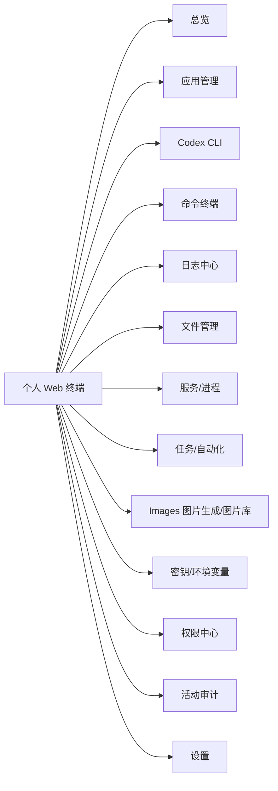
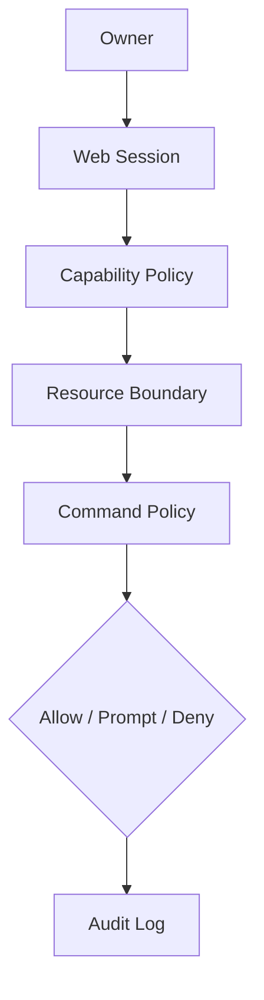

# 个人全面 Web 终端产品功能文档

文档日期：2026-06-04  
产品定位：面向个人使用的服务器 Web 控制台。它不是只管理 Codex CLI 的单点工具，而是一个长期演进的个人全面 Web 终端，用来在任何地方管理服务器上的自定义应用、命令执行、日志、文件、服务、自动化任务和 AI 代理能力。Codex CLI 是第一个接入模块。

## 1. 背景

用户有一台长期在线的 Linux 服务器，服务器上运行多个自定义应用。过去的操作入口主要依赖 SSH、tmux、shell 脚本和零散的管理命令。这个项目要把这些能力收敛成一个 Web 产品：

- 在任何设备上打开浏览器即可管理服务器。
- 每个自定义应用都有清晰的状态、日志、操作入口和历史。
- 命令、AI 代理、文件、进程、部署、定时任务逐步统一到同一个控制台。
- 关键操作必须有边界、可追踪。
- 第一阶段重点接入已经手动安装好的 Codex CLI，让 Web 上可以稳定使用 Codex。

## 2. 产品目标

### 2.1 核心目标

- 提供个人服务器的统一 Web 操作入口。
- 管理多个应用目录、服务、日志和任务。
- 在 Web 上使用 Codex CLI，包括会话、一次性任务、实时输出、审批和历史。
- 建立良好的权限管理系统，保护服务器路径、命令和密钥。
- 提供年轻化、现代感、色彩丰富的前端体验，同时保持运维工具的高效率。
- 浏览器断开后，长任务仍可继续运行并恢复查看。

### 2.2 非目标

- 不做多租户 SaaS。
- 不做团队协作权限系统。
- 不替代服务器初始化和基础运维。
- 不负责自动安装 Codex CLI，用户会在服务器上手动安装。
- 不直接暴露服务器 shell、Codex app-server 或内部服务到公网。
- 不在第一版实现完整 IDE。

## 3. 产品原则

- **个人优先**：所有设计默认服务单个 owner，不引入组织、租户、团队、成员等复杂概念。
- **能力可扩展**：Codex CLI 是第一个模块，后续模块应能以插件式方式加入。
- **默认安全**：任何能修改系统、删除数据、泄露密钥、访问外部网络的操作都必须经过明确的权限边界。
- **上下文连续**：会话、任务、日志、审批和文件变更都要可恢复。
- **操作透明**：用户必须知道系统正在执行什么、在哪个目录执行、影响什么资源。
- **视觉有活力**：不是传统后台模板，应该有鲜明的个人工具气质。

## 4. 用户画像和使用场景

### 4.1 用户画像

个人开发者或独立产品维护者，有一台或多台自管服务器，服务器上部署了多个自定义应用，希望在手机、平板、公司电脑或临时设备上快速管理这些应用。

### 4.2 核心场景

1. 在外面用手机打开 Web 终端，查看某个应用是否异常。
2. 选择一个应用，让 Codex 分析日志并给出修复建议。
3. 在 Web 上启动一次 Codex 会话，修改代码或配置，然后查看 diff。
4. 查看应用日志、进程状态、端口占用和最近部署记录。
5. 发起一个安全的只读命令，例如 `git status`、`tail log`。
6. 受限命令根据策略被允许、提示确认或拒绝。
7. 浏览器刷新或断线后，重新进入同一个任务继续查看输出。
8. 查看过去一周对某个应用执行过哪些操作。
9. 使用 Images 生成图片后，在图片库中查看、下载、删除之前生成的图片和上传参考图，并查看每张图片的模型、prompt、引用关系和存储位置。

## 5. 产品模块地图

第一阶段只需要完整落地 `Dashboard`、`Apps`、`Codex`、`Permissions`、`Audit` 的基础能力。其他模块先在产品文档中预留。

## 6. 信息架构

### 6.1 顶部状态栏

展示全局状态：

- 当前服务器。
- 当前应用。
- 当前任务状态。
- 待审批数量。
- Codex CLI 状态。
- 系统负载简要指标。
- 当前权限模式。

### 6.2 左侧主导航

- 总览。
- 应用。
- Codex。
- 终端。
- 日志。
- 文件。
- 服务。
- 任务。
- Images。
- 权限。
- 活动。
- 设置。

第一版可隐藏未实现模块，但导航结构要预留。

### 6.3 主工作区

根据模块展示不同操作界面：

- 总览卡片。
- 应用详情。
- Codex 会话。
- 一次性任务。
- 审批列表。
- 活动时间线。

### 6.4 右侧上下文栏

展示当前对象的上下文：

- 应用路径。
- Git 分支与工作区状态。
- 当前权限 profile。
- 最近命令。
- 最近文件变更。
- 关联日志。
- Token usage 或资源消耗。

### 6.5 Images 图片库

Images 是独立能力域，不属于 Codex、文件管理或通用设置。

功能边界：

- `Generate` 负责生成任务。
- `Library` 负责管理图片资产，包含已生成图片和上传参考图，支持放大查看、下载、删除、归档到 S3、私密收藏夹和右侧元数据 inspector。
- `History` 负责按 generation job 查看调用记录、失败原因和参数摘要。
- `Settings` 负责 xAI provider、默认参数和 Images 自己的图片存储设置。

图片库默认使用本地保存；当 Images Settings 配置 S3 API 兼容对象存储后，生成结果和上传参考图应优先保存到对象存储，减少服务器本地磁盘长期占用。这里的 S3 表示协议兼容，可以是阿里云 OSS、腾讯云 COS、MinIO、R2 等兼容服务，不要求真实 AWS S3。已存在本地的图片资产应支持归档到 S3。S3 bucket 不要求公开读，读取和下载默认由后端代理完成。

图片库支持私密收藏夹：Owner 可以将任意图片资产设为私密，普通图片库默认隐藏私密图片；进入私密收藏夹必须重新输入 owner 登录密码，解锁只对当前 Web session 短期有效。详细设计见 [images-library-feature-design.md](./images-library-feature-design.md)。

## 7. 权限管理系统

权限系统是产品的核心基础能力。虽然产品是个人使用，不需要多租户，但仍需要完整的访问控制、操作边界和审计。

### 7.1 权限模型定位

不做复杂 RBAC，不设计组织、租户、团队和成员。采用单 owner + 能力策略 + 资源边界 + 命令策略模型。

### 7.2 身份认证

第一版必须有登录保护。

功能：

- Owner 账号登录。
- 密码登录。
- Session 过期。
- 退出登录。
- 登录失败限流：连续 N 次失败后必须进入 backoff，且同时按账号和 IP 两个维度计数，避免单 IP 暴力猜测或单账号分布式重试。
- CSRF 防护。

登录失败限流要求：

- N 应为可配置值，默认建议为 5 次。
- 同一 IP 连续失败达到阈值后，该 IP 的登录请求进入指数退避或固定冷却窗口。
- 同一用户名连续失败达到阈值后，该用户名同样进入退避，避免攻击者轮换 IP。
- 成功登录后可以清理该账号的失败计数，但不应立即清理 IP 维度的异常窗口。
- 被限流的登录尝试必须写入 audit 摘要，不记录密码明文。

建议后续加入：

- Passkey。
- 恢复码。
- 临时访问 token。

### 7.3 能力权限

系统按能力控制，而不是按用户角色控制。

能力示例：

- `app.read`：查看应用。
- `app.write`：编辑应用配置。
- `codex.run`：运行 Codex 会话。
- `codex.write`：允许 Codex 修改工作区。
- `shell.readonly`：运行只读命令。
- `shell.write`：运行可能修改文件的命令。
- `file.read`：查看文件。
- `file.write`：编辑文件。
- `service.read`：查看进程和服务。
- `service.control`：重启、停止服务。
- `secret.read`：读取密钥，默认关闭。
- `secret.write`：写入密钥。
- `permission.manage`：修改权限策略。

个人模式下这些能力不分配给不同用户，而是绑定到：

- 当前应用是否允许。
- 当前权限 profile。
- 命令策略结果。

### 7.4 资源边界

资源边界定义系统可以操作哪里。

资源类型：

- 应用目录。
- 日志文件。
- 配置文件。
- systemd service。
- 端口。
- 任务脚本。
- 密钥项。

路径规则：

- 所有路径必须经过后端规范化。
- 只允许访问配置的根目录下的应用。
- 默认拒绝 `/`、`/etc`、`/var`、`/home` 整体目录。
- 单个日志文件可以白名单授权。
- 单个 systemd service 可以白名单授权。
- secret 文件默认不可读，只能通过密钥管理模块引用。

### 7.5 权限 Profile

Profile 用来快速切换操作强度。

建议内置：

- `Observe`：只读观察。允许查看状态、日志、Git status、Codex 只读任务。
- `Maintain`：日常维护。允许在应用目录内修改文件、运行测试、重启白名单服务。
- `Deploy`：部署操作。允许执行白名单部署脚本、拉取代码、重启服务。
- `Admin`：管理操作。允许修改应用登记、权限策略和系统设置。

默认使用 `Observe`，每个应用可配置默认 profile。

### 7.6 命令策略

命令策略用于 shell、Codex 和自动化任务。

策略类型：

- Allow：直接允许。
- Prompt：执行前审批。
- Deny：直接拒绝。

维度：

- 命令前缀。
- 当前 cwd。
- 当前应用。
- 当前 profile。
- 是否需要网络。
- 是否写入工作区外路径。

示例：

- `git status`：Allow。
- `npm test`：Allow in workspace。
- `npm install`：Prompt。
- `rm -rf`：Prompt 或 Deny。
- `sudo`：Deny by default。
- `curl | sh`：Deny by default。

### 7.7 审批机制

虽然是个人使用，审批仍然有价值，因为它是防误操作和远程访问保护。

审批触发：

- Codex 请求越权。
- 命令命中 Prompt 策略。

审批展示：

- 操作类型。
- 命令内容。
- 工作目录。
- 目标资源。
- 命中规则。
- 可能影响。

审批动作：

- 允许一次。
- 本会话允许。
- 拒绝。
- 终止任务。

### 7.8 审计日志

所有权限相关操作必须记录。

记录：

- 登录和退出。
- 权限 profile 切换。
- 命令执行。
- Codex turn。
- 文件变更。
- 服务控制。
- 审批决策。
- 被拒绝操作。
- 设置变更。

审计要求：

- 可按应用、类型、时间过滤。
- 记录不可由普通 UI 静默删除。
- 敏感字段脱敏。
- 支持导出。

## 8. 功能清单

### 8.1 总览 Dashboard

目标：打开页面后快速知道服务器和应用是否正常。

功能：

- 服务器在线状态。
- CPU、内存、磁盘简要状态。
- 应用健康摘要。
- 最近异常日志。
- 正在运行的任务。
- 待审批操作。
- 最近 Codex 会话。
- 快速入口：新建 Codex 会话、查看日志、运行只读检查。

### 8.2 应用管理

目标：把服务器上的自定义应用登记成可管理对象。

功能：

- 新增应用。
- 编辑应用名称、路径、描述、标签。
- 启用或停用应用。
- 配置默认权限 profile。
- 配置关联日志文件。
- 配置关联 systemd service。
- 配置常用命令。
- 查看 Git 状态。
- 查看最近活动。

应用字段：

- 名称。
- 路径。
- 类型，例如 Node、Python、Go、Static、Other。
- 标签。
- 默认 profile。
- 关联服务。
- 关联日志。
- 是否允许 Codex 写入。
- 是否允许部署操作。

### 8.3 Codex CLI 模块

目标：把已安装的 Codex CLI 变成可远程使用的 Web 功能。

状态管理：

- 检测 `codex` 命令是否存在。
- 显示 Codex CLI 版本。
- 检测登录状态。
- 检测配置目录可读性。
- 检测 app-server 或 exec 模式可用性。
- 提供重新检测。

会话功能：

- 创建新会话。
- 选择应用后创建会话。
- 输入 prompt。
- 流式展示回复。
- 展示命令执行、文件变更、错误和最终输出。
- 支持中断任务。
- 支持恢复历史会话。
- 支持归档会话。

一次性任务：

- 适合总结、审查、日志分析、报告生成。
- 默认只读。
- 支持保存最终结果。
- 可升级为长期会话。

Codex 权限：

- 默认只允许操作当前应用目录。
- 默认不允许 full access。
- Codex 请求越界时进入审批。
- Codex 产生的文件变更进入 diff 查看。

### 8.4 命令终端模块

目标：提供比 SSH 更受控的命令执行入口。

第一版可只做预留，后续实现：

- 运行白名单命令。
- 命令模板。
- 实时 stdout/stderr。
- 命令历史。
- cwd 固定在应用目录。
- 命令策略匹配。

不建议第一版实现任意 shell，因为任意 shell 会显著扩大安全面。

### 8.5 日志中心

目标：集中查看应用日志，并能交给 Codex 分析。

功能：

- 查看应用关联日志。
- tail 实时日志。
- 关键词搜索。
- 错误高亮。
- 时间范围过滤。
- 一键发送给 Codex 分析。
- 保存分析结果。

### 8.6 文件管理

目标：提供受控的文件查看和 diff 能力。

第一版建议只读：

- 文件树。
- 文件内容预览。
- 当前 Git diff。
- Codex 变更文件列表。
- 复制路径。

后续再加入编辑、上传、删除和回滚。

### 8.7 服务和进程

目标：查看和控制应用运行状态。

后续功能：

- 查看 systemd service 状态。
- 查看进程。
- 查看端口。
- 重启白名单服务。
- 查看最近启动失败日志。

### 8.8 任务和自动化

目标：把常用操作变成可重复任务。

后续功能：

- 任务模板。
- 手动执行任务。
- 定时任务。
- 任务运行历史。
- 失败通知。
- 任务前后检查。

### 8.9 密钥和环境变量

目标：集中管理应用运行所需的敏感配置。

第一版可以只做引用和脱敏展示，不直接编辑。

规则：

- secret 默认不可明文展示。
- 命令输出和日志中自动脱敏。
- Codex 默认不能读取 secret。

### 8.10 活动记录

目标：所有关键行为都有历史。

功能：

- 时间线视图。
- 按应用过滤。
- 按模块过滤。
- 按策略结果过滤。
- 查看事件详情。
- 查看关联会话、命令、审批和文件变更。

## 9. UI 和交互设计

### 9.1 Design Read

这是一个个人开发者的远程运维 cockpit，不是传统企业后台。视觉方向应年轻、鲜明、现代、有能量，但不能牺牲信息密度和操作确定性。

建议设计参数：

- `DESIGN_VARIANCE`: 7
- `MOTION_INTENSITY`: 5
- `VISUAL_DENSITY`: 7

含义：

- 布局比普通后台更有个性。
- 动效用于状态变化、流式事件、面板切换，不做无意义炫技。
- 信息密度偏高，因为这是运维和开发工具。

### 9.2 视觉语言

关键词：

- 年轻。
- 彩色。
- 清爽。
- 高对比。
- Devtool。
- 轻微游戏 HUD 感。
- 玻璃感和霓虹感少量使用。

避免：

- 全站灰白后台模板。
- AI 紫蓝渐变堆满页面。
- 大面积深蓝/ slate 单色。
- 营销页 hero。
- 卡片套卡片。
- 只靠阴影区分层级。

### 9.3 色彩方向

推荐使用深浅混合界面：

- 基础背景：近黑、深墨绿、深炭灰或浅色冷灰。
- 主强调色：电光青、酸橙绿、热粉、琥珀橙中选一到两个。
- 状态色：成功绿、警告黄、危险红、信息蓝。
- 应用标签可以使用多彩 token，但操作按钮保持一致。

建议第一版调性：

- 背景：深炭灰 + 局部浅色面板。
- 主强调：电光青。
- 次强调：酸橙绿或热粉。
- 危险操作：高饱和红。
- 审批等待：琥珀黄。

色彩使用规则：

- CTA 和当前活动状态用主强调色。
- 受限操作和审批必须使用稳定语义色，不随主题乱变。
- 同一操作类型在全站颜色一致。
- 多彩用于模块识别和状态，不用于干扰正文阅读。

### 9.4 布局

推荐桌面布局：

- 左侧窄导航。
- 顶部全局状态条。
- 中央主工作区。
- 右侧上下文栏。
- 底部或主区固定输入 composer。

移动端布局：

- 顶部应用切换。
- 主区优先展示当前任务。
- 底部 tab：总览、应用、Codex、审批、活动。
- 审批按钮必须单手可触达。

### 9.5 组件风格

组件要求：

- 圆角统一，建议 10-14px。
- 按钮使用图标 + 短文本。
- 受限操作使用明确图标和颜色。
- 卡片只用于独立对象，不做页面大包裹。
- 表格少用，优先使用列表、时间线、分栏详情。
- 事件流用紧凑 timeline。
- 命令输出使用 monospace 区块，默认折叠。

### 9.6 动效

动效用于增强反馈：

- 任务开始。
- Codex 流式输出。
- 命令状态变化。
- 审批出现。
- 错误发生。
- 面板切换。

动效要求：

- 持续时间短。
- 不影响阅读命令输出。
- 支持 `prefers-reduced-motion`。
- 不用无限循环装饰动画。

### 9.7 关键交互

Codex 输入区：

- 支持多行输入。
- 支持选择应用。
- 支持选择权限 profile。
- 发送前展示当前 cwd。
- running 状态下输入变成 steer 或排队，具体交互后续确认。

审批弹窗：

- 不做普通 confirm。
- 展示命令、cwd、命中规则和影响范围。
- 主要按钮和危险按钮位置清晰。

事件流：

- Agent 回复、命令、文件变更、审批、错误分不同视觉类型。
- 命令输出默认折叠。
- 错误自动展开。
- 可快速跳到最后。

应用切换：

- 应用颜色 token 固定。
- 切换应用时保留当前会话状态。
- 当前应用在顶部、侧栏和输入区都要清楚可见。

## 10. 关键页面

### 10.1 登录页

内容：

- 产品名。
- 用户名。
- 密码。

风格：

- 简洁但有视觉识别度。
- 可使用深色背景和鲜明高亮线条。
- 不放营销文案。

### 10.2 总览页

内容：

- 服务器状态。
- 应用健康。
- 正在运行任务。
- 待审批。
- 最近活动。
- 快速操作。

### 10.3 应用详情页

内容：

- 应用状态。
- Git 状态。
- 日志入口。
- Codex 快捷入口。
- 常用命令。
- 最近活动。

### 10.4 Codex 会话页

内容：

- 会话列表。
- 当前会话事件流。
- 输入 composer。
- 文件变更。
- 当前权限 profile。
- 中断、归档、复制结果。

### 10.5 权限中心

内容：

- 当前全局权限策略。
- 应用级权限。
- 命令策略。
- 待审批。
- 审批历史。

### 10.6 活动审计页

内容：

- 时间线。
- 过滤器。
- 事件详情。
- 关联资源跳转。

## 11. MVP 范围

### 11.1 必须实现

- 登录保护。
- 总览页基础状态。
- 应用目录登记。
- Codex CLI 状态检测。
- Codex 一次性任务。
- Codex 会话执行。
- 实时事件展示。
- 任务中断。
- 会话历史。
- 基础权限 profile。
- 基础命令策略。
- 审批中心。
- 活动审计。

### 11.2 可以延后

- 任意 shell 终端。
- Web 文件编辑。
- 服务重启。
- 定时任务。
- 密钥编辑。
- 多服务器节点。
- Passkey 和 TOTP。
- Web 触发 Codex 登录。
- Web 触发 Codex 安装。

## 12. 成功指标

MVP 成功标准：

- 不 SSH 到服务器，也能通过 Web 完成一次 Codex 任务。
- 至少管理 3 个应用目录。
- 浏览器刷新后能恢复任务输出。
- 活动历史能查到会话、命令、审批和错误。
- 页面在桌面端有清晰现代感，不像默认后台模板。
- 移动端至少能查看状态、发送 Codex prompt、处理审批。

## 13. 迭代顺序

### Phase 1：个人控制台骨架

- 登录。
- 总览。
- 应用管理。
- 权限 profile。
- 活动审计。

### Phase 2：Codex Web 化

- Codex CLI 状态检测。
- 一次性任务。
- 会话任务。
- 实时事件流。
- 中断和历史恢复。

### Phase 3：权限和审批增强

- 命令策略。
- 审批中心。

### Phase 4：服务器管理能力

- 日志中心。
- 文件只读浏览。
- 服务状态。
- 命令模板。
- 任务自动化。

### Phase 5：高级个人工作台

- 多服务器。
- 通知。
- 移动端优化。
- 密钥管理。
- 部署流水线。

## 14. 开放问题

- Web 登录使用内置账号密码，还是依赖反向代理认证。
- 第一版是否需要支持公网访问，还是只面向 VPN/内网。
- 是否允许非 Git 应用目录被 Codex 修改。
- Codex running 状态下的新输入是 steer 当前 turn，还是排队为下一 turn。
- 是否需要从第一版开始保存完整 stdout/stderr。
- UI 主题是否优先做深色，还是深浅双主题。
- 是否需要一开始就支持多服务器。
