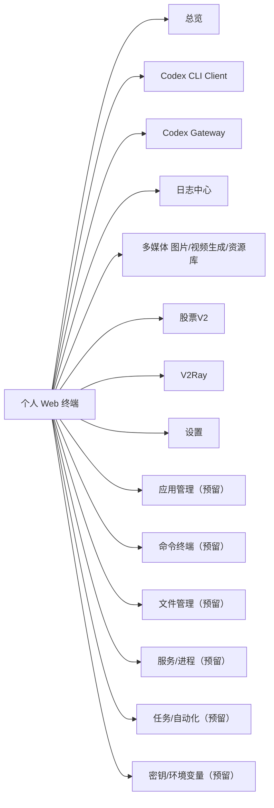
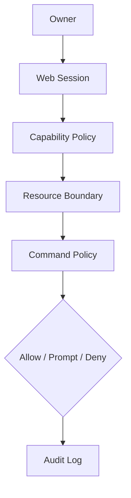

# 个人全面 Web 终端产品功能文档

文档日期：2026-06-07
产品定位：面向个人使用的服务器 Web 控制台。它是一个长期演进的个人全面 Web 终端，用来在任何地方管理服务器上的自定义应用、命令执行、日志、文件、服务、自动化任务和 AI 代理能力。当前能力域包括控制台总览、Codex、Codex Gateway、日志中心、多媒体图片/视频生成、股票V2、V2Ray 和全局设置。

Codex 和 Codex Gateway / OpenAI Gateway 是两个并列的独立能力域：

- `Codex` 依赖部署机本地安装的 `codex` CLI，为 owner 提供接近 Codex 桌面客户端的会话、工作区、审批、事件恢复和诊断能力，详细范围以 [codex-cli-client-feature-design.md](./codex-cli-client-feature-design.md) 为准；当前 UI 改造优先遵循 [codex-desktop-like-web-client-plan.md](./codex-desktop-like-web-client-plan.md)，即默认进入像 Codex Desktop 一样写代码的三栏工作台，而不是管理台式多 tab 首页。
- `Codex Gateway` 把 Codex/OpenAI 兼容能力暴露成远程 OpenAI 协议 API，详细范围以 [codex-openai-gateway-feature-design.md](./codex-openai-gateway-feature-design.md) 为准。

旧版 Codex 客户端代码已移除，但 SQLite 中可能仍有残留旧表或旧事件。新版 Codex 模块必须使用新的表名前缀和兼容迁移策略，不复用旧实现假设。

## 1. 背景

用户有一台长期在线的 Linux 服务器，服务器上运行多个自定义应用。过去的操作入口主要依赖 SSH、tmux、shell 脚本和零散的管理命令。这个项目要把这些能力收敛成一个 Web 产品：

- 在任何设备上打开浏览器即可管理服务器。
- 每个自定义应用都有清晰的状态、日志、操作入口和历史。
- 命令、AI 代理、文件、进程、部署、定时任务逐步统一到同一个控制台。
- 关键操作必须有边界、可追踪。

## 2. 产品目标

### 2.1 核心目标

- 提供个人服务器的统一 Web 操作入口。
- 当部署机安装 `codex` CLI 时，通过 Codex 模块提供受控的 Web 会话客户端能力。
- 通过 Codex Gateway 把本地 Codex/OpenAI 兼容能力暴露成可远程调用的 OpenAI 协议 API。
- 集中查看服务和应用日志，提供多媒体图片/视频生成和 V2Ray 管理能力。
- 建立良好的权限管理系统，保护服务器路径、命令和密钥。
- 提供 Quiet Agent Workbench / Quiet DevOps Control Plane 风格的前端体验：安静、克制、工程化、高效率。
- 浏览器断开后，长任务仍可继续运行并恢复查看。

### 2.2 非目标

- 不做多租户 SaaS。
- 不做团队协作权限系统。
- 不替代服务器初始化和基础运维。
- 不重新实现 Codex 模型、认证、sandbox、MCP、skills 或 AGENTS.md 发现机制。
- 不直接暴露服务器 shell 或内部服务到公网。
- 不在第一版实现完整 IDE。

## 3. 产品原则

- **个人优先**：所有设计默认服务单个 owner，不引入组织、租户、团队、成员等复杂概念。
- **能力可扩展**：Codex、Codex Gateway、多媒体、V2Ray、日志中心是独立模块，后续能力应作为独立模块或清晰子域加入。
- **默认安全**：任何能修改系统、删除数据、泄露密钥、访问外部网络的操作都必须经过明确的权限边界。
- **上下文连续**：任务、日志、事件和配置变更都要可恢复。
- **操作透明**：用户必须知道系统正在执行什么、影响什么资源。
- **视觉克制**：不是营销页或装饰型 dashboard，应保持低噪音、工程化、可扫描的个人工具气质。

## 4. 用户画像和使用场景

### 4.1 用户画像

个人开发者或独立产品维护者，有一台或多台自管服务器，服务器上部署了多个自定义应用，希望在手机、平板、公司电脑或临时设备上快速管理这些应用。

### 4.2 核心场景

1. 在外面用手机打开 Web 终端，查看服务和应用是否异常。
2. 在 Codex 中打开服务器上的项目，让本机 `codex` CLI 读取仓库、运行受控任务并保留可恢复会话。
3. 在 Codex 中处理审批请求、中断长任务，或刷新后继续查看事件流。
4. 在 Codex Gateway 中管理上游账号、public API key 和模型目录，并查看请求日志。
5. 用外部客户端通过 Gateway 的 OpenAI 协议 API 调用本地能力。
6. 查看服务日志、应用日志和运行事件，定位异常。
7. 浏览器刷新或断线后，重新进入同一个任务继续查看输出。
8. 查看过去一段时间执行过哪些关键操作。
9. 使用多媒体模块生成图片或视频后，在资源库中查看、下载、删除之前生成的资源和上传参考图，并查看每个资源的模型、提示词、引用关系和存储位置。
10. 配置并启停 V2Ray，查看运行状态和事件。

## 5. 产品模块地图

第一阶段完整落地 `Dashboard`、`Codex`、`Codex Gateway`、`Logs`、`多媒体`、`股票V2`、`V2Ray`、`Settings`。`Codex`、`Codex Gateway` 和 `股票V2` 是并列独立能力域，作为一级导航存在。其他模块先在产品文档中预留。

## 6. 信息架构

### 6.1 顶部状态栏

展示全局状态：

- 当前服务器。
- Codex CLI installed/auth/sandbox/app-server 摘要。
- Gateway enabled / API key / active accounts 摘要。
- 多媒体和 V2Ray 运行摘要。
- 系统负载简要指标。

### 6.2 左侧主导航

- 总览。
- Codex。
- Codex Gateway。
- 日志。
- 多媒体。
- 股票。
- V2Ray。
- 设置。

第一版可隐藏未实现模块，但导航结构要预留。

### 6.3 主工作区

根据模块展示不同操作界面：

- 总览卡片。
- Codex 会话、工作区、审批和诊断。
- Gateway 账号、模型和请求日志。
- 日志源列表和查看器。
- 多媒体生成和资源库。
- 股票机会、账户/仓位、数据底座、策略、后台监控、Review、操作确认和复盘记忆。
- V2Ray 配置和运行状态。

### 6.4 右侧上下文栏

展示当前对象的上下文：

- 当前对象状态。
- 关联日志。
- 关联事件。
- 资源消耗或运行指标。
- Codex 当前会话的 workspace、权限、审批和运行诊断。

### 6.5 多媒体生成与资源库

多媒体是独立能力域，不属于文件管理或通用设置。历史实现和 API/event 命名中可能仍保留 `images` 前缀，这是兼容旧数据、旧路由和旧事件的实现细节；面向用户的导航和文案使用“多媒体”。

功能边界：

- `Generate` 负责图片、视频、多图编辑和关键帧生成任务。
- `Library` 负责管理图片/视频资源资产，包含已生成资源、上传参考图和手动上传图片，支持内容去重、放大查看、播放、下载、删除、归档到对象存储、私密收藏夹、快捷用于图生图/图生视频/多图编辑/关键帧和右侧元数据 inspector。
- `History` 负责按 generation job 查看调用记录、失败原因、参数摘要、输出资源和诊断入口。
- `生成预设` 负责保存可复用的提示词、模型、模式和常用参数组合；默认不保存参考图引用，避免私密资源和历史资产被隐式复用。
- `Settings` 负责 xAI / Agnes provider、默认参数和多媒体自己的资源存储设置。

资源库默认使用本地保存；当多媒体 Settings 配置 S3 API 兼容对象存储或共享对象存储 profile 后，生成结果、上传参考图和手动上传图应优先保存到对象存储，减少服务器本地磁盘长期占用。保存前应按内容 checksum 做去重，命中已有公开资产时复用，不重复写本地或对象存储。这里的 S3 表示协议兼容，可以是阿里云 OSS、腾讯云 COS、MinIO、R2 等兼容服务，不要求真实 AWS S3。已存在本地的资源资产应支持归档到对象存储。bucket 不要求公开读，读取和下载默认由后端代理完成。

资源库支持私密收藏夹：Owner 可以将任意图片或视频资产设为私密，普通资源库默认隐藏私密资产；进入私密收藏夹必须重新输入 owner 登录密码，解锁只对当前 Web session 短期有效。详细设计见 [images-library-feature-design.md](./images-library-feature-design.md)。

## 7. 权限管理系统

权限系统是产品的核心基础能力。虽然产品是个人使用，不需要多租户，但仍需要完整的访问控制、操作边界和审计。

### 7.1 权限模型定位

不做复杂 RBAC，不设计组织、租户、团队和成员。采用单 owner + 能力策略 + 资源边界 + 命令策略模型。

### 7.2 身份认证

第一版必须有登录保护。

功能：

- Owner 账号登录。
- 密码登录。
- Session 过期。
- 退出登录。
- 登录失败限流：连续 N 次失败后必须进入 backoff，且同时按账号和 IP 两个维度计数，避免单 IP 暴力猜测或单账号分布式重试。
- CSRF 防护。

登录失败限流要求：

- N 应为可配置值，默认建议为 5 次。
- 同一 IP 连续失败达到阈值后，该 IP 的登录请求进入指数退避或固定冷却窗口。
- 同一用户名连续失败达到阈值后，该用户名同样进入退避，避免攻击者轮换 IP。
- 成功登录后可以清理该账号的失败计数，但不应立即清理 IP 维度的异常窗口。
- 被限流的登录尝试必须写入 audit 摘要，不记录密码明文。

建议后续加入：

- Passkey。
- 恢复码。
- 临时访问 token。

### 7.3 能力权限

系统按能力控制，而不是按用户角色控制。

能力示例：

- `app.read`：查看应用。
- `app.write`：编辑应用配置。
- `shell.readonly`：运行只读命令。
- `shell.write`：运行可能修改文件的命令。
- `file.read`：查看文件。
- `file.write`：编辑文件。
- `service.read`：查看进程和服务。
- `service.control`：重启、停止服务。
- `secret.read`：读取密钥，默认关闭。
- `secret.write`：写入密钥。
- `permission.manage`：修改权限策略。

个人模式下这些能力不分配给不同用户，而是绑定到：

- 当前资源是否允许。
- 路径是否落在允许根目录内。
- 命令策略结果。

### 7.4 资源边界

资源边界定义系统可以操作哪里。

资源类型：

- 应用目录。
- 日志文件。
- 配置文件。
- systemd service。
- 端口。
- 任务脚本。
- 密钥项。

路径规则：

- 所有路径必须经过后端规范化。
- 只允许访问配置的允许根目录下的资源。
- 默认拒绝 `/`、`/etc`、`/var`、`/home` 整体目录。
- 单个日志文件可以白名单授权。
- 单个 systemd service 可以白名单授权。
- secret 文件默认不可读，只能通过密钥管理模块引用。

### 7.5 执行边界

第一版不再引入额外权限分层。执行强度由更直接的边界控制：

- 操作路径必须落在允许根目录内。
- 部署、服务控制、敏感文件和系统级操作仍应通过命令策略、审批和审计控制。

### 7.6 命令策略

命令策略用于 shell 和后续自动化任务。

策略类型：

- Allow：直接允许。
- Prompt：执行前审批。
- Deny：直接拒绝。

维度：

- 命令前缀。
- 当前 cwd。
- 是否需要网络。
- 是否写入允许根目录外路径。

示例：

- `git status`：Allow。
- `npm test`：Allow in workspace。
- `npm install`：Prompt。
- `rm -rf`：Prompt 或 Deny。
- `sudo`：Deny by default。
- `curl | sh`：Deny by default。

### 7.7 审批机制

虽然是个人使用，审批仍然有价值，因为它是防误操作和远程访问保护。

审批触发：

- 命令命中 Prompt 策略。

审批展示：

- 操作类型。
- 命令内容。
- 工作目录。
- 目标资源。
- 命中规则。
- 可能影响。

审批动作：

- 允许一次。
- 拒绝。
- 终止任务。

### 7.8 审计日志

所有权限相关操作必须记录。

记录：

- 登录和退出。
- Codex workspace、thread、turn、审批和设置变更。
- Gateway 配置和账号变更。
- 多媒体生成和资产变更。
- 股票机会、账户/仓位、策略、后台监控、Review、提醒和人工操作变更。
- V2Ray 配置和控制。
- 命令执行。
- 审批决策。
- 被拒绝操作。
- 设置变更。

审计要求：

- 可按类型、时间过滤。
- 记录不可由普通 UI 静默删除。
- 敏感字段脱敏。
- 支持导出。

## 8. 功能清单

### 8.1 总览 Dashboard

目标：打开页面后快速知道服务器和各能力域是否正常。

功能：

- 服务器在线状态。
- CPU、内存、磁盘简要状态。
- Codex 摘要：CLI installed/auth/sandbox、app-server running/stopped、活跃会话、待审批、最近失败。
- Codex Gateway 摘要：enabled、API key、active accounts、最近请求。
- Images、股票和 V2Ray 运行摘要。
- 最近异常日志。
- 最近活动。
- 快速入口：Codex、Codex Gateway、Images、股票、V2Ray、查看日志。

### 8.2 应用管理

目标：把服务器上的自定义应用登记成可管理对象（预留模块）。

功能：

- 新增应用。
- 编辑应用名称、路径、描述、标签。
- 启用或停用应用。
- 配置关联日志文件。
- 配置关联 systemd service。
- 配置常用命令。
- 查看 Git 状态。
- 查看最近活动。

应用字段：

- 名称。
- 路径。
- 标签。
- 关联服务。
- 关联日志。
- 是否允许部署操作。

### 8.3 Codex 模块

目标：当部署机安装 `codex` CLI 时，为 owner 提供受控的 Web Codex 客户端能力。

本模块是独立能力域，详细范围以 [codex-cli-client-feature-design.md](./codex-cli-client-feature-design.md) 为准；当前 Codex 页面体验以 [codex-desktop-like-web-client-plan.md](./codex-desktop-like-web-client-plan.md) 为实现优先级。

功能：

- 探测 `codex` CLI 安装、版本、认证、sandbox、app-server 和 exec fallback 状态。
- 主程序定时检查 managed `codex app-server` 运行状态。
- 当 app-server 未启动或启动失败时，在 Codex 页面提供一键启动/重试启动按钮。
- 管理 Codex workspace，所有路径必须落在全局允许根目录内。
- 创建、恢复、继续、中断、归档和搜索 Codex 会话。
- 支持接近 Codex 桌面客户端的会话列表、项目分组、置顶、搜索、composer、模型和权限选择。
- 通过 `codex app-server` 提供长会话能力；不可用时降级到 `codex exec --json` 一次性任务。
- 将 Codex 原始事件归一化为稳定事件，写入事件表并通过 SSE 展示。
- 展示并恢复审批请求，审批决策进入 audit。
- 在模块内提供 Codex CLI 诊断和模块设置。

边界：

- 不安装或自动升级 `codex` CLI。
- 不读取、展示或托管 Codex token、cookie、`auth.json` 明文。
- 不使用 `--yolo` 或 full access 作为默认产品路径。
- 不从浏览器直接连接或启动 app-server；启动必须走后端受控 API。
- 不把 Codex 会话公开为 `/v1/*` API。
- 不把 Codex workspace、审批或诊断塞进通用 `设置` 页面。

### 8.4 Codex Gateway 模块

目标：把本地 Codex/OpenAI 兼容能力暴露成可远程调用的 OpenAI 协议 API。

本模块是独立能力域，详细范围以 [codex-openai-gateway-feature-design.md](./codex-openai-gateway-feature-design.md) 为准。

功能：

- 暴露 OpenAI-compatible `/v1/*` API（`/v1/models`、`/v1/chat/completions`、`/v1/responses`）。
- 管理上游 Codex/OpenAI 账号凭据（OAuth / token 导入），仅保存摘要。
- 管理 public API key，供外部客户端鉴权。
- 维护模型目录。
- 查看请求日志和连通性测试结果。

边界：

- 不绑定工作目录，不执行 shell，不修改文件。
- 上游凭据和 API key 不在前端回显明文。

### 8.5 命令终端模块

目标：提供比 SSH 更受控的命令执行入口。

第一版可只做预留，后续实现：

- 运行白名单命令。
- 命令模板。
- 实时 stdout/stderr。
- 命令历史。
- cwd 固定在应用目录。
- 命令策略匹配。

不建议第一版实现任意 shell，因为任意 shell 会显著扩大安全面。

### 8.6 日志中心

目标：集中查看服务和应用日志。

功能：

- 查看服务日志、应用关联日志和事件型日志。
- tail 实时日志。
- 关键词搜索。
- 错误高亮。
- 时间范围过滤。

详细设计见 [log-center-feature-design.md](./log-center-feature-design.md)。

### 8.7 文件管理

目标：提供受控的文件查看和 diff 能力（预留模块）。

第一版建议只读：

- 文件树。
- 文件内容预览。
- 当前 Git diff。
- 复制路径。

后续再加入编辑、上传、删除和回滚。

### 8.8 服务和进程

目标：查看和控制应用运行状态。

后续功能：

- 查看 systemd service 状态。
- 查看进程。
- 查看端口。
- 重启白名单服务。
- 查看最近启动失败日志。

### 8.9 任务和自动化

目标：把常用操作变成可重复任务。

后续功能：

- 任务模板。
- 手动执行任务。
- 定时任务。
- 任务运行历史。
- 失败通知。
- 任务前后检查。

### 8.10 密钥和环境变量

目标：集中管理应用运行所需的敏感配置。

第一版可以只做引用和脱敏展示，不直接编辑。

规则：

- secret 默认不可明文展示。
- 命令输出和日志中自动脱敏。

### 8.11 活动记录

目标：所有关键行为都有历史。

功能：

- 时间线视图。
- 按模块过滤。
- 按策略结果过滤。
- 查看事件详情。
- 查看关联命令、审批和配置变更。

## 9. UI 和交互设计

### 9.1 Design Read

这是一个个人开发者的远程运维和 agent 工作台，不是传统企业后台、营销页或装饰型 dashboard。视觉方向应安静、克制、工程化、可扫描，接近 Linear、Raycast、Cursor、Cloudflare dashboard 这类 devtool / control plane 审美。

建议设计参数：

- `DESIGN_VARIANCE`: 4
- `MOTION_INTENSITY`: 3
- `VISUAL_DENSITY`: 7

含义：

- 布局遵循稳定工作台结构，个性来自信息组织和细节完成度，而不是装饰。
- 动效只服务状态变化、流式事件、面板切换和加载反馈。
- 信息密度偏高，因为这是运维和开发工具，但聊天、终端和长任务页面要给阅读留出空间。

### 9.2 视觉语言

关键词：

- 安静。
- 中性。
- Devtool。
- 控制平面。
- 低噪音。
- 细边框。
- 稳定 inspector。
- Monospace 技术值。

避免：

- 营销页 hero。
- AI 紫蓝渐变。
- 玻璃拟态。
- 霓虹和游戏 HUD 感。
- 大插画和装饰动效。
- 大面积深蓝/ slate 单色。
- 高饱和彩色 dashboard。
- 卡片套卡片。
- 只靠阴影区分层级。

### 9.3 色彩方向

推荐使用浅色中性工作台：

- 基础背景：白色、浅灰、冷中性边框。
- 主文字：近黑。
- 次要文字：中性灰。
- 主强调色：一个克制蓝色或青色，只用于当前焦点和主操作。
- 状态色：成功绿、警告橙、危险红、信息蓝。

色彩使用规则：

- 当前活动状态、主按钮和 focus ring 使用同一主强调色。
- 受限操作和审批必须使用稳定语义色，不随主题乱变。
- 同一操作类型在全站颜色一致。
- 模块识别可以使用小面积 token，不使用大面积彩色背景。

### 9.4 布局

推荐桌面布局：

- 左侧窄导航。
- 顶部全局状态条。
- 中央主工作区。
- 右侧上下文栏。
- 底部或主区固定输入 composer。

移动端布局：

- 顶部模块切换。
- 主区优先展示当前任务。
- 底部 tab：总览、Codex、Codex Gateway、日志、Images、V2Ray。
- 关键操作按钮必须单手可触达。

### 9.5 组件风格

组件要求：

- 圆角统一，建议 6-8px。
- 按钮使用图标 + 短文本。
- 受限操作使用明确图标和颜色。
- 卡片只用于独立对象，不做页面大包裹。
- 数据密集区域可以使用表格；会话、事件和诊断优先使用列表、时间线、分栏详情。
- 事件流用紧凑 timeline。
- 命令输出使用 monospace 区块，默认折叠。

### 9.6 动效

动效用于增强反馈：

- 任务开始。
- 流式事件输出。
- 运行状态变化。
- 错误发生。
- 面板切换。

动效要求：

- 持续时间短。
- 不影响阅读命令输出。
- 支持 `prefers-reduced-motion`。
- 不用无限循环装饰动画。

### 9.7 关键交互

事件流：

- 运行事件、请求日志、错误分不同视觉类型。
- 命令输出默认折叠。
- 错误自动展开。
- 可快速跳到最后。

模块切换：

- 切换模块时保留当前视图状态。
- 当前模块在顶部和侧栏都要清楚可见。
- 模块内二级导航使用小字号、细边框和低对比选中态。

## 10. 关键页面

### 10.1 登录页

内容：

- 产品名。
- 用户名。
- 密码。

风格：

- 简洁但有视觉识别度。
- 使用中性浅色背景、清晰表单和低噪音焦点态。
- 不放营销文案。

### 10.2 总览页

内容：

- 服务器状态。
- Codex CLI 状态、活跃会话和待审批摘要。
- Codex Gateway 摘要。
- Images 和 V2Ray 运行摘要。
- 最近活动。
- 快速操作。

### 10.3 Codex 页

内容：

- 新对话、搜索、置顶和最近会话。
- Workspace 列表和信任状态。
- app-server 状态条：running、starting、stopped、failed、degraded，以及一键启动按钮。
- 当前 thread 消息流、事件流和 composer。
- 模型、权限和 workspace 选择。
- 待审批请求。
- 右侧 inspector 展示 Git、CLI、sandbox、运行状态和最近错误。
- Codex CLI 安装、认证、app-server runtime、exec fallback 和 sandbox 诊断。

### 10.4 Codex Gateway 页

内容：

- Gateway enabled 状态和 public API key。
- 上游账号列表和凭据摘要。
- 模型目录。
- 请求日志。
- 连通性测试入口。

### 10.5 日志中心页

内容：

- 日志源列表。
- 日志内容查看器。
- 右侧 inspector。

### 10.6 权限中心

内容：

- 当前全局权限策略。
- 应用级权限。
- 命令策略。
- 待审批。
- 审批历史。

### 10.7 活动审计页

内容：

- 时间线。
- 过滤器。
- 事件详情。
- 关联资源跳转。

## 11. MVP 范围

### 11.1 必须实现

- 登录保护。
- 总览页基础状态。
- Codex CLI Client 基础：安装探测、app-server 定时检查和一键启动、workspace、thread、turn、事件恢复、审批和中断。
- Codex Gateway public API、账号、模型和请求日志。
- 日志中心源列表和只读 tail。
- 多媒体图片/视频生成和资源库。
- V2Ray 配置和运行控制。
- 实时事件展示。
- 活动审计。

### 11.2 可以延后

- 任意 shell 终端。
- Codex Cloud 任务编排。
- Codex Desktop 启动器。
- Codex 会话多人协作。
- 应用目录登记。
- Web 文件编辑。
- 服务重启。
- 定时任务。
- 密钥编辑。
- 多服务器节点。
- Passkey 和 TOTP。

## 12. 成功指标

MVP 成功标准：

- 不 SSH 到服务器，也能通过 Web 管理 Codex、Codex Gateway、日志、多媒体和 V2Ray。
- 部署机安装并登录 `codex` CLI 后，owner 能在 Web 中创建、恢复和中断 Codex 会话，并处理审批。
- 外部客户端能通过 Gateway 的 OpenAI 协议 API 调用本地能力。
- 浏览器刷新后能恢复任务输出。
- 活动历史能查到关键操作、配置变更和错误。
- 页面在桌面端有清晰现代感，不像默认后台模板。
- 移动端至少能查看状态和处理关键操作。

## 13. 迭代顺序

### Phase 1：个人控制台骨架

- 登录。
- 总览。
- 事件存储和 SSE。
- 活动审计。

### Phase 2：核心能力域

- Codex CLI Client。
- Codex Gateway。
- 多媒体图片/视频生成和资源库。
- 股票V2。
- V2Ray 配置和运行控制。
- 日志中心。

### Phase 3：权限和审批增强

- 命令策略。
- 审批中心。

### Phase 4：服务器管理能力

- 应用目录登记。
- 文件只读浏览。
- 服务状态。
- 命令模板。
- 任务自动化。

### Phase 5：高级个人工作台

- 多服务器。
- 通知。
- 移动端优化。
- 密钥管理。
- 部署流水线。

## 14. 开放问题

- Web 登录使用内置账号密码，还是依赖反向代理认证。
- 第一版是否需要支持公网访问，还是只面向 VPN/内网。
- UI 主题是否优先做深色，还是深浅双主题。
- 是否需要一开始就支持多服务器。
