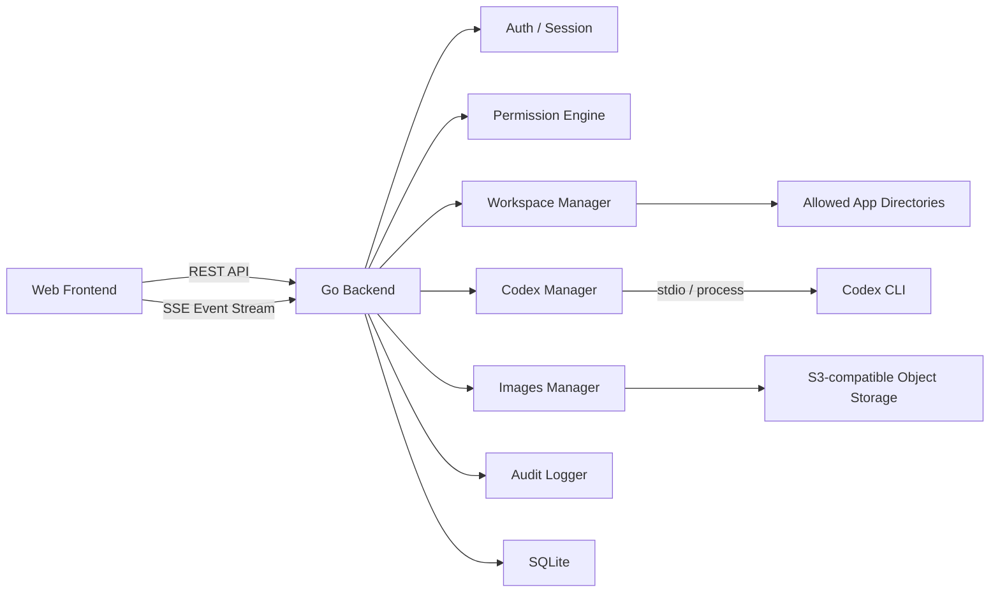
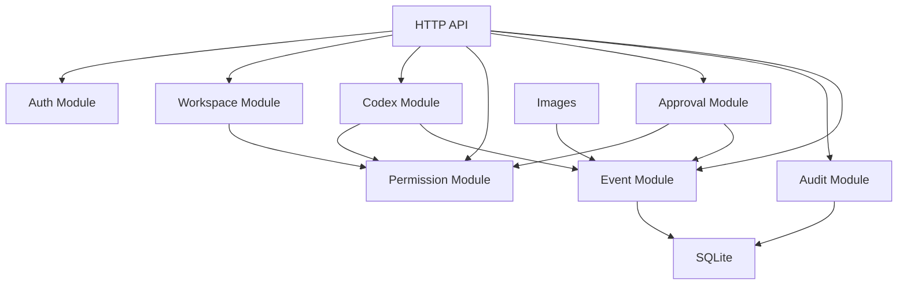

# 个人全面 Web 终端技术方案

文档日期：2026-06-04  
关联产品文档：[personal-web-terminal-product-features.md](./personal-web-terminal-product-features.md)  
后端要求：Go

## 1. 技术定位

本项目是一个面向个人使用的服务器 Web 控制台。第一阶段重点支持应用管理、权限控制、审计记录和 Codex CLI Web 化；后续再扩展日志、文件、服务、任务自动化和更多服务器管理模块。

技术方案保持单机、轻量、可扩展：

- 后端使用 Go。
- 前端使用现代 Web 技术栈。
- 数据存储优先使用 SQLite。
- 实时任务输出使用 SSE。
- 部署采用裸部署：Go 服务直接监听端口并提供 API、SSE 和前端静态资源。
- Codex CLI 由用户手动安装，系统只负责检测、调用和管理。
- 不做多租户，不做团队权限系统。

## 2. 总体架构

### 2.1 前端层

前端负责提供个人 Web 终端界面：

- 登录页。
- 总览页。
- 应用管理。
- Codex 会话页。
- 权限中心。
- 审批中心。
- 活动审计。

前端不直接连接服务器 shell、Codex app-server 或任何系统进程，只访问 Go 后端暴露的受控 API。

### 2.2 后端层

Go 后端是系统唯一的执行入口和权限边界，负责：

- 用户登录和 session 管理。
- 应用目录登记和路径边界校验。
- 路径边界、Codex sandbox、命令策略和审批流程。
- Codex CLI 状态检测、会话执行和任务中断。
- 实时事件推送。
- 审计日志和操作历史。

### 2.3 执行层

执行层由 Go 后端通过受控子进程调用：

- `codex app-server`：用于长期会话、流式事件和交互式 Codex 能力。
- `codex exec --json`：用于一次性任务。
- `git`：用于工作区状态、diff 等只读检查。
- 后续可扩展日志读取、服务状态、任务脚本等执行器。

所有执行请求都先经过权限引擎，不允许前端直接拼接命令执行。

### 2.4 存储层

第一版使用 SQLite，存储：

- owner 账号和 session。
- 应用目录。
- 权限配置。
- Codex 会话和事件。
- 审批记录。
- 活动审计。
- Images generation jobs、图片资产、provider 设置和图片存储设置。

SQLite 足够支撑个人单机使用，后续如需要多服务器或更强并发，可迁移到 PostgreSQL。

## 3. 后端模块架构

### 3.1 Auth Module

负责：

- Owner 登录。
- Session cookie。
- CSRF 防护。
- 登录失败限流。

登录失败限流必须在后端强制执行：

- 按用户名和 IP 维度分别记录失败次数、最近失败时间和退避截止时间。
- 连续 N 次失败后进入 backoff，N 为运行期可配置值，默认建议 5。
- IP 维度 backoff 用于拦截同源暴力尝试；用户名维度 backoff 用于拦截分布式撞库。
- backoff 命中时返回统一的认证失败或限流错误，不泄露账号是否存在。
- 成功登录后可清理用户名维度失败状态，但 IP 维度异常窗口应按时间自然过期。
- 所有达到阈值、被限流和成功解除的关键状态变化都写 audit，payload 不包含密码。

### 3.2 Workspace Module

负责：

- 应用目录登记。
- 用户明确选择时，在允许根目录内创建缺失的应用目录。
- 应用启用/禁用。
- 路径合法性校验。
- Git 状态读取。
- 应用关联资源管理。

### 3.3 Permission Module

负责：

- 路径边界。
- Codex sandbox 与项目写入开关。
- 命令策略。
- 策略匹配。
- allow / prompt / deny 决策。

这是所有执行类操作的必经模块。

### 3.4 Approval Module

负责：

- 创建待审批操作。
- 前端审批决策。
- 允许一次、拒绝、中断。
- 记录审批历史。

### 3.5 Codex Module

负责：

- 检测 Codex CLI 状态。
- 管理 Codex app-server 子进程和 app-server JSON-RPC 协议连接。
- 发起、恢复和管理 Codex 会话。
- 发起不绑定项目的只读 Codex 会话。
- 发起一次性 Codex 任务。
- 处理中断。
- 把 Codex 原始事件转换成本系统统一事件。
- 桥接 Codex server request、审批、模型、usage、review、MCP、plugins、skills、hooks 和账号状态等客户端能力。

如果目标是实现完整 Codex Web 客户端，Codex Module 需要拆分为 protocol adapter、session store、approval bridge、event normalizer 和 capability registry。详细设计见 [codex-client-architecture-design.md](./codex-client-architecture-design.md)。

### 3.6 Event Module

负责：

- 统一事件模型。
- 事件持久化。
- SSE 实时推送。
- 浏览器刷新后的事件恢复。

### 3.7 Audit Module

负责：

- 登录审计。
- 应用变更审计。
- 命令和 Codex 执行审计。
- 审批审计。
- 权限策略变更审计。

### 3.8 Images Module

负责：

- xAI Grok Imagine provider 设置和 API Key masked 状态。
- 图片生成 job 创建、后台执行、状态恢复和失败记录。
- 图片库资产查询、放大查看、下载、删除和归档到 S3。
- 生成输出图和用户上传参考图的统一资产管理。
- 图片资产私密收藏夹标记、owner 密码解锁、短期 session 解锁状态和失败 backoff。
- 本地图片资产保存与安全读取。
- S3 兼容对象存储设置、连接测试、上传、后端代理读取和删除。
- 将图片生成、图片资产变更和存储失败事件写入 Event / Audit。

Images 图片库的详细产品交互和对象存储设计见 [images-library-feature-design.md](./images-library-feature-design.md)。

## 4. 技术选型

### 4.1 后端

| 类型 | 选型 | 说明 |
| --- | --- | --- |
| 语言 | Go | 单 binary、部署简单、适合系统工具和子进程管理 |
| HTTP | `net/http` + `chi` | 标准库稳定，`chi` 轻量清晰 |
| 实时通信 | SSE | 适合任务事件流，浏览器支持好，实现简单 |
| 数据库 | SQLite | 个人单机使用足够，部署成本低 |
| 迁移 | embed SQL migrations | 跟随 Go binary 发布 |
| 配置 | TOML | 适合服务端配置，可读性好 |
| 日志 | JSON structured logging | 方便审计和排查 |
| 密码哈希 | Argon2id | 适合本地账号密码 |
| 子进程管理 | `os/exec` | 调用 Codex CLI、Git 和后续执行器 |
| 对象存储 | S3 API 兼容 SDK | 用于 Images 图片资产保存。Go 实现可用 AWS SDK for Go v2 S3 client + custom endpoint，但产品不绑定真实 AWS S3 |

### 4.2 前端

| 类型 | 选型 | 说明 |
| --- | --- | --- |
| 框架 | React + Vite | 开发快，适合控制台产品 |
| 语言 | TypeScript | 保证 API 和事件类型稳定 |
| 样式 | Tailwind CSS | 便于实现现代、年轻、彩色的界面 |
| 实时事件 | EventSource / SSE client | 对接后端事件流 |
| 状态管理 | Zustand 或 React Query | 轻量管理接口状态和 UI 状态 |
| 图标 | 单一图标库 | 保持视觉一致 |

### 4.3 Codex 集成

| 场景 | 方式 | 说明 |
| --- | --- | --- |
| 长期会话 | `codex app-server` | 更适合 Web 交互、历史和流式事件 |
| 一次性任务 | `codex exec --json` | 适合总结、审查、日志分析 |
| 状态检测 | `codex --version` / help commands | 检查 CLI 是否可用 |
| 权限控制 | 后端权限引擎 + Codex sandbox | 双层保护 |

### 4.4 部署

| 类型 | 选型 | 说明 |
| --- | --- | --- |
| 进程管理 | systemd | Linux 服务器标准方式 |
| 服务暴露 | Go HTTP Server 直接监听端口 | 裸部署，不依赖反向代理 |
| 后端部署 | Go 单 binary | 简化安装和升级 |
| 前端部署 | Go embed 静态资源 | 一个服务同时提供 Web、API 和 SSE |
| 运行用户 | 专用低权限用户 | 降低误操作影响 |

裸部署约束：

- Go 服务直接监听配置端口，例如 `0.0.0.0:8080` 或内网 IP。
- 前端构建产物由 Go embed 打进 binary，避免单独部署静态站点。
- API、SSE、静态资源由同一个 Go 进程提供。
- HTTPS 不作为 MVP 默认要求；如果后续公网暴露，再考虑 Go 内置 TLS、VPN 或反向代理增强。
- 即使是裸部署，也必须保留登录、session、CSRF、权限引擎和审批机制。

## 5. 关键技术边界

### 5.1 安全边界

- Web 前端不能直接执行命令。
- 所有执行请求必须经过 Go 后端。
- 所有执行请求必须经过权限引擎。
- Codex CLI 不直接暴露公网。
- 应用目录必须在允许的根目录内。
- 不符合权限策略的操作必须拒绝或进入审批。
- secret 默认不可明文展示。
- Images S3 secret 不进入前端 response、audit 和日志明文。
- Images 图片读取必须经过 owner session。S3 bucket 默认保持私有并由后端代理读取；短 TTL presigned URL 只作为可选优化。
- Images 私密图片的列表、详情、内容读取、下载、删除、归档和旧本地 asset URL 必须额外校验当前 session 的私密解锁状态；解锁必须使用 owner 登录密码并受 IP 维度 backoff 限制。

### 5.2 Codex 边界

- 项目不负责安装 Codex CLI。
- 项目不负责 OpenAI 账号登录。
- 项目只检测和调用已经安装好的 Codex CLI。
- 不解析 Codex TUI。
- 优先使用 `codex app-server` 和 `codex exec --json`。

### 5.3 MVP 边界

第一版做：

- 登录。
- 应用管理。
- 路径边界和 Codex sandbox 控制。
- 审批。
- 审计。
- Codex 状态检测。
- Codex 会话。
- Codex 一次性任务。
- SSE 事件流。

第一版不做：

- 任意 shell。
- Web 安装 Codex。
- Web 登录 Codex。
- 文件编辑。
- 服务重启。
- 多服务器。
- 多用户和多租户。

## 6. 推荐开发顺序

1. Go 服务骨架、配置、SQLite、路由。
2. 登录、session、CSRF。
3. 应用目录管理和路径边界。
4. Codex sandbox、命令策略、审批模型。
5. 事件存储和 SSE。
6. Codex CLI 状态检测。
7. `codex exec --json` 一次性任务。
8. `codex app-server` 长期会话。
9. 审计和活动记录。
10. 前端控制台对接。
