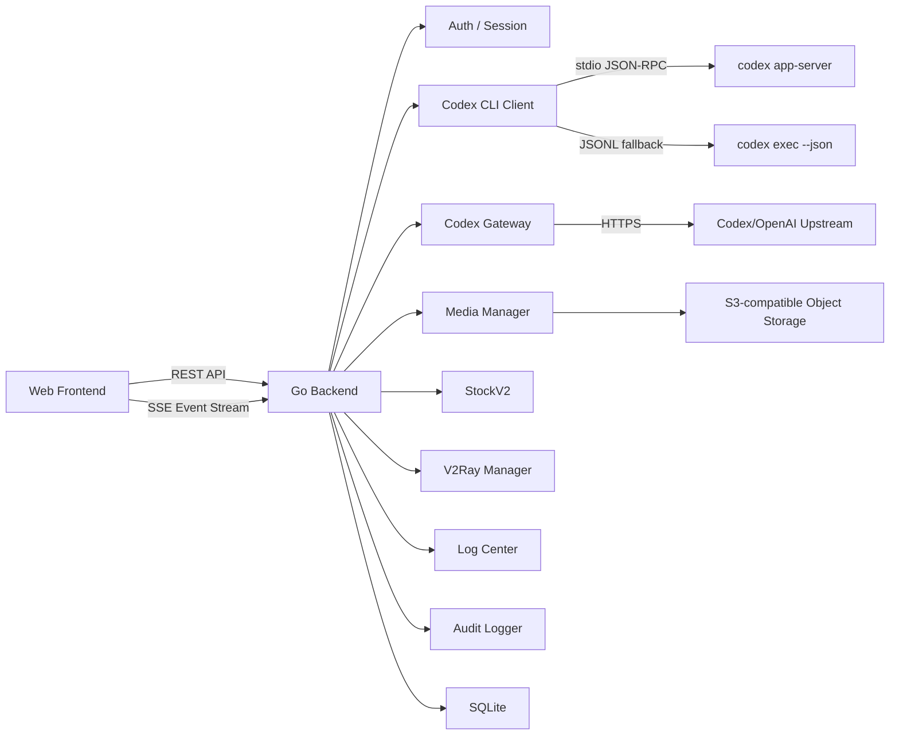
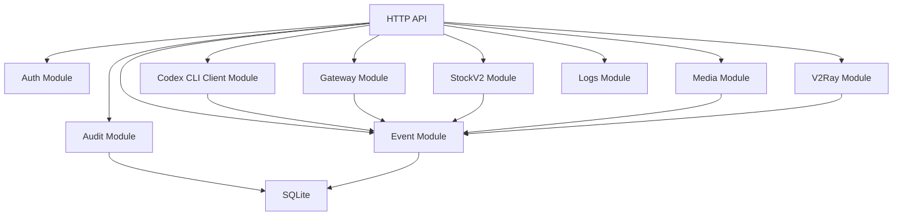

# 个人全面 Web 终端技术方案

文档日期：2026-06-07
关联产品文档：[personal-web-terminal-product-features.md](./personal-web-terminal-product-features.md)
后端要求：Go

Codex CLI Client 和 Codex Gateway / OpenAI Gateway 是并列独立能力域：

- Codex CLI Client 依赖部署机本地安装的 `codex` CLI，提供受控 Web 会话客户端能力，详细设计见 [codex-cli-client-feature-design.md](./codex-cli-client-feature-design.md)；当前 UI/产品改造优先见 [codex-desktop-like-web-client-plan.md](./codex-desktop-like-web-client-plan.md)。
- Codex Gateway / OpenAI Gateway 暴露 OpenAI-compatible `/v1/*` API，详细设计见 [codex-openai-gateway-feature-design.md](./codex-openai-gateway-feature-design.md)。

旧版 Codex 客户端代码已移除，但数据库中可能仍有残留旧表或旧事件。新版 Codex CLI Client 必须使用新的表名前缀和 additive migration，不复用旧 schema 假设。

## 1. 技术定位

本项目是一个面向个人使用的服务器 Web 控制台。当前能力域包括控制台总览、Codex、Codex Gateway、日志中心、多媒体图片/视频生成、股票V2、V2Ray 和全局设置；后续可继续扩展应用管理、文件、服务、任务自动化等服务器管理模块。

技术方案保持单机、轻量、可扩展：

- 后端使用 Go。
- 前端使用现代 Web 技术栈。
- 数据存储优先使用 SQLite。
- 实时任务输出使用 SSE。
- 部署采用裸部署：Go 服务直接监听端口并提供 API、SSE 和前端静态资源。
- 不做多租户，不做团队权限系统。

## 2. 总体架构

### 2.1 前端层

前端负责提供个人 Web 终端界面：

- 登录页。
- Codex 会话客户端页。
- 总览页。
- Codex Gateway 管理页。
- 日志中心。
- 多媒体图片/视频生成和资源库。
- 股票V2。
- V2Ray 管理页。
- 全局设置。

前端不直接连接服务器 shell 或任何系统进程，只访问 Go 后端暴露的受控 API。

### 2.2 后端层

Go 后端是系统唯一的执行入口和权限边界，负责：

- 用户登录和 session 管理。
- 允许根目录和路径边界校验。
- Codex CLI 安装探测、app-server runtime supervisor、workspace policy、exec runner、审批和事件归一化。
- Gateway public API、账号凭据摘要、模型目录和请求日志管理。
- 多媒体生成 job、图片/视频资产和对象存储管理。
- 股票机会、账户/仓位、数据底座、策略、盯盘、Alert、Review、操作建议和记忆管理。
- V2Ray 配置与运行控制。
- 日志源登记和受控 tail。
- 实时事件推送。
- 审计日志和操作历史。

### 2.3 执行层

执行层由 Go 后端通过受控子进程或外部调用完成：

- Gateway 上游 `/v1/*` 请求转发。
- Codex CLI app-server 定时探测和 stdio JSON-RPC 调用。
- Codex exec JSONL fallback。
- 多媒体 provider HTTPS 调用。
- V2Ray 进程启停。
- 日志文件只读 tail 与搜索。
- 后续可扩展服务状态、任务脚本等执行器。

所有执行请求都先经过后端权限校验，不允许前端直接拼接命令执行。

### 2.4 存储层

第一版使用 SQLite，存储：

- owner 账号和 session。
- 允许根目录和全局运行设置。
- Gateway settings、public API keys、账号摘要、模型目录和请求日志。
- Codex CLI installation、workspace、thread、turn、event、approval、run 和 attachment metadata。
- 活动审计。
- 持久事件。
- 多媒体 generation jobs、图片/视频资产、provider 设置和资源存储设置。
- 股票机会、账户/仓位、行情快照、数据任务、消息、策略、盯盘、Alert、Review、信号、操作建议、人工操作、记忆和 Agent trace。
- V2Ray 配置和运行状态。

SQLite 足够支撑个人单机使用，后续如需要多服务器或更强并发，可迁移到 PostgreSQL。

## 3. 后端模块架构

### 3.1 Auth Module

负责：

- Owner 登录。
- Session cookie。
- CSRF 防护。
- 登录失败限流。

登录失败限流必须在后端强制执行：

- 按用户名和 IP 维度分别记录失败次数、最近失败时间和退避截止时间。
- 连续 N 次失败后进入 backoff，N 为运行期可配置值，默认建议 5。
- IP 维度 backoff 用于拦截同源暴力尝试；用户名维度 backoff 用于拦截分布式撞库。
- backoff 命中时返回统一的认证失败或限流错误，不泄露账号是否存在。
- 成功登录后可清理用户名维度失败状态，但 IP 维度异常窗口应按时间自然过期。
- 所有达到阈值、被限流和成功解除的关键状态变化都写 audit，payload 不包含密码。

### 3.2 Gateway Module

负责：

- 暴露 OpenAI-compatible `/v1/*` API（`/v1/models`、`/v1/chat/completions`、`/v1/responses`）。
- 管理 Gateway public API key、Codex 账号凭据摘要、模型目录和请求日志。
- 将外部客户端请求转发到上游 Codex/OpenAI 兼容能力。
- 为 Gateway 管理 UI 提供账号、模型、日志和连通性测试 API。

Gateway Module 不绑定工作目录，不执行 shell，不修改文件。详细设计见 [codex-openai-gateway-feature-design.md](./codex-openai-gateway-feature-design.md)。

### 3.3 Codex CLI Client Module

负责：

- 探测 `codex` binary、version、auth、sandbox、app-server 和 exec fallback。
- 维护 managed app-server runtime 状态，主程序定时检查 running/stopped/failed/degraded。
- 在 app-server 未启动时，通过受控 API 支持页面一键启动。
- 管理 Codex workspace，校验允许根目录、信任状态和默认权限模式。
- 通过 `codex app-server --listen stdio://` 创建、恢复、继续、中断和归档 thread。
- 在 app-server 不可用时，通过 `codex exec --json` 提供一次性任务 fallback。
- 将 Codex JSON-RPC notification 或 exec JSONL event 转换为 Phantom Lancer 稳定事件。
- 持久化 thread、turn、event、approval 和 run 状态，支持刷新后恢复。
- 将审批请求写入可恢复状态，等待 owner 决策后回传 Codex。
- 对 prompt 摘要、stderr、URL、token、secret、附件和事件 payload 做 redaction 和大小限制。
- 将关键操作写入 audit，服务 `slog` 只记录异常摘要。

Codex CLI Client 不负责安装 CLI、不托管 Codex token、不暴露 `/v1/*` API、不默认 full access。详细设计见 [codex-cli-client-feature-design.md](./codex-cli-client-feature-design.md)，Desktop-like Web 工作台改造见 [codex-desktop-like-web-client-plan.md](./codex-desktop-like-web-client-plan.md)。

### 3.4 Event Module

负责：

- 统一事件模型。
- 事件持久化。
- SSE 实时推送。
- 浏览器刷新后的事件恢复。

### 3.5 Audit Module

负责：

- 登录审计。
- Codex workspace、thread、turn、审批、设置和诊断审计。
- Gateway 配置和账号变更审计。
- 多媒体生成和资产变更审计。
- 股票机会、账户/仓位、策略、盯盘、Alert、Review、操作建议和人工操作审计。
- V2Ray 配置和控制审计。
- 全局设置变更审计。

### 3.6 Logs Module

负责：

- 日志源登记与轻量 metadata。
- 服务日志、应用日志、事件型日志的只读 tail 与搜索。
- 路径白名单、最大行数/字节数和脱敏。

详细设计见 [log-center-feature-design.md](./log-center-feature-design.md)。

### 3.7 Media Module

负责：

- xAI Grok Imagine、Agnes 等 provider 设置和 API Key masked 状态。
- 图片/视频生成 job 创建、后台执行、状态恢复、轮询和失败记录。
- 资源库资产查询、图片放大查看、视频播放、下载、删除和归档到对象存储。
- 生成输出资源、用户上传参考图和 Library 手动上传图的统一资产管理。
- 图片/视频资产按内容 checksum 去重；普通上传和生成结果只复用未删除、非私密的公开资产，避免泄露私密收藏夹存在性。
- Library 图片可作为图生图、图生视频、多图编辑和关键帧参考；后端按 asset id 读取受控 bytes 并转换为 provider payload，不把需要登录态的本地 API URL 直接传给外部 provider。
- 图片/视频资产私密收藏夹标记、owner 密码解锁、短期 session 解锁状态和失败 backoff。
- 本地图片/视频资产保存与安全读取。
- S3 兼容对象存储或共享对象存储 profile 设置、连接测试、上传、后端代理读取和删除。
- 将图片/视频生成、资产变更和存储失败事件写入 Event / Audit。

多媒体资源库的详细产品交互和对象存储设计见 [images-library-feature-design.md](./images-library-feature-design.md)；Agnes 图片/视频接入设计见 [agnes-image-video-integration-design.md](./agnes-image-video-integration-design.md)。

### 3.8 StockV2 Module

负责：

- 当前股票模块只保留 StockV2：后端 `internal/stockv2/`，API `/api/stockv2/*`，前端 `web/src/features/stockv2/`。
- 管理股票标的、日 K / 分钟行情、股票画像、主板市场机会扫描、手工主题研究、组合、持仓、策略、后台监控、消息、Alert、Review、Agent 治理和留痕。
- 受支持的 Agent 任务可以按任务绑定选择性地把完整脱敏上下文直接流式归档到共享对象存储；归档无本地副本、无数据库索引、无读取 API，失败不改变任务结果。
- StockV1 的 `internal/stock/`、`/api/stock/*` 和旧设计文档已经移除，不再作为实现边界。

详细设计见 [stock-agent-workbench-v2-key-points-2026-06-18.md](./stock-agent-workbench-v2-key-points-2026-06-18.md)。

### 3.9 V2Ray Module

负责：

- V2Ray 监听端口、传输协议、TLS 和远程设备凭据配置。
- V2Ray 进程启动、停止、重启和运行状态。
- 运行事件写入 Event，配置和控制操作写入 Audit。

## 4. 技术选型

### 4.1 后端

| 类型 | 选型 | 说明 |
| --- | --- | --- |
| 语言 | Go | 单 binary、部署简单、适合系统工具和子进程管理 |
| HTTP | `net/http` + `chi` | 标准库稳定，`chi` 轻量清晰 |
| 实时通信 | SSE | 适合任务事件流，浏览器支持好，实现简单 |
| 数据库 | SQLite | 个人单机使用足够，部署成本低 |
| 迁移 | embed SQL migrations | 跟随 Go binary 发布 |
| 配置 | TOML | 适合服务端配置，可读性好 |
| 日志 | JSON structured logging | 方便审计和排查 |
| 密码哈希 | Argon2id | 适合本地账号密码 |
| 子进程管理 | `os/exec` | 调用 V2Ray 进程和后续执行器 |
| 对象存储 | S3 API 兼容 SDK | 用于多媒体图片/视频资产保存和可选的 StockV2 Agent 完整上下文旁路归档。Go 实现使用 AWS SDK for Go v2 S3 client + custom endpoint，但产品不绑定真实 AWS S3 |

### 4.2 前端

| 类型 | 选型 | 说明 |
| --- | --- | --- |
| 框架 | React + Vite | 开发快，适合控制台产品 |
| 语言 | TypeScript | 保证 API 和事件类型稳定 |
| 样式 | Tailwind CSS | 便于实现 Quiet Agent Workbench 风格的浅色中性工作台 |
| 实时事件 | EventSource / SSE client | 对接后端事件流 |
| 状态管理 | Zustand 或 React Query | 轻量管理接口状态和 UI 状态 |
| 图标 | 单一图标库 | 保持视觉一致 |

前端首屏只同步加载工作台壳和 Dashboard，其他一级能力域使用 Vite 动态 chunk 按访问加载。认证成功后先显示工作台，再独立加载 Dashboard 基础摘要和当前能力域数据；非当前能力域的配置与大列表不阻塞首屏。生产构建同时生成 Brotli 和 gzip 静态旁路文件，由 Go 服务根据 `Accept-Encoding` 协商返回。

### 4.3 Codex CLI 集成

| 场景 | 方式 | 说明 |
| --- | --- | --- |
| 安装探测 | `codex --version` / 诊断命令 | 只记录版本和能力摘要，不记录 token |
| app-server runtime | 定时 probe + 一键启动 | 主程序维护 running/stopped/failed/degraded 状态，页面通过受控 API 启动 |
| 长会话 | `codex app-server --listen stdio://` | Go 后端通过 stdio JSON-RPC 连接，不暴露给浏览器 |
| 一次性任务 fallback | `codex exec --json` | app-server 不可用时使用，默认低权限 |
| 权限模式 | CLI `--sandbox` / Codex 配置审批策略 | 由 workspace trust state 和 owner 选择共同决定 |
| 事件接入 | JSON-RPC notification / JSONL | 后端归一化后写入 Event Module 和 SSE |
| 子进程管理 | `os/exec` + context | 受控 env allowlist、timeout、interrupt、stderr size limit |

### 4.4 Gateway 集成

| 场景 | 方式 | 说明 |
| --- | --- | --- |
| 公开 API | OpenAI-compatible `/v1/*` | 供外部客户端按 OpenAI 协议调用 |
| 上游转发 | HTTPS 转发到 Codex/OpenAI 兼容能力 | 通过账号凭据完成鉴权 |
| 账号管理 | OAuth / token 导入 | 仅保存摘要，不在前端回显明文 |
| 连通性测试 | 上游探测 | 在管理 UI 提供测试入口 |

### 4.5 部署

| 类型 | 选型 | 说明 |
| --- | --- | --- |
| 进程管理 | systemd | Linux 服务器标准方式 |
| 服务暴露 | Go HTTP Server 直接监听端口 | 裸部署，不依赖反向代理 |
| 后端部署 | Go 单 binary | 简化安装和升级 |
| 前端部署 | Go embed 静态资源 | 一个服务同时提供 Web、API 和 SSE |
| 运行用户 | 专用低权限用户 | 降低误操作影响 |

裸部署约束：

- Go 服务直接监听配置端口，例如 `0.0.0.0:8080` 或内网 IP。
- 前端构建产物由 Go embed 打进 binary，避免单独部署静态站点。
- 带内容哈希的静态资源使用长期 immutable 缓存；Go 服务直接返回构建阶段生成的 Brotli/gzip 旁路文件，不在请求路径实时压缩。
- API、SSE、静态资源由同一个 Go 进程提供。
- Codex CLI 由 owner 预先安装在部署机，Phantom Lancer 只通过配置的 binary path 或 PATH 探测使用。
- HTTPS 不作为 MVP 默认要求；公网暴露时优先采用 Go 内置闭环 TLS，详见 [closed-loop-tls-feature-design.md](./closed-loop-tls-feature-design.md)。VPN 或反向代理仍可作为部署侧可选方案。
- 即使是裸部署，也必须保留登录、session、CSRF 和后端权限校验。

## 5. 关键技术边界

### 5.1 安全边界

- Web 前端不能直接执行命令。
- 所有执行请求必须经过 Go 后端。
- Codex CLI 子进程不能继承完整服务环境，必须使用 env allowlist。
- Codex workspace 必须落在允许根目录内。
- Codex 默认不启用 network 和 full access；需要越界时必须通过审批或显式策略。
- Codex app-server 启动必须由 Go 后端执行，写操作 API 必须校验 owner session + CSRF。
- app-server 定时 probe 的成功路径不写服务日志或 audit，失败只记录脱敏摘要。
- Gateway 公开 API 通过 public API key 鉴权，上游凭据只保存摘要。
- 允许操作的目录必须在允许的根目录内。
- secret 默认不可明文展示。
- 多媒体对象存储 secret 不进入前端 response、audit 和日志明文。
- 多媒体资源读取必须经过 owner session。S3 bucket 默认保持私有并由后端代理读取；短 TTL presigned URL 只作为可选优化。
- 多媒体私密资源的列表、详情、内容读取、下载、删除、归档和旧本地 asset URL 必须额外校验当前 session 的私密解锁状态；解锁必须使用 owner 登录密码并受 IP 维度 backoff 限制。

### 5.2 Gateway 边界

- Gateway 不绑定工作目录，不执行 shell，不修改文件。
- Gateway 负责受控上游选择、账号凭据摘要、模型目录、public API key 和请求日志。`local_codex` 上游使用固定空目录、无审批的临时 app-server 会话；thread 级硬隔离禁用本机 Apps、MCP、skills、hooks、搜索和多 Agent，并以根文件系统默认拒绝的权限 profile 限制读取。权限、instruction sources 或 MCP 工具隔离验证失败时请求必须 fail closed；不进入 owner workspace，也不执行客户端工具。
- 上游账号登录由 OAuth / token 导入完成，不在前端回显明文。
- Gateway 详细边界见 [codex-openai-gateway-feature-design.md](./codex-openai-gateway-feature-design.md)。

### 5.3 Codex CLI Client 边界

- Codex CLI Client 绑定 workspace、thread、turn、sandbox、approval 和事件流。
- Codex CLI Client 不读取或展示 `auth.json`、access token、refresh token、cookie。
- Codex CLI Client 不安装、升级或替换 `codex` CLI。
- Codex CLI Client 不通过浏览器直连 app-server，不暴露 non-loopback WebSocket listener。
- Codex CLI Client 页面的一键启动只触发后端受控 `codex app-server --listen stdio://`，不能拼接任意命令。
- Codex CLI Client 不默认使用 `--yolo`、`danger-full-access` 或跳过审批的危险模式。
- Codex CLI Client 的新表使用 `codex_cli_` 前缀；旧版残留 Codex 表不自动删除、不自动迁移。
- Codex CLI Client 详细边界见 [codex-cli-client-feature-design.md](./codex-cli-client-feature-design.md)。

### 5.4 数据库兼容边界

旧版 Codex 代码已经移除，但生产 SQLite 可能留有旧表、旧索引、旧 settings key 或旧 event scope。

兼容要求：

- 所有 Codex CLI Client 新表使用 `codex_cli_` 前缀。
- Gateway 表继续使用 `codex_gateway_` 前缀。
- migration 必须 additive 和 idempotent，不得 `DROP` 旧 Codex 表。
- 启动时允许探测旧表存在，并在诊断 UI 显示 legacy data 状态。
- MVP 不自动导入旧数据；如后续需要导入，必须显式设计 legacy import。
- 旧表存在不能影响新模块启动，除非数据库本身损坏。

### 5.5 MVP 边界

第一版做：

- 登录。
- Codex CLI Client，包括 app-server 定时检查和页面一键启动。
- Codex Gateway。
- 日志中心。
- 多媒体图片/视频生成和资源库。
- V2Ray。
- 审计。
- SSE 事件流。

第一版不做：

- 任意 shell。
- Codex CLI 安装器。
- Codex Desktop 启动器。
- Codex Cloud 任务编排。
- 文件编辑。
- 服务重启。
- 多服务器。
- 多用户和多租户。

## 6. 推荐开发顺序

1. Go 服务骨架、配置、SQLite、路由。
2. 登录、session、CSRF。
3. 事件存储和 SSE。
4. Codex CLI Client SQLite schema、旧表探测、binary detector。
5. Codex CLI Client AppServerSupervisor、定时 probe、一键启动 API、workspace、event mapping、approval broker。
6. Codex Gateway public API、账号、模型和请求日志。
7. 多媒体生成、资源库和对象存储。
8. V2Ray 配置与运行控制。
9. 日志中心源登记与 tail。
10. 审计和活动记录。
11. 前端控制台对接。
