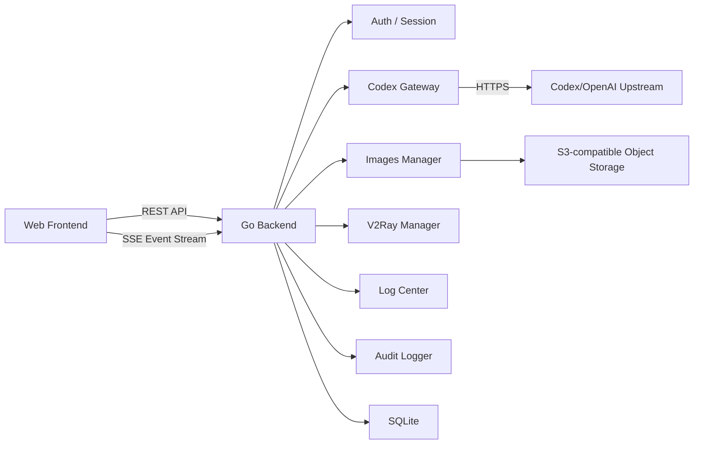
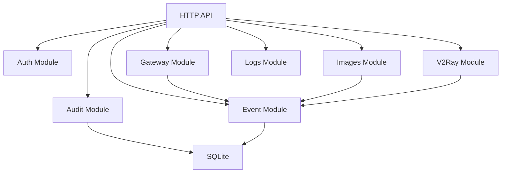

# 个人全面 Web 终端技术方案

文档日期：2026-06-04  
关联产品文档：[personal-web-terminal-product-features.md](./personal-web-terminal-product-features.md)  
后端要求：Go

Codex Gateway / OpenAI Gateway 是独立能力域，其详细设计见 [codex-openai-gateway-feature-design.md](./codex-openai-gateway-feature-design.md)。原 Codex CLI / Codex Client 客户端方案已废弃，本控制台不再内置 Codex 会话、审批、sandbox 或工作区写入能力。

## 1. 技术定位

本项目是一个面向个人使用的服务器 Web 控制台。当前已落地的能力域包括控制台总览、Codex Gateway、日志中心、Images 图片生成、V2Ray 和全局设置；后续可继续扩展应用管理、文件、服务、任务自动化等服务器管理模块。

技术方案保持单机、轻量、可扩展：

- 后端使用 Go。
- 前端使用现代 Web 技术栈。
- 数据存储优先使用 SQLite。
- 实时任务输出使用 SSE。
- 部署采用裸部署：Go 服务直接监听端口并提供 API、SSE 和前端静态资源。
- 不做多租户，不做团队权限系统。

## 2. 总体架构

### 2.1 前端层

前端负责提供个人 Web 终端界面：

- 登录页。
- 总览页。
- Codex Gateway 管理页。
- 日志中心。
- Images 图片生成和图片库。
- V2Ray 管理页。
- 全局设置。

前端不直接连接服务器 shell 或任何系统进程，只访问 Go 后端暴露的受控 API。

### 2.2 后端层

Go 后端是系统唯一的执行入口和权限边界，负责：

- 用户登录和 session 管理。
- 允许根目录和路径边界校验。
- Gateway public API、账号凭据摘要、模型目录和请求日志管理。
- Images 生成 job、图片资产和对象存储管理。
- V2Ray 配置与运行控制。
- 日志源登记和受控 tail。
- 实时事件推送。
- 审计日志和操作历史。

### 2.3 执行层

执行层由 Go 后端通过受控子进程或外部调用完成：

- Gateway 上游 `/v1/*` 请求转发。
- Images provider HTTPS 调用。
- V2Ray 进程启停。
- 日志文件只读 tail 与搜索。
- 后续可扩展服务状态、任务脚本等执行器。

所有执行请求都先经过后端权限校验，不允许前端直接拼接命令执行。

### 2.4 存储层

第一版使用 SQLite，存储：

- owner 账号和 session。
- 允许根目录和全局运行设置。
- Gateway settings、public API keys、账号摘要、模型目录和请求日志。
- 活动审计。
- 持久事件。
- Images generation jobs、图片资产、provider 设置和图片存储设置。
- V2Ray 配置和运行状态。

SQLite 足够支撑个人单机使用，后续如需要多服务器或更强并发，可迁移到 PostgreSQL。

## 3. 后端模块架构

### 3.1 Auth Module

负责：

- Owner 登录。
- Session cookie。
- CSRF 防护。
- 登录失败限流。

登录失败限流必须在后端强制执行：

- 按用户名和 IP 维度分别记录失败次数、最近失败时间和退避截止时间。
- 连续 N 次失败后进入 backoff，N 为运行期可配置值，默认建议 5。
- IP 维度 backoff 用于拦截同源暴力尝试；用户名维度 backoff 用于拦截分布式撞库。
- backoff 命中时返回统一的认证失败或限流错误，不泄露账号是否存在。
- 成功登录后可清理用户名维度失败状态，但 IP 维度异常窗口应按时间自然过期。
- 所有达到阈值、被限流和成功解除的关键状态变化都写 audit，payload 不包含密码。

### 3.2 Gateway Module

负责：

- 暴露 OpenAI-compatible `/v1/*` API（`/v1/models`、`/v1/chat/completions`、`/v1/responses`）。
- 管理 Gateway public API key、Codex 账号凭据摘要、模型目录和请求日志。
- 将外部客户端请求转发到上游 Codex/OpenAI 兼容能力。
- 为 Gateway 管理 UI 提供账号、模型、日志和连通性测试 API。

Gateway Module 不绑定工作目录，不执行 shell，不修改文件。详细设计见 [codex-openai-gateway-feature-design.md](./codex-openai-gateway-feature-design.md)。

### 3.3 Event Module

负责：

- 统一事件模型。
- 事件持久化。
- SSE 实时推送。
- 浏览器刷新后的事件恢复。

### 3.4 Audit Module

负责：

- 登录审计。
- Gateway 配置和账号变更审计。
- Images 生成和资产变更审计。
- V2Ray 配置和控制审计。
- 全局设置变更审计。

### 3.5 Logs Module

负责：

- 日志源登记与轻量 metadata。
- 服务日志、应用日志、事件型日志的只读 tail 与搜索。
- 路径白名单、最大行数/字节数和脱敏。

详细设计见 [log-center-feature-design.md](./log-center-feature-design.md)。

### 3.6 Images Module

负责：

- xAI Grok Imagine provider 设置和 API Key masked 状态。
- 图片生成 job 创建、后台执行、状态恢复和失败记录。
- 图片库资产查询、放大查看、下载、删除和归档到 S3。
- 生成输出图和用户上传参考图的统一资产管理。
- 图片资产私密收藏夹标记、owner 密码解锁、短期 session 解锁状态和失败 backoff。
- 本地图片资产保存与安全读取。
- S3 兼容对象存储设置、连接测试、上传、后端代理读取和删除。
- 将图片生成、图片资产变更和存储失败事件写入 Event / Audit。

Images 图片库的详细产品交互和对象存储设计见 [images-library-feature-design.md](./images-library-feature-design.md)。

### 3.7 V2Ray Module

负责：

- V2Ray 监听端口、传输协议、TLS 和远程设备凭据配置。
- V2Ray 进程启动、停止、重启和运行状态。
- 运行事件写入 Event，配置和控制操作写入 Audit。

## 4. 技术选型

### 4.1 后端

| 类型 | 选型 | 说明 |
| --- | --- | --- |
| 语言 | Go | 单 binary、部署简单、适合系统工具和子进程管理 |
| HTTP | `net/http` + `chi` | 标准库稳定，`chi` 轻量清晰 |
| 实时通信 | SSE | 适合任务事件流，浏览器支持好，实现简单 |
| 数据库 | SQLite | 个人单机使用足够，部署成本低 |
| 迁移 | embed SQL migrations | 跟随 Go binary 发布 |
| 配置 | TOML | 适合服务端配置，可读性好 |
| 日志 | JSON structured logging | 方便审计和排查 |
| 密码哈希 | Argon2id | 适合本地账号密码 |
| 子进程管理 | `os/exec` | 调用 V2Ray 进程和后续执行器 |
| 对象存储 | S3 API 兼容 SDK | 用于 Images 图片资产保存。Go 实现可用 AWS SDK for Go v2 S3 client + custom endpoint，但产品不绑定真实 AWS S3 |

### 4.2 前端

| 类型 | 选型 | 说明 |
| --- | --- | --- |
| 框架 | React + Vite | 开发快，适合控制台产品 |
| 语言 | TypeScript | 保证 API 和事件类型稳定 |
| 样式 | Tailwind CSS | 便于实现现代、年轻、彩色的界面 |
| 实时事件 | EventSource / SSE client | 对接后端事件流 |
| 状态管理 | Zustand 或 React Query | 轻量管理接口状态和 UI 状态 |
| 图标 | 单一图标库 | 保持视觉一致 |

### 4.3 Gateway 集成

| 场景 | 方式 | 说明 |
| --- | --- | --- |
| 公开 API | OpenAI-compatible `/v1/*` | 供外部客户端按 OpenAI 协议调用 |
| 上游转发 | HTTPS 转发到 Codex/OpenAI 兼容能力 | 通过账号凭据完成鉴权 |
| 账号管理 | OAuth / token 导入 | 仅保存摘要，不在前端回显明文 |
| 连通性测试 | 上游探测 | 在管理 UI 提供测试入口 |

### 4.4 部署

| 类型 | 选型 | 说明 |
| --- | --- | --- |
| 进程管理 | systemd | Linux 服务器标准方式 |
| 服务暴露 | Go HTTP Server 直接监听端口 | 裸部署，不依赖反向代理 |
| 后端部署 | Go 单 binary | 简化安装和升级 |
| 前端部署 | Go embed 静态资源 | 一个服务同时提供 Web、API 和 SSE |
| 运行用户 | 专用低权限用户 | 降低误操作影响 |

裸部署约束：

- Go 服务直接监听配置端口，例如 `0.0.0.0:8080` 或内网 IP。
- 前端构建产物由 Go embed 打进 binary，避免单独部署静态站点。
- API、SSE、静态资源由同一个 Go 进程提供。
- HTTPS 不作为 MVP 默认要求；如果后续公网暴露，再考虑 Go 内置 TLS、VPN 或反向代理增强。
- 即使是裸部署，也必须保留登录、session、CSRF 和后端权限校验。

## 5. 关键技术边界

### 5.1 安全边界

- Web 前端不能直接执行命令。
- 所有执行请求必须经过 Go 后端。
- Gateway 公开 API 通过 public API key 鉴权，上游凭据只保存摘要。
- 允许操作的目录必须在允许的根目录内。
- secret 默认不可明文展示。
- Images S3 secret 不进入前端 response、audit 和日志明文。
- Images 图片读取必须经过 owner session。S3 bucket 默认保持私有并由后端代理读取；短 TTL presigned URL 只作为可选优化。
- Images 私密图片的列表、详情、内容读取、下载、删除、归档和旧本地 asset URL 必须额外校验当前 session 的私密解锁状态；解锁必须使用 owner 登录密码并受 IP 维度 backoff 限制。

### 5.2 Gateway 边界

- Gateway 不绑定工作目录，不执行 shell，不修改文件。
- Gateway 只负责账号凭据摘要、模型目录、public API key 和请求日志。
- 上游账号登录由 OAuth / token 导入完成，不在前端回显明文。
- Gateway 详细边界见 [codex-openai-gateway-feature-design.md](./codex-openai-gateway-feature-design.md)。

### 5.3 MVP 边界

第一版做：

- 登录。
- Codex Gateway。
- 日志中心。
- Images 图片生成和图片库。
- V2Ray。
- 审计。
- SSE 事件流。

第一版不做：

- 任意 shell。
- 内置 Codex CLI 会话客户端。
- 文件编辑。
- 服务重启。
- 多服务器。
- 多用户和多租户。

## 6. 推荐开发顺序

1. Go 服务骨架、配置、SQLite、路由。
2. 登录、session、CSRF。
3. 事件存储和 SSE。
4. Codex Gateway public API、账号、模型和请求日志。
5. Images 生成、图片库和对象存储。
6. V2Ray 配置与运行控制。
7. 日志中心源登记与 tail。
8. 审计和活动记录。
9. 前端控制台对接。
