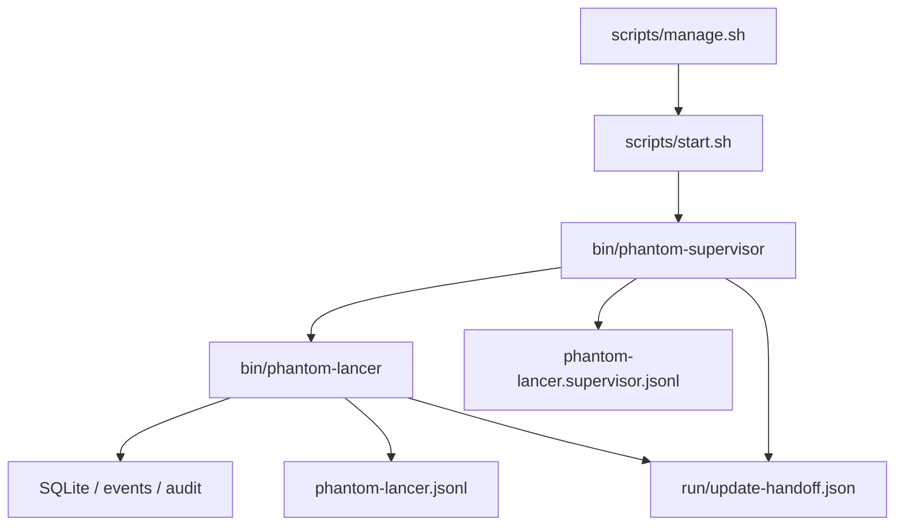

# Phantom Lancer 独立 Supervisor 方案

文档日期：2026-06-11
适用范围：Phantom Lancer 裸部署、脚本启动、自更新重启、启动失败保活和最小自动回滚。

## 1. 背景

当前 Phantom Lancer 主程序在自更新完成后支持 `restart_mode = "exit"`：

- 主程序安装新 binary。
- 主程序记录 `update.restart.requested`。
- 主程序短窗口关闭 HTTP server 后退出。
- 依赖 systemd、supervisord 或其他外部 supervisor 重新拉起服务。

这使更新重启无法仅靠项目自身闭环。`scripts/manage.sh` 目前只是 `nohup` 启动一次进程，不负责保活；`scripts/start.sh` 也直接 `exec` 主程序。一旦主程序按 `exit` 模式退出，如果没有额外系统服务配置，就不会再有进程写入“拉起新版本”的日志。

本方案引入一个独立二进制 `phantom-supervisor`，由项目自己发布和启动。它与主程序解耦，只负责进程生命周期、日志和极小的更新 handoff 文件协议；业务状态、SQLite、HTTP API、自更新检查、审计和 UI 仍由 `phantom-lancer` 主程序负责。

## 2. 目标

- 不依赖 systemd/supervisord 完成“更新后重新拉起主程序”。
- 保持 supervisor 独立二进制，与主程序业务代码解耦。
- `scripts/start.sh` 默认启动 supervisor，supervisor 再启动主程序。
- `scripts/manage.sh start/stop/restart/status/logs` 面向 supervisor，而不是直接面向主程序。
- 主程序更新后退出，supervisor 自动重启主程序并记录清晰日志。
- 新版本完全起不来时，supervisor 可根据 handoff 文件恢复更新前的主程序 binary。
- 保留现有外部 supervisor 部署能力；如果用户愿意继续用 systemd，也不阻断。

## 3. 非目标

- 不做复杂进程编排平台。
- 不做多 worker、分布式心跳或远程控制。
- MVP 不做 HTTP health watchdog，不因短暂健康检查失败 kill 主程序。
- MVP 不解析 SQLite，不直接写业务 audit/event。
- 不让 Web UI 输入任意 restart command。
- 不替代机器重启后的首次启动入口。服务器重启后仍需要 systemd、cron `@reboot`、容器入口或手动执行 `scripts/manage.sh start`。

## 4. 总体架构



运行形态：

```text
phantom-supervisor
  └── phantom-lancer
```

更新重启：

```text
phantom-lancer 安装新 binary
phantom-lancer 写 update-handoff.json
phantom-lancer graceful shutdown 后 exit(0)
phantom-supervisor 发现 child 退出
phantom-supervisor 重新启动 phantom-lancer
新 phantom-lancer ConfirmBoot 成功后清理 handoff
```

新版本无法启动时：

```text
phantom-supervisor 重启 child
child 快速退出或反复退出
handoff 超时 / 快速失败阈值触发
phantom-supervisor 用 backup binary 恢复 main binary
phantom-supervisor 再启动 phantom-lancer
旧版本 phantom-lancer 启动后将 update job 标记失败
```

## 5. 二进制与目录

新增二进制：

- `cmd/phantom-supervisor`
- 构建产物：`bin/phantom-supervisor`
- release 包同时包含：
  - `bin/phantom-lancer`
  - `bin/phantom-supervisor`
  - `scripts/start.sh`
  - `scripts/manage.sh`
  - `configs/phantom.example.toml`

默认运行目录：

```text
<data_dir>/
  logs/
    phantom-lancer.jsonl
    phantom-lancer.supervisor.jsonl
    phantom-lancer.nohup.log
  run/
    phantom-supervisor.pid
    phantom-lancer.pid
    phantom-supervisor.lock
    update-handoff.json
```

路径必须来自脚本参数、环境变量或配置推导，不在仓库提交真实服务器路径。

## 6. Supervisor CLI

建议 CLI：

```bash
phantom-supervisor \
  --pid-file <data_dir>/run/phantom-supervisor.pid \
  --child-pid-file <data_dir>/run/phantom-lancer.pid \
  --lock-file <data_dir>/run/phantom-supervisor.lock \
  --log-file <data_dir>/logs/phantom-lancer.supervisor.jsonl \
  --handoff-file <data_dir>/run/update-handoff.json \
  --restart-min-delay 1s \
  --restart-max-delay 30s \
  --stable-after 60s \
  --stop-timeout 10s \
  -- <path-to-phantom-lancer> <phantom-lancer-args...>
```

约束：

- `--` 后的 child command 只来自本地启动脚本，不来自 Web UI。
- supervisor 启动时获取 lock，防止两个 supervisor 同时拉起两个主进程。
- supervisor 写自己的 pid file，child 启动成功后写 child pid file。
- supervisor 退出时删除 supervisor pid file；child 退出时删除 child pid file。
- child 环境变量增加：
  - `PL_UNDER_SUPERVISOR=1`
  - `PL_SUPERVISOR_PID=<pid>`
  - `PL_SUPERVISOR_LOG_FILE=<path>`

## 7. 启停语义

### 7.1 start

`scripts/start.sh` 默认启动 supervisor：

```text
exec bin/phantom-supervisor ... -- bin/phantom-lancer <resolved server args>
```

保留逃生开关：

```bash
PL_NO_SUPERVISOR=1 scripts/start.sh
```

此时仍直接 `exec bin/phantom-lancer`，用于调试或外部 systemd 部署。

### 7.2 stop

`scripts/manage.sh stop` 读取 `phantom-supervisor.pid`，向 supervisor 发送 SIGTERM。

supervisor 收到 SIGTERM：

1. 进入 `stopping=true`。
2. 向 child 发送 SIGTERM。
3. 等待 `stop-timeout`。
4. 超时后向 child 发送 SIGKILL。
5. 删除 pid 文件并退出 0。

由于 `stopping=true`，child 退出不会触发重启。

### 7.3 restart

`scripts/manage.sh restart`：

1. stop supervisor。
2. start supervisor。

不再直接操作 child pid。

### 7.4 child spontaneous exit

如果 supervisor 未处于 stopping：

- child 退出码为 0：仍视为需要重启，因为自更新 `exit` 属于正常退出。
- child 非 0：记录失败并重启。
- child 被 signal 杀死：记录 signal 并重启。
- 短时间内反复失败：指数 backoff。

backoff 建议：

```text
1s, 2s, 5s, 10s, 30s, 30s...
```

child 连续运行超过 `stable-after`（默认 60s）后，失败计数清零。

## 8. 更新 Handoff 文件

仅靠 supervisor 重启 child 还不够。如果新 binary 在打开 SQLite 或启动 HTTP 前崩溃，主程序没有机会执行 `ConfirmBoot`，也无法自动回滚。因此主程序在安装完成、请求重启前必须写一个小型 handoff 文件。

文件：`<data_dir>/run/update-handoff.json`

示例：

```json
{
  "schemaVersion": 1,
  "jobId": "upd_xxxxx",
  "source": "self-update",
  "currentVersion": "v0.1.0",
  "targetVersion": "v0.1.1",
  "mainBinaryPath": "/opt/phantom-lancer/bin/phantom-lancer",
  "mainBackupPath": "/var/lib/phantom-lancer/updates/backups/phantom-lancer-v0.1.0-20260611T123000Z",
  "supervisorBinaryPath": "/opt/phantom-lancer/bin/phantom-supervisor",
  "supervisorBackupPath": "",
  "requestedAt": "2026-06-11T12:30:00Z",
  "restartTimeoutSeconds": 120
}
```

安全要求：

- 不包含 token、cookie、API key、远程 URL query、prompt 或 stdout/stderr。
- 只包含稳定 ID、版本号和本机路径。
- 原子写入：先写 `.tmp`，fsync 后 rename。
- 文件权限 `0600`，目录权限 `0700`。

主程序责任：

- 安装完成并保存 update job 后写 handoff。
- 新版本启动且 `ConfirmBoot` 成功后删除 handoff。
- 启动后发现版本不匹配时，按现有 update job 逻辑标记失败，并清理或标记 handoff。

supervisor 责任：

- child 退出后读取 handoff。
- 如果 handoff 不存在，按普通 child exit 重启。
- 如果 handoff 存在且 child 快速失败次数超过阈值，或 `requestedAt + restartTimeoutSeconds` 已过，尝试恢复 `mainBackupPath` 到 `mainBinaryPath`。
- 恢复成功后记录 `supervisor rollback restored backup`，再启动 child。
- supervisor 不写 SQLite，不写 audit。业务审计由旧版本主程序重新启动后补齐失败状态。

建议快速失败阈值：

- handoff 存在。
- child 连续 3 次运行时间小于 10s。
- 或 handoff 超过 `restartTimeoutSeconds` 未被清理。

## 9. Supervisor 自更新

`phantom-supervisor` 是独立二进制，也需要随 release 更新。

推荐分两阶段：

### Phase 1：主程序更新 supervisor 文件，运行中 supervisor 不立即替换自身进程

- release 包包含 `bin/phantom-supervisor`。
- self-update installer 如果在 archive 中找到 supervisor binary，则将它原子替换到安装目录。
- Linux 允许替换正在运行的可执行文件；旧 supervisor 进程继续运行旧代码。
- 旧 supervisor 仍能重启新主程序，满足更新闭环。

### Phase 2：supervisor 检测自身文件变化后自 re-exec

- supervisor 启动时记录自身 executable 的 inode/mtime/sha256 摘要。
- child 退出且准备重启前，检查 supervisor binary 是否已经变化。
- 如果变化，记录 `supervisor self reexec requested`，然后 `syscall.Exec` 自己。
- 新 supervisor 启动后继续拉起 child。

MVP 可以先做 Phase 1；Phase 2 作为增强项。

## 10. 日志

supervisor 独立写 JSONL，不与主程序 rotating log 共用 writer，避免两个进程同时 rotate 同一个文件。

默认路径：

```text
<data_dir>/logs/phantom-lancer.supervisor.jsonl
```

关键日志事件：

- `supervisor boot starting`
- `supervisor lock acquired`
- `supervisor child starting`
- `supervisor child started`
- `supervisor child exited`
- `supervisor restart scheduled`
- `supervisor stop requested`
- `supervisor child stop timeout`
- `supervisor handoff detected`
- `supervisor rollback threshold reached`
- `supervisor rollback restored backup`
- `supervisor rollback failed`
- `supervisor exiting`

字段建议：

- `child_pid`
- `exit_code`
- `signal`
- `uptime_ms`
- `attempt`
- `delay_ms`
- `stable_after_ms`
- `handoff_job_id`
- `target_version`
- `main_binary_path`
- `backup_path`

不要记录：

- 完整环境变量。
- Authorization、cookie、token。
- stdout/stderr 全量内容。
- URL query。

## 11. 主程序调整

主程序仍负责：

- self-update 检查、下载、校验、安装。
- update job SQLite 状态。
- audit/event。
- `ConfirmBoot`。

需要调整：

- 默认更新重启路径收敛到 `restart_mode = "exit"`。
- `self-exec` 保留为兼容项，但不作为推荐路径。
- 安装完成后写 `update-handoff.json`。
- `ConfirmBoot` 成功后清理 handoff。
- rollback 成功后同样写 handoff 并请求退出，由 supervisor 拉起。
- `Status` API 增加 `underSupervisor` 可选字段，用于 UI 显示“更新后将由内置 supervisor 拉起”。

## 12. 脚本调整

### start.sh

默认：

```text
resolve config/server args
resolve supervisor binary
exec phantom-supervisor ... -- phantom-lancer <server args>
```

兼容：

```bash
PL_NO_SUPERVISOR=1 scripts/start.sh
```

### manage.sh

变更：

- `PID_FILE` 指向 supervisor pid。
- 新增 `CHILD_PID_FILE` 展示主程序 pid。
- `status` 同时展示 supervisor 和 child。
- `logs` 默认 tail 主程序 service log。
- 可新增 `supervisor-logs` tail supervisor log。

## 13. 配置建议

示例配置保持简单：

```toml
[updates]
enabled = true
restart_mode = "exit"
restart_timeout_seconds = 120
```

不建议新增复杂 supervisor 配置到 Web UI。supervisor 属于部署层，优先通过环境变量或脚本参数控制：

- `PL_NO_SUPERVISOR`
- `PL_SUPERVISOR_BIN`
- `PL_SUPERVISOR_LOG_FILE`
- `PL_SUPERVISOR_PID_FILE`
- `PL_CHILD_PID_FILE`
- `PL_SUPERVISOR_RESTART_MAX_DELAY`

## 14. 故障场景

### 新版本启动成功

1. child exit。
2. supervisor 重启 child。
3. 新 child 运行 `ConfirmBoot`。
4. job completed。
5. handoff 删除。

### 新版本启动后版本不匹配

1. 新 child 能启动。
2. `ConfirmBoot` 发现 current != target。
3. 主程序标记 job failed。
4. 如果需要回滚，由主程序现有 rollback 流程恢复 backup 并退出。
5. supervisor 再次拉起。

### 新版本完全无法启动

1. supervisor 多次启动 child。
2. child 快速退出。
3. handoff 阈值触发。
4. supervisor 恢复 backup binary。
5. supervisor 启动旧版本。
6. 旧版本启动后将 update job 标记 failed。

### supervisor 自身崩溃

项目内置 supervisor 不能恢复自身崩溃。机器级可靠性仍需要 systemd、容器 restart policy、cron 或人工启动。该限制必须在 README 中说明。

## 15. 实施阶段

### Phase 1：独立 supervisor MVP

- 新增 `cmd/phantom-supervisor`。
- 支持 child start/stop/restart-on-exit/backoff/pid file/lock file。
- supervisor 独立 JSONL 日志。
- `scripts/start.sh` 默认走 supervisor。
- `scripts/manage.sh` 面向 supervisor pid。
- 主程序自更新继续使用 `restart_mode = "exit"`。

### Phase 2：更新 handoff 与 supervisor rollback

- 主程序写入/清理 `update-handoff.json`。
- supervisor 读取 handoff。
- 快速失败或超时后恢复 backup binary。
- 日志补齐 rollback 诊断。

### Phase 3：release 与 installer 支持 supervisor binary

- CI release 包加入 `bin/phantom-supervisor`。
- 安装脚本/更新 installer 支持替换 supervisor binary。
- README 和 `configs/phantom.example.toml` 更新部署说明。

### Phase 4：可观测性与 UI 提示

- `/api/system/update/status` 返回 `underSupervisor`。
- 设置页显示“更新后由内置 supervisor 拉起”。
- Logs 模块可登记 supervisor log source。

## 16. 测试计划

单元测试：

- supervisor backoff。
- stop signal 不重启 child。
- child exit 0 仍重启。
- lock file 防双开。
- pid file 写入和清理。
- handoff 文件解析和异常处理。
- backup restore 原子替换。

集成测试：

- `scripts/manage.sh start/status/stop/restart`。
- update restart：child 退出后 supervisor 拉起。
- child 快速失败：supervisor backoff。
- handoff + broken binary：supervisor 自动恢复 backup。
- handoff + successful boot：主程序清理 handoff。

手工验证日志：

```text
supervisor child exited
supervisor restart scheduled
supervisor child started
confirming system update boot
system update boot confirmed
```

## 17. 方案结论

独立 `phantom-supervisor` 可以显著降低裸部署下自更新重启的操作系统依赖。它不能替代服务器重启后的首次启动入口，也不能恢复 supervisor 自身崩溃，但可以覆盖当前最痛的场景：主程序因更新主动退出后无人拉起。

推荐将它作为默认裸部署路径：

- 默认 `scripts/start.sh` 启动 supervisor。
- 默认 `updates.restart_mode = "exit"`。
- `self-exec` 降级为兼容旧部署的非推荐路径。
- systemd 仍可作为机器级首次启动与 supervisor 自身保活的可选增强。
