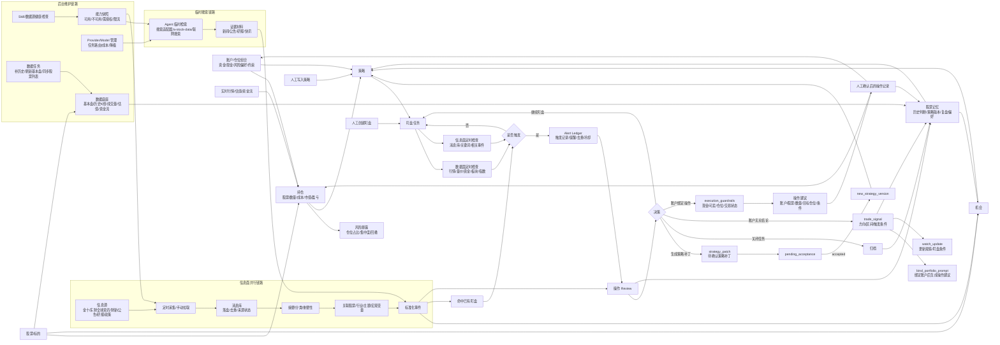
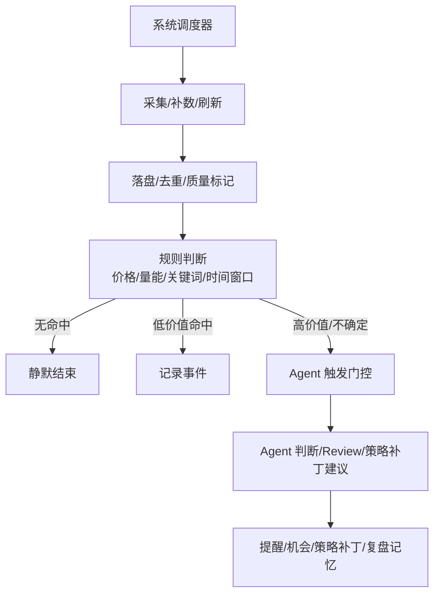
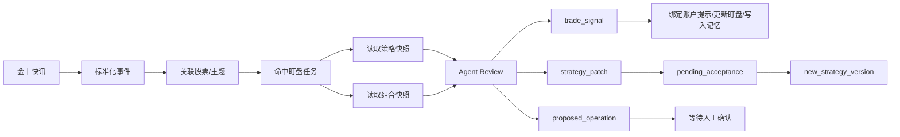

# 股票 Agent 工作台功能设计草案

文档日期：2026-06-14

本文整理股票能力模块的产品设计结论。该模块面向个人使用，不做自动交易，不构成投资建议；目标是把股票机会发现、策略管理、仓位管理、盯盘、消息面触发、操作 Review 和复盘记忆组织成一个长期运行的股票 Agent 工作台。

本设计参考历史原型中的股票功能链路，但不照搬其旧依赖服务和线性 workflow 形态。新模块应作为 Phantom Lancer 的独立能力域存在，Codex CLI 只作为 Agent 执行器之一，股票能力本身不耦合 Codex 页面。

## 1. 核心结论

股票模块不应建模为单条线性状态机，也不应只是一组 Agent prompt。它更适合建模为一组可独立进入、可互相关联的业务对象网络。

核心对象包括：

- 股票/标的。
- 账户/仓位组合。
- 持仓。
- 数据底座。
- 信息面事件。
- 机会。
- 策略。
- 盯盘任务。
- 触发记录/提醒。
- 操作 Review。
- 交易信号、操作建议与人工操作记录。
- 股票记忆。
- Agent Provider/Model 配置。
- Skill 与数据源能力快照。

推荐路径是：

```text
账户/仓位 -> 机会/策略 -> 盯盘 -> Review -> 交易信号/账户绑定操作建议 -> 人工确认操作 -> 更新仓位 -> 复盘记忆
```

但这只是推荐路径，不是强制流程。任意对象都应支持独立入口，例如人工直接录入策略后创建盯盘任务，或某条金十快讯直接命中已有盯盘并触发 Review。

## 2. 对象网络



## 3. 多入口原则

股票工作台应允许从多个位置进入同一对象网络。

典型入口：

- 从主题或问题进入机会发现。
- 从新闻、公告、金十快讯或政策事件进入机会。
- 从人工输入直接创建策略。
- 从已有策略直接创建盯盘任务。
- 从股票详情页查看数据、策略、盯盘和 Review。
- 从账户/仓位组合进入策略生成或风险检查。
- 从盯盘触发记录进入操作 Review。
- 从 Review 结果生成交易信号、策略补丁、关闭任务或账户绑定操作建议。
- 从人工操作记录回流持仓和复盘记忆。

策略是一等对象，不等于系统生成报告。策略来源可以是：

- 人工写入。
- Agent 生成。
- Review 生成策略补丁并经用户确认后产生新版本。
- 历史策略复制修改。
- 外部导入。
- 记忆召回后重新整理。

每个对象都必须保存来源，例如 `manual`、`agent`、`scheduled_scan`、`review_update`、`imported`、`memory_recall`，避免系统假设所有对象都来自同一条流水线。

## 4. 账户与仓位组合

账户/仓位组合是核心对象，应独立于策略和盯盘存在。

用户应能够建立多个组合，例如：

- A 股主账户。
- 模拟组合。
- 短线观察仓。
- 长线配置仓。
- 某个主题资金池。

每个组合至少包含：

- 总资金。
- 可用现金。
- 当前持仓股票。
- 每只股票数量、成本价、当前价、市值、盈亏。
- 仓位占比。
- 风险偏好：保守、均衡、进取或自定义。
- 单票仓位上限。
- 单行业或主题上限。
- 最大回撤容忍。
- 是否允许买入、加仓、减仓、卖出、做 T。
- 操作备注和约束，例如不买 ST、不碰北交所、短线仓不隔夜等。

资产更新应由系统根据行情数据自动完成，不依赖 Agent：

- 最新价。
- 市值。
- 浮动盈亏。
- 持仓占比。
- 账户总资产。
- 现金占比。
- 风险暴露。
- 单票、行业、主题集中度。
- 是否超过组合约束。

Agent 可以生成建议，但不应直接修改真实持仓。持仓变更应来自用户确认、手工录入、导入成交记录，或未来券商接口同步。

## 5. 策略、交易信号与操作建议

策略分为两类：

- `account_agnostic`：账户无关策略，用于研究、观察和通用买卖条件描述。
- `account_bound`：账户绑定策略，绑定明确账户/仓位组合快照，用于生成可执行操作建议。

账户无关策略可以包含买入、卖出、持有、观察等方向性判断，也可以包含价格区间、触发条件、止盈、止损和失效条件。但它必须明确展示提示：该策略未绑定账户/组合，只能生成 `trade_signal`，不能生成可执行的加仓、减仓、卖出数量或资金比例建议。

账户绑定策略必须绑定明确上下文，尤其是账户/仓位快照。策略不能只输出“买入某只股票”，而应说明：

- 针对哪个账户或组合。
- 针对哪只股票。
- 当前持仓状态。
- 当前现金和仓位约束。
- 建议动作：买入、加仓、持有、减仓、卖出、观察。
- 目标仓位或数量。
- 执行条件。
- 止盈、止损和失效条件。
- 风险约束。
- 需要继续盯盘的触发条件。

策略输出应可转化为盯盘任务，但不强制由系统生成。人工策略同样可以创建盯盘。

Review 输出分为两类：

- `trade_signal`：账户无关交易信号，允许输出买入、卖出、持有、观察、价格区间、触发条件、止盈止损和失效条件。
- `proposed_operation`：账户绑定操作建议，才允许输出数量、金额、目标仓位、加仓、减仓、卖出或买入操作单。

进入 `proposed_operation` 前必须绑定账户/组合快照。若 Review 基于账户无关策略产生“方向上应买入/卖出”的结论，系统只能输出 `trade_signal` 和需要绑定账户的提示，不能生成具体股数、金额、仓位变化或可执行操作单。

操作建议与真实操作分离：

- `trade_signal` 和 `proposed_operation` 都可以是 Agent 或 Review 的产物，但只有 `proposed_operation` 可以进入人工确认和操作记录。
- 真实操作记录必须由用户确认、录入或外部同步产生。
- 操作记录更新持仓和组合，再进入复盘记忆。

## 6. 操作 Review

操作 Review 是盯盘触发后的闭环枢纽，负责把触发事件、策略快照、账户/仓位快照、行情、消息和历史记忆重新汇总，并输出下一步动作。Review 不能只是一段 Agent 文本，必须有稳定输入、状态和输出。

建议输入 schema：`operation-review-input/v1`。

核心字段：

- `schema_version`：固定为 `operation-review-input/v1`。
- `source_type`：`watch_trigger|manual|scheduled|strategy_recheck|news_event`。
- `source_ref_id`：触发来源对象 ID。
- `instrument`：股票代码、市场、名称。
- `strategy_snapshot`：当前策略快照，包含策略类型、来源、版本、触发条件、失效条件和原文。
- `portfolio_snapshot`：账户/组合快照；若 Review 可能输出 `propose_operation`，该字段必填。
- `holding_snapshot`：当前持仓、可卖数量、成本、市值、盈亏和仓位占比。
- `trigger_context`：触发原因、触发规则、去重 key、冷却状态。
- `market_snapshot`：行情、K 线、成交量、板块、指数、数据时间戳和新鲜度。
- `news_context`：相关消息、公告、研报、来源和重要性。
- `data_quality`：缺失、过期、延迟、疑似异常、来源失败等标签。
- `decision_protocol`：本次使用 `single_review`、`analysis_with_challenge`、`full_debate` 或其他协议。

Review 状态建议：

- `queued`：已创建，等待执行。
- `context_building`：构建上下文。
- `evidence_checking`：核验证据和数据质量。
- `reviewing`：Agent 或规则审查中。
- `guardrail_checking`：执行约束检查中。
- `completed`：完成。
- `failed`：失败。
- `degraded`：部分能力失败后降级完成。
- `canceled`：取消。

建议输出 schema：`operation-review-report/v1`。

核心字段：

- `schema_version`：固定为 `operation-review-report/v1`。
- `review_result`：`strategy_patch|continue_watch|trade_signal|propose_operation|ignore|close_watch`。
- `summary`：一句话结论。
- `confidence`：置信度。
- `evidence`：关键证据、来源和核验状态。
- `counter_evidence`：主要反方证据和风险。
- `data_quality_summary`：本次数据质量和限制。
- `strategy_patch`：当 `review_result=strategy_patch` 时给出策略补丁建议，状态为待确认。
- `trade_signal`：当 `review_result=trade_signal` 时给出账户无关交易信号、触发条件和绑定账户提示。
- `proposed_operation`：当 `review_result=propose_operation` 时给出操作建议，并引用账户/组合快照。
- `watch_action`：继续、暂停、关闭、调整冷却或调整触发条件。
- `memory_updates`：需要写入记忆的复盘摘要。
- `next_actions`：后续需要用户确认或系统执行的动作。

失败降级规则：

- Review 失败不能自动更新策略、关闭盯盘或生成可执行操作建议。
- 若 Agent 失败但规则触发明确，系统可保留 `rule_alert` 并标记为 `pending_review`。
- 若数据质量不足，Review 必须输出 `degraded` 或 `ignore`，并说明缺失信息。
- 若账户快照缺失，Review 不能输出可执行 `propose_operation`，只能输出 `trade_signal`、绑定账户提示或继续观察建议。
- Review 不能直接更新正式策略。`strategy_patch` 必须先进入 `pending_acceptance`，用户确认后才生成 `new_strategy_version`；确认前旧策略继续生效。

## 7. 确定性执行约束检查

操作建议必须经过非 Agent 的 `execution_guardrails` 检查。该检查由系统规则完成，不依赖模型判断。

执行约束至少包括：

- 现金不足时不能给出买入或加仓操作建议。
- 卖出数量不能超过可卖数量。
- 持仓为空时不能给出减仓或卖出操作建议，只能给出观察或建仓策略。
- 单票仓位不能超过账户/组合上限。
- 单行业、主题或关联标的集中度不能超过账户/组合上限。
- 账户或策略禁止买入时不能给出买入或加仓建议。
- 账户或策略禁止卖出时不能给出卖出或减仓建议。
- 无实时价或行情时间戳过期时，不得给出精确股数或精确金额，只能给出比例、区间或等待刷新。
- 股票停牌、不可交易、涨跌停限制或数据源标记不可交易时，不得生成立即执行建议。
- 账户无关策略不得生成具体股数、金额、目标仓位或可执行操作单，只能生成 `trade_signal`。

Guardrails 的结果应进入 Review 输出：

- `passed`：通过。
- `blocked`：阻止生成操作建议。
- `requires_confirmation`：允许展示，但必须用户二次确认。
- `data_missing`：关键数据缺失，不能给出精确操作。

如果 Agent 建议与 guardrails 冲突，以 guardrails 为准，并把冲突写入 Agent Decision Ledger 和 Review 报告。

## 8. 交易日与交易时段模型

首个可用版本明确只支持 A 股交易日和交易时段模型，后续再扩展港股、美股或其他市场。

盯盘和数据刷新必须理解：

- `market_calendar`：交易日、节假日、临时休市和补班交易日。
- `active_session`：盘前、集合竞价、连续竞价、午休、盘后、非交易时段。
- `data_freshness`：行情源时间戳、延迟秒数、最近成功刷新时间。
- `tradable_status`：正常交易、停牌、涨停、跌停、不可交易、未知。
- `market_scope`：SH、SZ、BJ 等市场差异。

30 秒级盯盘只应在有效交易时段内运行。非交易时段可以降频，只做消息面检查、策略过期检查或日终摘要。

触发判断必须参考数据新鲜度：

- 行情时间戳过期时不能触发强操作建议。
- 数据源延迟或失败时，应标记为 `stale` 或 `unknown`，避免误触发。
- 停牌或不可交易状态下，价格类触发只能生成观察或 Review，不生成立即操作建议。

## 9. 提醒系统

提醒是盯盘触发和 Review 之间的用户可见层，不能只是一条普通事件。

提醒至少包含：

- `level`：`info|weak|strong|urgent`。
- `status`：`new|acknowledged|snoozed|ignored|resolved`。
- `source_type`：`market_data|news|review|guardrail|manual`。
- `source_ref_id`：来源对象 ID。
- `dedupe_key`：去重 key。
- `cooldown_until`：冷却截止时间。
- `title`、`summary`、`created_at`、`updated_at`。
- 关联股票、策略、盯盘任务、账户/组合和 Review。

提醒系统应支持：

- 确认。
- 忽略。
- 稍后提醒。
- 冷却。
- 去重。
- 过期。
- 外部通知通道预留。
- 订阅游标和补拉窗口，保证用户离线后能看到错过的提醒。

外部通知不是首个可用版本重点，但内部 alert ledger 必须先稳定。任何外部通知都只消费 alert ledger，不直接消费普通事件流。

## 10. 信息面能力与数据源治理

信息面能力分为两条链路。

第一条是持续采集链路：

- 定时获取金十、东财全球资讯、公告、研报、政策文件等信息。
- 保存消息条目。
- 做去重、摘要、分类和重要性标记。
- 关联股票、行业、主题和宏观变量。
- 命中机会发现或已有盯盘任务。

第二条是临时搜索链路：

- Agent 在研究、核验、Review 时按关键词临时搜索。
- 可接入金十、财新或其他公开/授权财经搜索适配器；如果复用历史原型中的搜索服务，必须以公共可访问或用户自有代码方式引入，不提交私有路径、私有仓库地址或凭据。
- 可结合 `a-stock-data` 的个股新闻、公告、研报、热点题材等能力。
- 搜索结果用于补充证据，不作为长期消息库的唯一来源。

金十/财新搜索适配器适合作为 Agent 搜索工具，不适合作为金十持续采集底座。金十快讯的定时采集、游标、去重、落库、失败状态和触发逻辑应由本项目自己的消息面聚合模块负责。

数据源治理要求：

- 每个数据源必须记录授权模式：无需授权、API key、cookie、用户自有配置或禁用。
- 所有示例 endpoint、token、cookie、bucket、账号和路径必须使用通用占位值，不提交真实个人或私有信息。
- 每个数据源必须有超时、限流、失败退避、连续失败计数和恢复状态。
- 持续采集源必须维护游标或最近发布时间，失败时不能错误推进游标。
- 原始 payload 可以受控保存，但必须设置大小上限、脱敏和留存策略。
- 每条数据应有质量标签，例如 `fresh|stale|partial|failed|rate_limited|auth_required|unknown`。
- 数据源协议、授权和访问限制必须遵守公开来源或用户授权来源边界，不绕过登录、会员、验证码、反爬或访问控制。
- 数据源不可用时应进入能力快照，并在 Agent Prompt 中明确屏蔽或降级。

## 11. 数据能力与 Skill 分工

`a-stock-data` 可作为默认股票数据 Skill。它适合提供：

- 实时行情。
- K 线和成交量。
- PE、PB、市值和换手率。
- 板块归属和热点题材。
- 资金流向。
- 龙虎榜。
- 解禁、大宗交易、融资融券、股东户数、分红。
- 个股新闻、全球资讯、公告、研报、F10 和财报。

但历史 K 线、成交量、估值、资金流等长期数据落盘，不应只写成 Skill。它们属于稳定数据服务，需要调度、重试、去重、版本、来源、失败记录和数据质量状态，应由本项目自己的股票数据模块负责。

推荐分工：

```text
后端数据模块负责落盘和一致性
Skill 负责让 Agent 正确调度这些能力
```

Agent 不应直接写数据库，应通过受控 API 或任务接口请求数据刷新或读取结果。

可以给 Agent 暴露稳定工具能力：

- `search_market_news(keyword, sources, limit)`：临时搜索金十、财新等来源。
- `query_news_items(symbol?, keyword?, from?, to?, source?, important?)`：查询本地已落库消息。
- `run_news_ingestion_once(source)`：手动触发一次采集。
- `get_news_source_health(source)`：查看消息源健康状态。
- `create_news_watch(symbol, strategy_id, keywords, trigger_policy)`：创建消息面盯盘。
- `query_market_data(symbol, fields, from?, to?)`：查询行情、K 线、估值或资金流。
- `run_market_data_backfill(symbols, range, datasets)`：触发补数任务。
- `get_stock_data_coverage(symbol)`：查看数据覆盖情况。

## 12. 系统闭环与 Agent 介入边界

定时任务不应强依赖 Agent。Agent 只在需要判断、解释、归纳或决策时介入。

系统自动闭环的任务：

- 同步股票列表。
- 补历史 K 线、成交量、估值、资金流。
- 定时刷新基本盘、公告、新闻。
- 金十和资讯源增量采集、去重、落盘。
- 数据源健康检查。
- `a-stock-data`、财经搜索适配器、金十 connector 可用性探测。
- 盯盘任务的基础条件判断，例如价格突破、跌破、成交量放大、时间窗口命中。
- 消息面关键词命中、股票代码或名称命中、重要性过滤。
- 失败重试、限流退避、游标推进。
- 数据质量标记，例如缺失、过期、疑似异常。

Agent 介入的任务：

- 新闻是否真正影响某个策略。
- 某个事件是否构成机会。
- 多条消息和行情组合后是否触发 Review。
- 策略是否应该更新。
- 当前触发是噪音还是有效信号。
- 机会优选、策略生成、复盘总结。
- 将复杂公告、研报、新闻摘要成可操作结论。
- 从历史记忆中提取相似案例和反例。

建议增加 Agent 触发门控：

- `silent`：系统记录，不调用 Agent。
- `rule_alert`：系统直接提醒，不调用 Agent。
- `agent_review`：信息复杂、影响策略、置信度不足时调用 Agent。
- `urgent_agent_review`：重大消息或强触发，立即调用 Agent。
- `daily_digest`：收盘后批量总结一次，减少盘中 token 消耗。



## 13. Agent Provider 与 Model 管理

股票模块需要自己的 Agent Provider/Model 管理层。它不是 Codex 页面设置的附属项，也不应和 Codex 功能强耦合；Codex CLI 只是可选执行器之一，股票模块应通过稳定的 Agent 任务接口选择 provider、model、工具能力和授权策略。

Provider/Model 管理的目标：

- 支持背后模型切换，避免策略、Review、辩论流程写死到某一个模型。
- 按任务类型选择合适模型，控制成本、延迟和风险。
- 在 provider、model、skill 或数据源不可用时可降级、跳过或提示用户。
- 让每次 Agent 决策都能在 Decision Ledger 中追溯实际配置。
- 让高成本、高风险任务有明确授权边界，低风险任务尽量自动运行。

建议维护的核心对象：

- `agent_provider`：provider 名称、类型、启用状态、授权状态、默认 endpoint 标识、健康状态、限流状态。
- `model_profile`：模型名称、provider、上下文长度、结构化输出能力、工具调用能力、成本等级、速度等级、适用任务标签。
- `agent_profile`：股票模块内的 Agent 角色配置，例如策略生成、Review、反方审查、摘要、数据诊断。
- `task_model_policy`：按任务类型绑定默认模型、备用模型、最大 token、超时、是否允许工具调用、是否允许辩论。
- `cost_budget`：日预算、单任务预算、单次辩论预算、超限后的降级动作。
- `authorization_policy`：哪些任务可静默运行，哪些任务需要用户确认，哪些任务禁止自动调用外部模型。

任务类型建议至少区分：

- `opportunity_discovery`：机会发现，偏探索，可使用较强模型和更多搜索工具。
- `strategy_generation`：策略生成，要求结构化输出和证据引用。
- `operation_review`：触发后的操作 Review，要求稳定 schema、证据核验和 guardrails 对接。
- `trade_signal_review`：账户无关交易信号生成，允许较轻模型，但必须保留证据和限制说明。
- `proposed_operation_review`：账户绑定操作建议生成，必须使用更严格模型策略、反方审查和执行约束检查。
- `debate_challenge`：反方审查或完整辩论，按风险等级启用。
- `daily_digest`：日终摘要，优先低成本模型。
- `data_diagnostics`：数据源、skill 和任务诊断，优先低成本、可工具调用模型。
- `memory_summarization`：复盘和记忆压缩，优先稳定、低成本模型。

模型选择不应由 Agent 自己临时决定。推荐流程是：

```text
任务类型 + 风险等级 + 对象上下文 -> task_model_policy -> provider/model/profile -> Agent 执行 -> Decision Ledger 记录实际配置
```

降级策略应显式配置：

- 主 provider 不可用时，切换到备用 provider 或备用 model。
- 结构化输出校验失败时，可重试一次；再次失败则进入 `degraded`，不生成可执行操作建议。
- 高成本模型预算耗尽时，降级到摘要、提醒或待人工 Review，不强行生成策略或操作建议。
- 外部模型不可用时，系统仍应保留规则提醒、Alert Ledger、数据落盘和人工处理入口。
- 对 `proposed_operation_review` 这类高风险任务，降级后不得绕过反方审查、guardrails 或人工确认。

授权策略建议按风险分层：

- `auto_allowed`：低风险摘要、数据诊断、记忆压缩、日终 digest。
- `auto_with_budget`：机会发现、普通策略草稿、账户无关 `trade_signal`。
- `confirm_required`：账户绑定 `proposed_operation`、策略补丁、完整辩论、高成本模型调用。
- `blocked`：缺少授权、provider 健康异常、数据源协议不允许、任务超过预算或风险策略禁止。

页面上不建议把 Provider/Model 做成独立主入口。更适合放在 `记忆 / 诊断` 或股票模块设置的 inspector 中，展示：

- 当前默认 provider/model。
- 各任务类型绑定的模型策略。
- provider 健康、限流、最近失败。
- 本日 token/cost 预算使用。
- 哪些任务被降级、禁用或等待授权。
- 最近一次 Agent 运行的实际 provider/model/profile。

Provider/Model 配置也必须遵守公开仓库边界：文档和示例不得包含真实 endpoint、token、私有代理地址或个人账户标识。运行时凭据只能保存在本机受控配置中，Decision Ledger 只记录 provider/model 标识和脱敏后的配置摘要。

## 14. 辩论式决策协议

历史原型中使用多 Agent 辩论完成部分决策，这个方向可以保留，但不应作为所有 Agent 任务的默认流程。

辩论适合高价值、强不确定、会影响策略或仓位的场景，例如：

- 候选机会优选。
- 操作策略生成。
- 强触发后的操作 Review。
- 是否生成策略补丁。
- 是否生成交易信号或加仓、减仓、卖出等账户绑定操作建议。
- 多条消息和行情信号互相冲突时的裁决。

辩论不适合低价值或结构化任务，例如：

- 数据采集。
- 历史行情补数。
- 股票列表同步。
- 基础规则触发判断。
- 简单消息关键词命中。
- 数据源健康检查。

推荐将辩论从“聊天式多轮对话”收敛为“结构化对抗决策协议”：

```text
上下文包 -> 证据/Claim Ledger -> 多头观点 -> 空头观点 -> 约束/风险检查 -> 裁决 -> 结构化输出
```

建议按风险分级选择决策协议：

- `single_review`：低风险，单 Agent 结构化判断，不辩论。
- `analysis_with_challenge`：中风险，一个主分析 Agent 加一个反方审查 Agent。
- `full_debate`：高风险，完整多空辩论、风险审查和裁决。
- `portfolio_constrained_debate`：涉及仓位操作时，在多空辩论之外增加组合约束审查。

默认原则：

- 涉及仓位操作、策略补丁、强提醒的任务，至少需要反方审查。
- 完整多 Agent 辩论应只用于高价值决策，避免 token 成本过高和形式化表演。
- 证据核验应发生在辩论前。未经核验的 claim 必须标记为未验证，不能被多空双方当成事实。
- 裁决步骤必须输出被采纳理由、被拒绝观点、主要冲突点、证据缺口和后续验证建议。

建议保留的角色：

- `context_builder`：构建上下文包，包含股票、组合、策略、行情、消息和记忆。
- `evidence_auditor`：抽取关键 claim，核验证据来源，维护 Claim Ledger。
- `bull_reviewer`：提出机会、收益弹性和执行理由。
- `bear_reviewer`：提出反方风险、证据不足和失效条件。
- `portfolio_constraint_reviewer`：检查现金、仓位上限、集中度、风险偏好和可操作空间。
- `decision_manager`：裁决并生成结构化结果。
- `report_formatter`：把裁决结果整理为稳定 schema，供页面、盯盘和记忆使用。

不同任务可以裁剪角色，不要求每次都完整运行所有角色。

## 15. Agent 决策留痕与运行子图

每个涉及 Agent 的决策行为都必须在股票模块内留下独立记录。该记录不是全局审计的替代，而是股票业务自己的 Agent Decision Ledger，用于复盘、排障、回放和改进策略。

每次 Agent 决策至少应保存：

- 触发来源：机会、策略、盯盘、消息、人工操作、定时扫描等。
- 关联对象：股票、账户/仓位组合、持仓、策略版本、信息事件、盯盘任务、Review。
- 输入快照：组合快照、持仓快照、行情快照、消息快照、策略快照、记忆摘要。
- Prompt 快照：system prompt、任务 prompt、工具说明、输出 schema、能力屏蔽说明。
- Agent Profile：agent id、角色、provider、model、temperature、版本。
- Skill 与工具能力快照：哪些可用、哪些不可用、哪些需要授权、哪些被本轮禁用。
- 工具调用记录：工具名、参数、结果摘要、失败摘要、耗时。
- 原始输入输出：模型原始输入、模型原始输出、结构化 JSON、schema 校验错误。
- 决策摘要：结论、置信度、主要证据、主要反对意见、信息缺口。
- 成本和耗时：token、调用次数、开始时间、结束时间。
- 后续动作：生成策略、生成策略补丁、触发提醒、生成交易信号、生成操作建议、关闭任务、写入记忆等。

“看清思考过程”不应依赖模型隐藏思维链。系统应要求 Agent 输出可审计推理产物，例如：

- Claim Ledger。
- 证据表。
- 多头观点。
- 空头观点。
- 组合约束检查。
- 冲突点。
- 被拒绝方案。
- 裁决理由。
- 信息缺口。

Agent Decision Ledger 必须遵守独立的安全和生命周期约束：

- 不写入普通服务日志，不替代全局 audit；全局 audit 只记录决策发生、对象 ID、结果摘要和风险等级。
- 所有 prompt、工具结果、原始输入输出和错误信息进入 ledger 前必须做 secret redaction 和长度限制。
- 禁止保存 API Key、Authorization、cookie、session token、password、secret、私钥正文、完整 presigned URL query、图片 base64 或其他凭据。
- 对外部工具、新闻源、子进程和用户输入返回的文本，必须裁剪长度并保留原始材料的受控引用，而不是无限制复制全文。
- Ledger 只对 owner 登录态可见；涉及私密组合、策略或交易记录的条目不进入公共下载、示例或测试 fixture。
- 需要提供保留策略和清理入口，例如按天数、条数或空间上限清理旧 ledger，同时保留必要的决策摘要和对象关系。

容量策略建议：

- 结构化摘要、索引字段和对象关系保存在数据库中。
- 大体积 prompt、工具结果、模型原始输出和运行子图 artifact 可以文件化保存到受控数据目录。
- 单字段、单步骤和单次运行都需要最大字节数限制；超出部分保存裁剪摘要和 artifact 引用。
- 首个可用版本可以采用保守默认值，例如单字段不超过 256 KB、单步骤内联内容不超过 1 MB、单次运行内联内容不超过 2 MB。
- 默认保留周期建议按天数和总空间双重限制，例如保留最近 90 天或最近 N 条运行；用户可在诊断页手动清理。
- 外部新闻、网页正文和工具结果进入 prompt 前应做 prompt injection 防护提示，Agent 需要把它们视为不可信材料，而不是系统指令。

股票模块还应为每次任务生成运行子图，用于展示本次实际走过对象网络中的哪些节点和边。运行子图是对象网络的实例化，不是全局对象图本身。

例如一次金十消息触发已有策略 Review 的运行子图：



运行子图中的每个节点都应能打开对应记录：

- 事件如何采集和标准化。
- 为什么关联到某只股票、行业或主题。
- 为什么命中某个盯盘任务。
- 使用了哪个策略快照和组合快照。
- 调用了哪些数据和工具。
- Agent 使用了什么 Prompt。
- Agent 输出了什么原始结果和结构化结果。
- 最终为什么生成提醒、交易信号、操作建议、策略补丁或关闭任务。

这个能力的目标是让股票模块成为可回放的对象网络执行系统，而不是黑盒 Agent 任务系统。后续判断失误时，用户可以区分是数据错误、触发规则错误、证据不足、Agent 角色偏移，还是裁决偏好不合适。

## 16. 后台定时任务

核心链路之外需要一组长期后台任务。

数据类任务：

- 股票代码、名称、市场状态同步。
- 股票基本信息、行业、概念、主营、F10 刷新。
- 历史 K 线、成交量、估值、资金流落盘。
- 盘中行情快照或关键指标采样。
- 公告、新闻、研报摘要采集。

消息类任务：

- 金十快讯增量采集。
- 东财全球资讯或类似信息源采集。
- 公告和政策类消息同步。
- 消息去重、分类、重要性标记和关联标的。

运行维护类任务：

- 数据源健康检查。
- Skill 可用性检查。
- 能力快照更新。
- 失败重试和限流退避。
- 过期策略和失效盯盘清理。
- 记忆整理和复盘归档。

这些任务的运行记录必须可查询，至少包含状态、开始时间、结束时间、处理数量、失败摘要、下一次计划时间和来源健康摘要。

## 17. 数据库边界

股票模块建议使用独立数据库边界。控制台主库和股票领域库不要混在一起。

控制台主库保存：

- 用户登录和 session。
- 全局设置。
- 模块启用状态。
- Codex、Gateway、日志、多媒体、V2Ray 等控制台模块状态。
- 系统审计和通用事件。

股票领域库保存：

- 股票主数据。
- 行情、K 线、成交量、估值、资金流。
- 公告、新闻、研报、标准化事件。
- 账户/仓位组合和持仓。
- 策略、策略版本和策略快照。
- 盯盘任务、检查记录、触发记录。
- 操作 Review、交易信号、操作建议和人工操作记录。
- 股票记忆。
- Agent Provider、Model Profile、任务模型策略和预算状态。
- 数据源和 Skill 能力状态。

股票领域库内部建议从逻辑上拆分为两类 repo/service 边界：

- `stock_ops`：账户、持仓、策略、盯盘、Review、提醒、操作记录、Agent Provider/Model 配置、Agent Decision Ledger 等操作状态。
- `stock_market`：股票主数据、历史行情、估值、资金流、公告、新闻、研报和标准化事件等数据资产。

推荐目标形态：

- `stock_ops.sqlite`：承载事务型操作状态，便于写入、迁移、备份和一致性控制。
- `stock_market.duckdb`：承载历史行情、估值、资金流、公告新闻索引等分析型数据资产。

DuckDB 更适合本地分析、批量导入、列式扫描、聚合和导出。该选择是股票模块的数据资产例外，不替代控制台主库的 SQLite 定位。

如果首个可用版本为了降低部署复杂度暂时使用单个物理库，也必须保持 `stock_ops` 和 `stock_market` 的 repo/service 边界，不能让操作状态和行情资产互相穿透。若实际部署阶段发现 DuckDB 依赖、打包或并发写入成本高于收益，可以先用独立 `stock.sqlite` 承载操作状态和小规模数据，并保留后续导出或迁移到 DuckDB 的边界。

## 18. 模块页面建议

股票 Agent 工作台建议作为独立一级导航，内部使用二级页面或上下文列组织。

为避免变成厚重管理后台，主入口应收敛到 5 到 6 个：

- `总览`：组合资产摘要、今日触发、待处理 Review、数据源健康。
- `账户/仓位`：账户、资金、持仓、风险约束和资产刷新状态。
- `股票/数据`：股票基本盘、历史数据覆盖、公告新闻、数据任务和数据源状态。
- `策略`：人工策略、Agent 策略、账户无关策略、账户绑定策略、版本和盯盘入口。
- `盯盘 / Review`：盯盘任务、提醒、触发记录、操作 Review、交易信号、操作建议和人工确认。
- `记忆 / 诊断`：复盘记忆、Agent Decision Ledger、运行子图、Agent/Skill/Provider/Model 能力快照和留存清理。

决策留痕、Agent/Skill/Provider/Model、数据源诊断和数据任务可以作为详情 inspector、诊断页签或二级视图，不应默认全部提升为主入口。

页面风格应保持 Quiet Agent Workbench：低噪音、列表优先、右侧 inspector、渐进披露。股票模块不是营销页，也不是彩色投资大屏。

### 18.1 UI 与前端开发 Skill 约束

进行 UI 和前端开发时必须参考已安装的 `stitch-design-taste`、`design-taste-frontend`、`design-taste-frontend-v1`、`web-design-guidelines`、`high-end-visual-design` 等 skill 进行设计判断、实现和审查。公开文档只记录 skill 名称或 `$CODEX_HOME/skills/...`、`$AGENTS_HOME/skills/...` 这类占位路径，不记录个人本机绝对路径、用户名或私有安装位置。

由于股票 Agent 工作台属于个人服务器 Web 控制台中的高密度工程工作台，而不是营销页、作品集或彩色投资大屏，使用上述 skill 时应优先采用其中关于审美校准、信息层级、可访问性、响应式稳定性、色彩一致性、形状一致性、交互状态、性能约束和 anti-slop pre-flight 的规则；不应机械套用 landing page、hero、logo wall、过度装饰动效或消费级大卡片布局。进行 UI review、可访问性检查或设计审查时，应结合 `web-design-guidelines` 的最新规则执行。

## 19. 非目标

首个可用版本不做：

- 自动下单。
- 多用户协作。
- 商业化行情或新闻分发。
- 绕过验证码、登录、会员、反爬或访问控制。
- 保证全市场高频实时数据完整性。
- A 股之外的多市场交易日历和交易规则。
- 复杂外部通知通道。
- 将 Agent 作为所有定时任务的默认执行者。
- 将所有 Agent 任务默认升级为完整多角色辩论。
- 把策略建议当成确定收益承诺。

## 20. 分阶段交付建议

完整模块应分阶段交付，避免所有对象同时开工。这里的分层不是削减范围，而是把可用能力按闭环拆开，确保每一层都能独立产生价值。

### 20.1 基础可用闭环

- 独立股票领域库，并逻辑拆分 `stock_ops` 和 `stock_market` 边界。
- 账户/仓位组合和持仓管理。
- 人工策略录入。
- 账户无关策略与账户绑定策略的明确区分。
- 从策略创建盯盘任务。
- 数据面基础条件盯盘。
- A 股交易日历、交易时段、数据新鲜度和可交易状态。
- Alert Ledger、去重、冷却、确认、忽略和补拉窗口。
- 操作 Review 输入、输出、状态和降级规则。
- 确定性 execution guardrails。
- `trade_signal`、`proposed_operation` 和人工操作记录。
- 复盘记忆回流。

### 20.2 数据增强闭环

- 股票主数据与基础行情刷新。
- a-stock-data 作为默认股票数据 Skill。
- 金十/财新搜索适配器作为 Agent 临时搜索工具。
- 本地消息面聚合的最小模型、数据源治理和金十采集入口。
- 信息面关键词和关联标的命中。
- 数据质量标签、stale 标识、失败退避和游标推进。
- 数据任务、补数、刷新和数据源健康检查。

### 20.3 Agent 可追溯闭环

- Agent 策略生成。
- Agent 触发门控。
- Provider/Model 管理、任务模型路由、预算和降级策略。
- Agent Decision Ledger 和运行子图。
- 辩论式决策协议。
- Claim Ledger、证据核验和反方审查。
- 记忆回流和历史相似案例召回。

### 20.4 体验闭环

- 诊断 inspector。
- 留存清理。
- 导出。
- 提醒补拉。
- 失败恢复。
- 外部通知通道预留。

首个可用版本完成基础可用闭环后，股票模块应具备以下能力：

```text
账户/持仓 -> 人工策略 -> 系统盯盘 -> Alert -> Review -> trade_signal -> 绑定账户/更新盯盘/记忆
账户/持仓 -> 账户绑定策略 -> 系统盯盘 -> Alert -> Review -> proposed_operation -> 人工确认 -> 仓位更新 -> 复盘记忆
```
