# 股票 Agent 工作台 V2 关键点

> 文档日期：2026-06-18
>
> 状态：V2 重构基准说明
>
> StockV1 代码与旧设计文档已移除；本文是当前 StockV2 的核心系统思路说明。
>
> 本文只记录 V2 的核心系统思路，不展开 API、表结构、页面细节和交付拆分。
>
> 相关补充设计：`docs/stock-v2-strategy-generation-design-2026-06-26.md` 定义 `strategy_generation`、组合持仓诊断模式和策略草案确认流程；`docs/stock-v2-opportunity-discovery-technical-design-2026-06-26.md` 定义主题机会发现、Codex CLI 研究执行、MCP 资料查询与可观测性方案；`docs/stock-v2-news-context-feature-design-2026-07-12.md` 定义消息脉络、三级新闻归纳、安全清理、主题演进、轮换线索、向量索引和 MCP 检索方案。

## 1. 核心定位

股票模块不是一条线性流水线，也不是一个单一 Agent 任务。

它应建模为一个长期运行的对象网络：股票、组合、持仓、数据、消息、机会、策略、后台监控、命中、提醒、Review、操作、记忆和 Agent 留痕都可以独立存在，也可以互相关联。

推荐链路是：

```text
机会发现 -> 策略确定 -> 后台监控 -> 命中候选 -> Agent doublecheck -> Alert / Review -> 信号/操作提案 -> 人工确认 -> 操作记录 -> 记忆回流
```

但这不是强制路径。人工写入策略、手动触发一次监控、外部消息命中、已有持仓进入 Review、手动记录操作，都应该能作为合法入口。

盯盘不是用户手动创建、编辑、删除的业务对象，而是系统固化的后台监控行为。用户可以暂停某类监控、调整周期、调整作用范围和 Agent 预算，但不应被要求逐个创建“单票 + 价格规则”的监控任务。

### 1.1 Agent 执行模式

每个可执行 Agent 任务绑定同时保存模型和执行模式，并在创建 run 时写入不可变快照：

- `cli`：使用本机 Codex CLI 与 StockV2 MCP，适合需要 Codex 内建搜索、浏览或较长自主执行的任务。
- `api`：直接调用所选 OpenAI-compatible Provider 的 `/chat/completions`，由 StockV2 在进程内执行受控 function-call 循环并校验 `stock_agent_submit_result`。适合 DeepSeek 等单次分析成本更低的模型，也可绑定本机 Codex Gateway 的 `local_codex` 上游。

推理强度允许留空；留空时请求不携带对应字段，保持 Provider/模型默认行为。DeepSeek 思考模式工具调用的 `reasoning_content` 必须逐轮原样回传，API run 记录请求数、输入、缓存命中和输出 token 摘要。

## 2. 对象网络图

```mermaid
flowchart LR
  subgraph Data["数据资产层"]
    Instrument["股票标的"]
    StockProfile["股票画像"]
    EmbeddingAsset["向量资产"]
    Quote["实时行情"]
    MarketData["历史 K 线 / 成交量 / 估值 / 资金流"]
    RawNews["原始消息 / 金十推送"]
    News["标准化消息"]
    DataSource["数据源 / Adapter"]
    DataTask["定时数据任务"]
    Calendar["交易日历 / 交易时段 / 数据新鲜度"]
  end

  subgraph InfoLink["信息面关联层"]
    EntityMatch["硬匹配 / 关键词匹配"]
    VectorMatch["向量召回 / 相似度过滤"]
    NewsLinkCandidate["消息关联候选"]
    UnlinkedNewsQueue["低置信消息池"]
  end

  subgraph Discovery["机会发现层"]
    Theme["主题 / 事件 / 异动线索"]
    Opportunity["机会"]
  end

  subgraph Portfolio["账户与仓位层"]
    PortfolioObj["账户 / 组合"]
    Holding["持仓"]
    PortfolioSnapshot["组合快照"]
    RiskProfile["风险偏好 / 仓位约束"]
  end

  subgraph Strategy["策略层"]
    ManualStrategy["人工策略"]
    GeneratedStrategy["Agent 生成策略"]
    StrategyObj["策略"]
    StrategyVersion["策略版本"]
    StrategyBias["策略倾向"]
    StrategyPlaybook["操作剧本 / 动作规则"]
    StrategyPatch["策略补丁"]
  end

  subgraph Monitor["后台监控与命中层"]
    MonitorTaskDefinition["系统内置监控任务"]
    MonitorTaskConfig["任务配置 / 开关 / 周期"]
    MonitorRun["监控运行"]
    MatchRule["内部预筛规则"]
    MonitorHit["命中候选"]
    AgentContextPack["Agent Context Pack"]
    TriggerDecision["Agent 触发判断"]
    Alert["提醒"]
    AlertLedger["提醒台账 / 去重 / 冷却"]
  end

  subgraph Review["Review 与决策层"]
    OperationReview["操作 Review"]
    TradeSignal["账户无关 Trade Signal"]
    Guardrails["确定性执行约束检查"]
    ProposedOperation["账户绑定操作提案"]
    UserConfirm["用户确认 / 作废 / 延后"]
    OperationRecord["人工操作记录"]
  end

  subgraph Agent["Agent 能力层"]
    AgentRun["Agent Run"]
    RunSubgraph["运行子图 / 派生视图"]
    DecisionLedger["Decision Ledger"]
    ProviderProfile["Provider Profile"]
    ModelProfile["Model Profile"]
    AgentTaskProfile["Agent Task Profile"]
    SkillRegistry["Skill Registry"]
    ExecutionPolicy["执行边界 / sandbox / budget / timeout"]
    CodexCLIExecutor["Codex CLI Executor"]
    MCPSubmit["MCP submit_result(taskID)"]
    AgentTaskPool["AgentTaskPool 内存结果池"]
    MainValidation["主程序校验"]
  end

  subgraph Memory["记忆与回流层"]
    MemoryObj["记忆"]
    ReviewLearning["Review 结论"]
    StrategyMemory["策略经验"]
  end

  DataSource --> DataTask
  DataTask --> Quote
  DataTask --> MarketData
  DataTask --> RawNews
  Calendar --> MonitorRun
  Quote --> Instrument
  MarketData --> Instrument
  RawNews --> News
  Instrument --> StockProfile
  MarketData --> StockProfile
  StockProfile --> EmbeddingAsset
  News --> EmbeddingAsset

  News --> EntityMatch
  News --> VectorMatch
  Instrument --> EntityMatch
  StockProfile --> VectorMatch
  EmbeddingAsset --> VectorMatch
  EntityMatch --> NewsLinkCandidate
  VectorMatch --> NewsLinkCandidate
  NewsLinkCandidate -->|低置信| UnlinkedNewsQueue

  Quote --> Theme
  MarketData --> Theme
  NewsLinkCandidate --> Theme
  Theme --> Opportunity

  Opportunity --> GeneratedStrategy
  ManualStrategy --> StrategyObj
  GeneratedStrategy --> StrategyObj
  StrategyObj --> StrategyVersion
  StrategyVersion --> StrategyBias
  StrategyVersion --> StrategyPlaybook
  StrategyPatch --> StrategyVersion
  StrategyObj --> MonitorRun
  StrategyPlaybook --> MatchRule
  StrategyPlaybook --> AgentContextPack

  PortfolioObj --> Holding
  Holding --> PortfolioSnapshot
  RiskProfile --> PortfolioSnapshot
  PortfolioObj --> PortfolioSnapshot
  PortfolioSnapshot --> MonitorRun
  PortfolioSnapshot --> OperationReview
  PortfolioSnapshot --> Guardrails

  MonitorTaskDefinition --> MonitorTaskConfig
  MonitorTaskConfig --> MonitorRun
  Quote --> MonitorRun
  NewsLinkCandidate --> MonitorRun
  MarketData --> MonitorRun
  MonitorRun --> MatchRule
  MatchRule --> MonitorHit
  MonitorHit --> AgentContextPack
  News --> AgentContextPack
  NewsLinkCandidate --> AgentContextPack
  Quote --> AgentContextPack
  MarketData --> AgentContextPack
  PortfolioSnapshot --> AgentContextPack
  StrategyObj --> AgentContextPack
  TriggerDecision --> Alert
  Alert --> AlertLedger
  Alert --> OperationReview

  OperationReview --> TradeSignal
  OperationReview --> StrategyPatch
  OperationReview --> Guardrails
  Guardrails --> ProposedOperation
  ProposedOperation --> UserConfirm
  UserConfirm --> OperationRecord
  OperationRecord --> Holding

  TradeSignal --> MemoryObj
  StrategyPatch --> UserConfirm

  ProviderProfile --> ModelProfile
  AgentTaskProfile --> ModelProfile
  AgentTaskProfile --> AgentRun
  ModelProfile --> AgentRun
  SkillRegistry --> AgentRun
  ExecutionPolicy --> AgentRun
  AgentContextPack --> AgentRun
  AgentRun --> CodexCLIExecutor
  CodexCLIExecutor --> MCPSubmit
  MCPSubmit --> AgentTaskPool
  AgentTaskPool --> MainValidation
  CodexCLIExecutor --> DecisionLedger
  MainValidation --> DecisionLedger
  MainValidation --> OperationReview
  AgentRun -. "消息面 / 自动 doublecheck 目标态" .-> TriggerDecision
  AgentRun --> OperationReview
  AgentRun --> GeneratedStrategy
  AgentRun --> DecisionLedger
  AgentRun --> RunSubgraph

  TriggerDecision --> DecisionLedger
  OperationReview --> DecisionLedger
  GeneratedStrategy --> DecisionLedger
  StrategyPatch --> DecisionLedger

  OperationReview --> ReviewLearning
  ReviewLearning --> MemoryObj
  StrategyVersion --> StrategyMemory
  StrategyMemory --> MemoryObj
  MemoryObj --> Opportunity
  MemoryObj --> StrategyObj
  MemoryObj --> OperationReview
```



## 3. 对象网络与运行子图

对象网络图表示长期全局关系。

运行子图表示某一次任务实际走过的节点和边。每次 Agent 任务、Review、策略生成或复杂分析，都应能回看它本次经过了哪些对象、调用了哪些能力、产出了什么结果。

运行子图不是独立的核心业务对象，更像由 `MonitorRun`、`MonitorHit`、`OperationReview`、`AgentRun`、`DecisionLedger`、CLI transcript 和 MCP 回填结果拼出的派生视图。

## 4. 数据与信息面

股票模块有两条并行数据链路：

- 行情与基本面链路：股票主数据、实时行情、历史 K 线、成交量、估值、资金流。
- 信息面链路：金十分钟级快讯、公告、财报、研报、政策、行业事件、主题事件。

这些数据应优先由系统任务自闭环维护，包含调度、限流、失败退避、去重、质量标记和可用性状态。不要让所有定时采集都强依赖 Agent，否则会浪费 token，也会降低稳定性。

Agent 可以临时检索补充证据，但长期数据资产应由股票数据模块自己落盘和治理。

信息面链路不应由相似度直接决定触发。相似度、关键词和实体匹配只负责第一轮高召回过滤：过滤明显噪音，保留可能相关的股票、主题和事件候选。

金十这类分钟级消息应由系统采集器持续拉取或接收，先落成原始消息，再标准化为 `NewsEvent`，做去重、质量标记和来源记录。后续再通过股票名、代码、关键词、主题词和向量召回生成 `NewsLinkCandidate`。

`NewsLinkCandidate` 是候选关系，不是事实关系。为了避免漏掉关键信息，第一轮过滤应偏向高召回：阈值可以保守偏低，保留 topK 候选；显式命中的股票名、代码、持仓股票、活跃监控任务和活跃策略可以降低进入门槛。

当候选消息达到某类系统监控任务或机会发现的初筛条件后，系统应构造 `Agent Context Pack`，把消息、候选关联、实时行情、历史 K 线摘要、组合快照、策略、内部预筛结果、数据新鲜度和近期同类记录一起交给 Agent。Agent 再输出结构化的 `TriggerDecision`，决定是否真的触发提醒、进入 Review、生成机会，或忽略本次消息。

股票画像用于支撑信息面召回和机会发现。初始画像不需要追求完整知识图谱，可以先由股票主数据、行业/板块/概念标签、历史 K 线统计、成交量特征、近期已确认消息主题和人工补充信息拼成可向量化文本。组合持仓、成本、仓位和风险约束属于用户上下文，不应写入通用股票画像，而应在 `Agent Context Pack` 中动态附加。

向量资产只负责语义召回，不替代关键词和实体匹配。Embedding 生成必须依赖 StockV2 已绑定且可用的嵌入模型；DuckDB 只负责存储和搜索向量，不负责生成 embedding。未绑定嵌入模型时，股票画像 / 新闻 / 主题的 embedding 生成、向量索引重建和语义向量召回必须在上层入口直接拦截并展示不可用原因，不允许静默降级成“假向量召回”。

### 4.1 离线向量模型迁移

跨模型、跨维度切换不能复用旧向量，必须在正式服务停机并完成 SQLite、DuckDB 一致性备份后运行离线迁移命令：

```bash
./phantom-lancer stockv2-embedding-migrate \
  --config ./configs/phantom.toml \
  --target-model-name BAAI/bge-m3 \
  --batch-size 200 \
  --rate-limit-ms 500
```

命令只启动 StockV2 存储和向量客户端，不启动 HTTP、调度器或 Agent。它使用非 `force` 的 missing/failed 扫描逐批写入，进程中断后重复执行同一命令即可从已完成资产续跑。迁移完成必须逐源验证模型、维度、文本哈希、资产状态和 DuckDB `vector_ref`；验证通过前不得删除旧向量或启动正式服务。验证通过后命令删除所有非目标模型的 SQLite 资产和 DuckDB 向量、执行 checkpoint，并恢复目标模型的自动维护。迁移失败时保持自动维护关闭，避免部分索引被正式服务继续使用。

## 5. 后台监控与命中

后台监控是系统内置能力，不是用户逐条创建的业务对象。

系统应内置多类监控任务，例如：

- 数据面策略监控：扫描行情、日 K、成交量、数据新鲜度与策略条件的匹配情况。
- 消息面策略监控：扫描金十、公告、财报、研报、政策消息与策略、持仓、主题的相关性。
- 组合风险监控：扫描仓位集中度、持仓异动、浮盈亏、数据过期和风险暴露。
- 每日基本面监控：按天汇总财报、公告、估值、行业变化，检查长期策略 thesis 是否变化。
- 数据质量监控：检查行情源失败、K 线缺口、延迟和异常值。

用户配置的是任务开关、周期、作用范围、敏感度、冷却时间、通知等级、Agent doublecheck 是否启用和 Agent 成本预算，而不是逐个配置单票价格突破规则。

每次后台任务执行都应生成 `MonitorRun`，记录任务类型、扫描范围、输入数据窗口、扫描数量、命中数量、耗时、状态和失败原因。命中策略、组合、股票或消息时生成 `MonitorHit`，记录命中的对象、证据、预筛原因和后续处理结果。

`MatchRule` 是内部预筛能力，不是用户主模型。价格、涨跌幅、日 K、数据新鲜度、消息相关性、组合权重等规则都只是为了发现值得进入 Agent doublecheck 的候选命中。

数据面策略监控应优先读取策略操作剧本里的 `dataPrefilters` 和 `portfolioPrefilters`，命中后生成带有 `matchedAction` 的候选命中，例如建仓、加仓、减仓或清仓候选。旧的单一触发价字段只能作为兼容兜底。

消息面策略监控后续应读取策略操作剧本里的 `newsPrefilters`，与 `NewsLinkCandidate`、实时行情、历史 K 线摘要和组合快照一起构造 Agent 判断上下文。

监控页面的核心应是可观测性：任务配置、正在执行的任务、执行历史、命中记录、命中证据、是否进入 Agent doublecheck、Agent 结论、最终产生的 Alert 或 Review。

## 6. 账户、仓位与策略

账户/组合是操作建议的上下文核心。

无账户策略可以存在，也可以输出账户无关的 `trade_signal`，例如买入、卖出、持有、观察、价格区间、触发条件、止盈止损。

策略不应被建模成单一买入或卖出方向。策略版本应至少包含：

- `strategy_bias`：总体倾向，例如偏多、偏空、中性或观察。
- `playbook`：一组操作动作规则，例如观察、建仓、加仓、持有、减仓、清仓。

每条操作动作规则可以包含触发描述、前置条件、目标状态、风险备注，以及供后台监控预筛使用的 `dataPrefilters`、`portfolioPrefilters` 和 `newsPrefilters`。

后台监控命中操作剧本时，只表示“某个动作值得进入 Agent doublecheck 或 Review”，不代表系统已经决定执行该动作。

只有绑定账户/组合快照后，系统才允许输出 `proposed_operation`，例如数量、金额、目标仓位、加仓、减仓、清仓。

策略更新不应被 Agent 直接写入正式策略。Review 只能生成 `strategy_patch`，进入待确认状态；用户确认后才生成新策略版本。

## 7. Review 是闭环枢纽

Review 负责把触发事件、策略、行情、消息、组合快照和记忆放在一起判断。

Review 的输出应分清：

- `trade_signal`：账户无关信号。
- `strategy_patch`：策略修订建议，等待用户确认。
- `proposed_operation`：账户绑定操作提案，必须经过确定性约束检查。
- `continue_monitoring`：继续监控，不调整策略。
- `ignore`：忽略本次命中。
- `suppress_hit`：压制本次或同类低价值命中。
- `adjust_monitor_config`：建议调整监控配置，等待用户确认。

Review 不等同于下单，也不直接改持仓。

## 8. 确定性约束检查

所有账户绑定操作提案都必须经过非 Agent 的 guardrails。

guardrails 至少负责检查现金、可卖数量、单票上限、禁止买卖、无实时价、停牌、涨跌停、数据过期、持仓为空却减仓等硬约束。

Agent 可以解释和建议，但不能绕过 guardrails。

## 9. Agent、Skill 与执行边界

股票模块需要自己的 Provider / Model 管理，不应耦合 Codex 页面。

Codex CLI 可以作为执行器之一，但股票模块的能力边界应独立：Agent 任务、Provider / Model profile、Agent Task Profile、skill registry、执行策略、成本边界和可用性探测都属于股票模块自己的治理面。

当前 V2 不保留待授权状态机。执行边界主要由模型可用性、预算、sandbox、timeout、只读执行、MCP taskID 校验和主程序结构化校验组成。

Codex CLI 的执行过程由主程序 watch stdout/stderr；最终结构化结果通过 MCP `submit_result(taskID)` 回填到内存任务池，再由主程序校验、落库到 Decision Ledger，并按任务类型更新 Review 等业务对象。

Skill 可以扩展数据获取、分析和检索能力。Skill 的可用性应定期探测，部分能力不可用时要在 Prompt 或任务说明中提前屏蔽。

## 10. 决策留痕

凡是涉及 Agent 的决策行为，都要进入股票模块自己的 Decision Ledger。

留痕应能回答：

- 谁触发了任务。
- 关联了哪些对象。
- 使用了哪个 provider、model 和 skill。
- 输入上下文是什么。
- Prompt 是什么。
- 原始输出是什么。
- 结构化输出是什么。
- 运行子图经过了哪些步骤。
- 哪些结论被用户接受、拒绝或归档。

留痕要有脱敏、裁剪和保留策略，避免长期运行后膨胀或泄露敏感信息。

## 11. 记忆回流

记忆不是聊天记录，而是股票对象网络中的长期经验。

记忆可以来自 Review 结论、策略版本变化、操作结果、人工复盘、数据质量问题和 Agent 失败案例。

记忆应回流到机会发现、策略生成、Review 和风险约束中，但不能越过用户确认和 guardrails。

## 12. 数据边界

股票模块建议保持独立领域边界。

操作状态和市场数据资产应在逻辑上分开：

- `stock_ops`：账户、持仓、策略、监控任务配置、监控运行、命中记录、Review、提醒、操作记录、Agent 配置、Decision Ledger。
- `stock_market`：股票主数据、行情、历史数据、估值、资金流、公告、新闻、研报和事件。

即使物理存储暂时放在同一个库，也要保持 repo/service 边界，不让操作状态和行情资产互相穿透。

## 13. V2 判断原则

V2 的目标不是复刻 V1，也不是给 V1 修补更多页面。

V2 应优先保证：

- 对象网络正确。
- 入口不是单线流程。
- 数据任务能自闭环。
- 后台监控是固化系统行为，用户只配置开关、周期、范围和预算。
- 操作建议必须绑定账户上下文。
- Review 有清晰输出。
- guardrails 是确定性的。
- Agent 可替换、可控、可追溯。
- 每次任务能生成运行子图。
- 记忆能回流但不能自动越权。
