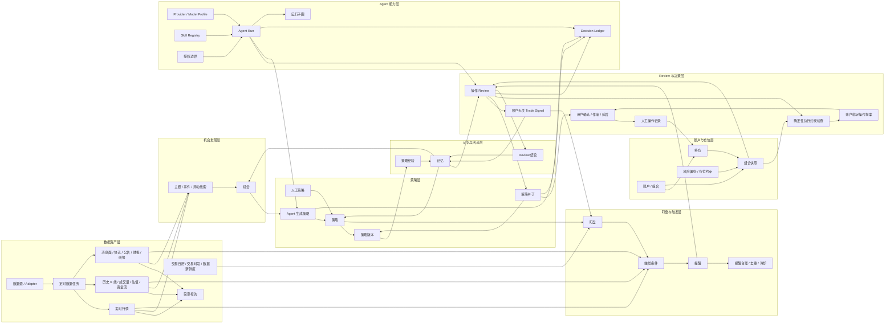

# 股票 Agent 工作台 V2 关键点

> 文档日期：2026-06-18
>
> 状态：V2 重构基准说明
>
> REPLACES:
> - `docs/stock-agent-workbench-feature-design.md`
> - `docs/stock-masterdata-self-closed-loop-design.md`
>
> 本文只记录 V2 的核心系统思路，不展开 API、表结构、页面细节和交付拆分。

## 1. 核心定位

股票模块不是一条线性流水线，也不是一个单一 Agent 任务。

它应建模为一个长期运行的对象网络：股票、组合、持仓、数据、消息、机会、策略、盯盘、Review、操作、记忆和 Agent 留痕都可以独立存在，也可以互相关联。

推荐链路是：

```text
机会发现 -> 策略确定 -> 盯盘 -> 触发 -> Review -> 信号/操作提案 -> 人工确认 -> 操作记录 -> 记忆回流
```

但这不是强制路径。人工写入策略、直接创建盯盘、外部消息命中、已有持仓进入 Review、手动记录操作，都应该能作为合法入口。

## 2. 对象网络图



## 3. 对象网络与运行子图

对象网络图表示长期全局关系。

运行子图表示某一次任务实际走过的节点和边。每次 Agent 任务、Review、策略生成或复杂分析，都应能回看它本次经过了哪些对象、调用了哪些能力、产出了什么结果。

## 4. 数据与信息面

股票模块有两条并行数据链路：

- 行情与基本面链路：股票主数据、实时行情、历史 K 线、成交量、估值、资金流。
- 信息面链路：快讯、公告、财报、研报、政策、行业事件、主题事件。

这些数据应优先由系统任务自闭环维护，包含调度、限流、失败退避、去重、质量标记和可用性状态。不要让所有定时采集都强依赖 Agent，否则会浪费 token，也会降低稳定性。

Agent 可以临时检索补充证据，但长期数据资产应由股票数据模块自己落盘和治理。

## 5. 账户、仓位与策略

账户/组合是操作建议的上下文核心。

无账户策略可以存在，也可以输出账户无关的 `trade_signal`，例如买入、卖出、持有、观察、价格区间、触发条件、止盈止损。

只有绑定账户/组合快照后，系统才允许输出 `proposed_operation`，例如数量、金额、目标仓位、加仓、减仓、清仓。

策略更新不应被 Agent 直接写入正式策略。Review 只能生成 `strategy_patch`，进入待确认状态；用户确认后才生成新策略版本。

## 6. Review 是闭环枢纽

Review 负责把触发事件、策略、行情、消息、组合快照和记忆放在一起判断。

Review 的输出应分清：

- `trade_signal`：账户无关信号。
- `strategy_patch`：策略修订建议，等待用户确认。
- `proposed_operation`：账户绑定操作提案，必须经过确定性约束检查。
- `continue_watch`：继续盯盘。
- `ignore`：忽略本次触发。
- `close_watch`：关闭或归档盯盘。

Review 不等同于下单，也不直接改持仓。

## 7. 确定性约束检查

所有账户绑定操作提案都必须经过非 Agent 的 guardrails。

guardrails 至少负责检查现金、可卖数量、单票上限、禁止买卖、无实时价、停牌、涨跌停、数据过期、持仓为空却减仓等硬约束。

Agent 可以解释和建议，但不能绕过 guardrails。

## 8. Agent、Skill 与授权边界

股票模块需要自己的 Provider / Model 管理，不应耦合 Codex 页面。

Codex CLI 可以作为执行器之一，但股票模块的能力边界应独立：Agent 任务、模型 profile、skill registry、授权策略、成本边界和可用性探测都属于股票模块自己的治理面。

高成本或高风险 Agent 任务应先进入待授权状态，用户确认后再执行。

Skill 可以扩展数据获取、分析和检索能力。Skill 的可用性应定期探测，部分能力不可用时要在 Prompt 或任务说明中提前屏蔽。

## 9. 决策留痕

凡是涉及 Agent 的决策行为，都要进入股票模块自己的 Decision Ledger。

留痕应能回答：

- 谁触发了任务。
- 关联了哪些对象。
- 使用了哪个 provider、model 和 skill。
- 输入上下文是什么。
- Prompt 是什么。
- 原始输出是什么。
- 结构化输出是什么。
- 运行子图经过了哪些步骤。
- 哪些结论被用户接受、拒绝或归档。

留痕要有脱敏、裁剪和保留策略，避免长期运行后膨胀或泄露敏感信息。

## 10. 记忆回流

记忆不是聊天记录，而是股票对象网络中的长期经验。

记忆可以来自 Review 结论、策略版本变化、操作结果、人工复盘、数据质量问题和 Agent 失败案例。

记忆应回流到机会发现、策略生成、Review 和风险约束中，但不能越过用户确认和 guardrails。

## 11. 数据边界

股票模块建议保持独立领域边界。

操作状态和市场数据资产应在逻辑上分开：

- `stock_ops`：账户、持仓、策略、盯盘、Review、提醒、操作记录、Agent 配置、Decision Ledger。
- `stock_market`：股票主数据、行情、历史数据、估值、资金流、公告、新闻、研报和事件。

即使物理存储暂时放在同一个库，也要保持 repo/service 边界，不让操作状态和行情资产互相穿透。

## 12. V2 判断原则

V2 的目标不是复刻 V1，也不是给 V1 修补更多页面。

V2 应优先保证：

- 对象网络正确。
- 入口不是单线流程。
- 数据任务能自闭环。
- 操作建议必须绑定账户上下文。
- Review 有清晰输出。
- guardrails 是确定性的。
- Agent 可替换、可授权、可追溯。
- 每次任务能生成运行子图。
- 记忆能回流但不能自动越权。
