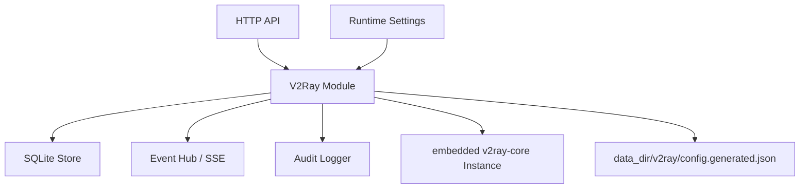

# V2Ray 服务端功能设计

文档日期：2026-06-05  
关联文档：

- [personal-web-terminal-product-features.md](./personal-web-terminal-product-features.md)
- [personal-web-terminal-technical-design.md](./personal-web-terminal-technical-design.md)
- [happy-technical-reference.md](./happy-technical-reference.md)

## 1. Design Read

Reading this as: 个人服务器控制台里的网络服务控制面，面向单 owner 技术用户，采用 Quiet Agent Workbench / Quiet DevOps Control Plane 语言，强调受控开关、配置校验、运行状态、审计和低噪音诊断。

本功能不是营销页，不新增品牌化 VPN landing，也不把 v2ray 做成独立炫技入口。它应像服务/进程控制面板：能看清当前监听、凭据、风险、配置版本、运行日志和最近操作。

## 2. 功能定位

目标是在 Phantom Lancer 控制台里集成一个受控的 V2Ray 服务端。V2Ray 不作为本机外部 binary 或 systemd service 运行，而是作为 Go 依赖直接编进 Phantom Lancer，由后端启动和关闭一个内嵌 V2Ray core instance。

- Owner 在 Web 控制台中打开开关，即可在当前服务器启动一个内嵌 V2Ray 服务端实例。
- Owner 可以在页面上配置服务端监听地址、端口、协议、传输、安全选项和远程设备接入凭据。高级 raw JSON 作为后续扩展，不进入当前内嵌 MVP。
- 后端负责生成、校验、保存并启动 V2Ray 配置，不让前端直接写系统配置文件或拼接 shell 命令。
- 服务状态、配置变更、启动停止、远程设备接入凭据变更都进入审计。
- 浏览器刷新后仍能看到当前实际运行状态、期望状态和最近事件。

术语边界：

- V2Ray 本质是代理/转发核心，不等同于操作系统级 VPN。若客户端启用全局代理或 TUN 模式，可以达到“让客户端流量经由本服务器出口”的 VPN-like 效果。
- 本项目负责服务端 endpoint 的配置和内嵌 core 生命周期管理；客户端设备如何启用全局代理、TUN、系统代理或浏览器代理，不在服务端 MVP 内自动处理。
- 文档中的 `client` 指 V2Ray 服务端 inbound 允许接入的远程设备身份，例如手机、平板、笔记本或另一台机器。Phantom Lancer 所在宿主机不作为 V2Ray 客户端，也不启动任何本地出站客户端实例。
- V2Ray 是 Phantom Lancer 的子模块，生命周期严格是 Phantom Lancer 进程生命周期的子集。Phantom Lancer 停止、重启或崩溃时，内嵌 V2Ray instance 必然随主进程停止；项目不提供一个可独立存活的 V2Ray daemon。

## 3. 产品边界

### 3.1 MVP 范围

- 将 `github.com/v2fly/v2ray-core/v5` 作为 Go 模块依赖编入服务端，并在页面显示内嵌 core 版本和构建状态。
- 页面编辑运行期 V2Ray 设置。
- 支持一个默认服务端 profile。
- 支持 VMess over TCP 的 guided 配置。
- 支持可选 TLS 证书路径和 WebSocket 传输作为高级 guided 配置。
- 支持添加、禁用、删除和轮换远程设备 UUID。
- 支持生成远程设备导入用的客户端配置 JSON，以及 VMess 分享信息。
- 当前 MVP 只支持受控 guided 配置，后端直接构造 V2Ray `core.Config`；raw JSON 暂不支持启动。
- 支持启动、停止、重启、校验配置。
- 支持 V2Ray 日志桥接、最近日志查看、SSE 事件推送。
- 支持配置版本记录和回滚到最近一个已验证版本。
- 支持 Dashboard 状态摘要和 Settings/Services 中的配置入口。

### 3.2 非目标

- 不在 MVP 自动下载或安装 V2Ray。
- 不依赖本机已安装的 `v2ray` binary。
- 不在 MVP 自动修改防火墙、云安全组、NAT、DNS、iptables、nftables 或系统路由。
- 不让前端直接编辑 `/etc/v2ray/config.json`。
- 不接管系统已有的 `v2ray.service`。
- 不实现多租户、多 owner 或客户端用户自助门户。
- 不做 Xray/Reality/XTLS 专属能力；后续可作为独立兼容方向评估。
- 不提供绕过网络监管或第三方服务限制的使用指导。

## 4. 信息架构

当前控制台只实现了 `控制台`、`Codex`、`设置` 三个一级入口。V2Ray 是全局网络服务，不归属于 Codex 工作区，也不应成为与 Codex 并列的零散一级能力。

建议分阶段放置：

- MVP：放在 `设置` 页面里的 `Network Services` 区块，同时在 Dashboard 状态条展示 `V2Ray running/stopped/stale/error`。
- 服务模块落地后：迁移到一级 `服务` 下的二级视图 `V2Ray`，与 systemd service、端口、进程等能力同域管理。

页面结构：

- 顶部状态：运行状态、期望状态、监听 endpoint、版本、最近校验结果。
- 主操作：开关、启动、停止、重启、校验、保存并应用。
- 配置区：监听、协议、传输、TLS、远程设备和路由保护。
- 右侧 inspector：内嵌 core 版本、config hash、instance uptime、监听端口、日志桥接、最近审计。

## 5. 用户流程

### 5.1 首次启用

1. Owner 打开 `设置 > Network Services > V2Ray`。
2. 系统显示内嵌 V2Ray core 版本和支持的配置格式。
3. Owner 选择 guided 模式，填写监听地址、端口、公开主机名、协议和远程设备名称。
4. 系统生成 UUID 和服务端配置预览。
5. Owner 点击 `校验配置`。
6. 后端根据受控表单构造 V2Ray `core.Config`、实例化内嵌 instance，并检查端口占用。
7. 校验通过后，Owner 打开服务开关。
8. 后端启动内嵌 V2Ray instance，记录配置版本、事件和审计。
9. 页面显示客户端 JSON/分享信息，用于导入远程手机或桌面设备。

### 5.2 配置变更

1. Owner 修改端口、传输或远程设备凭据。
2. 页面将当前运行中的配置标记为 `stale`。
3. Owner 可以选择 `保存` 或 `保存并重启`。
4. `保存并重启` 必须先校验新配置。
5. 校验失败时不影响当前正在运行的旧配置。
6. 校验通过后执行 restart，审计记录新旧配置 hash、变更摘要和结果。

### 5.3 远程设备凭据轮换

1. Owner 在远程设备列表中选择 `轮换 UUID`。
2. 系统生成新 UUID，将旧 UUID 标记为 revoked 或 disabled。
3. 如果服务正在运行，页面提示需要重启才会生效。
4. 重启成功后，使用旧 UUID 的远程设备无法再连接。

## 6. 配置模型

### 6.1 Guided 配置字段

服务级字段：

- `enabled`：期望服务是否运行。
- `startOnPhantomLaunch`：Phantom Lancer 进程启动时是否自动启动内嵌 V2Ray。它不是独立系统自启动，也不会让 V2Ray 脱离 Phantom Lancer 存活。
- `coreVersion`：只读，来自内嵌 V2Ray core。
- `assetDir`：可选，用于高级路由需要的 `geoip.dat`、`geosite.dat` 等资源；MVP guided 配置不依赖 geodata。
- `configMode`：当前 MVP 固定为 `guided`；`raw_json` 字段保留但不允许启动。
- `configFormat`：当前用于审计配置快照的 JSON 预览；运行时直接构造 protobuf `core.Config`。
- `publicHost`：给远程设备导入配置使用的域名或公网 IP。
- `logLevel`：`warning`、`info`、`error`、`none`。

入站字段：

- `listen`：默认 `0.0.0.0`，可选 `127.0.0.1`、具体网卡 IP。
- `port`：允许 1-65535；默认仍使用 1024 以上端口。低于 1024 的 privileged ports 需要 Phantom Lancer 进程具备系统绑定权限，启动阶段必须用真实端口绑定检查暴露权限或占用错误。
- `protocol`：MVP 默认 `vmess`。
- `transport`：`tcp`，后续支持 `ws`。
- `wsPath`：WebSocket path，启用 `ws` 时必填。
- `security`：`none` 或 `tls`。
- `tlsCertFile` / `tlsKeyFile`：TLS 文件路径。
- `sniffingEnabled`：默认关闭。
- `blockPrivateNetwork`：默认开启，避免远程设备借服务端访问本机或内网地址。

远程设备接入凭据字段：

- `label`：显示名称。
- `uuid`：连接凭据，后端生成，也允许粘贴合法 UUID。
- `email`：V2Ray 统计和日志标识，可自动生成。
- `level`：默认 `0`。
- `alterId`：VMess 默认 `0`。
- `enabled`：是否启用。
- `createdAt` / `updatedAt` / `revokedAt`。

### 6.2 Raw JSON 模式

Raw JSON 用于高级用户直接提供完整 V2Ray 配置。

约束：

- 保存前必须 parse JSON。
- 启动前必须通过内嵌 V2Ray config loader 和 instance construction 校验。
- 配置文件只写入 Phantom Lancer data dir。
- 页面显示 guided 配置预览与上一版配置的摘要 diff；raw JSON 后续扩展时再单独加入风险提示和 diff。
- 审计只记录 hash、大小、inbound 数、outbound 数和风险摘要，不记录完整敏感内容。
- Raw JSON 模式不从 guided 字段自动合并，避免生成结果不可预测。

## 7. 生成的服务端配置

Guided 模式生成一个受控 V2Ray JSON。VMess TCP 的基础形态：

```json
{
  "log": {
    "access": "",
    "error": "",
    "loglevel": "warning"
  },
  "inbounds": [
    {
      "listen": "0.0.0.0",
      "port": 10086,
      "protocol": "vmess",
      "tag": "pl-v2ray-in",
      "settings": {
        "clients": [
          {
            "id": "00000000-0000-0000-0000-000000000000",
            "level": 0,
            "alterId": 0,
            "email": "owner@phantom-lancer"
          }
        ],
        "disableInsecureEncryption": true
      },
      "streamSettings": {
        "network": "tcp",
        "security": "none"
      }
    }
  ],
  "outbounds": [
    {
      "protocol": "freedom",
      "tag": "direct"
    },
    {
      "protocol": "blackhole",
      "tag": "blocked"
    }
  ],
  "routing": {
    "domainStrategy": "AsIs",
    "rules": [
      {
        "type": "field",
        "ip": [
          "10.0.0.0/8",
          "172.16.0.0/12",
          "192.168.0.0/16",
          "127.0.0.0/8",
          "169.254.0.0/16",
          "fc00::/7",
          "fe80::/10",
          "::1/128"
        ],
        "outboundTag": "blocked"
      }
    ]
  }
}
```

说明：

- `outbounds[0]` 是默认出口，因此 `freedom` 放第一位。
- `blockPrivateNetwork` 开启时，将本机、链路本地和常见私有网段转到 `blackhole`，降低把个人服务器变成内网跳板的风险。MVP 使用显式 CIDR，避免依赖外部 geodata 文件。
- TLS 或 WebSocket 开启时只修改 `streamSettings` 和必要传输字段，不改变远程设备接入凭据模型。

## 8. 后端模块设计

新增模块建议命名为 `internal/v2ray`。

职责：

- `Service`：生命周期协调，暴露 `Status`、`Start`、`Stop`、`Restart`、`Validate`、`Configure`。
- `ConfigBuilder`：从 guided 配置生成 V2Ray JSON。
- `ConfigBuilder`：根据受控表单和远程设备接入凭据直接构造 V2Ray `core.Config`。
- `Validator`：执行 JSON parse、字段校验、端口检查、V2Ray config load 和 instance construction 校验。
- `CoreRuntime`：持有当前 `*core.Instance`，负责 start、close、restart 和状态快照。
- `LogBridge`：把 V2Ray 日志和 Phantom Lancer 运行日志转成事件。
- `RemoteClientExporter`：生成远程设备导入用的客户端 JSON 和分享信息。
- `Redactor`：审计和日志脱敏。

依赖策略：

- 使用 `github.com/v2fly/v2ray-core/v5`，版本写入 `go.mod` 并固定。
- 只导入 MVP 需要的协议、传输和配置格式包，避免把暂不使用的能力全部注册进最终服务端可执行文件。
- JSON 配置支持不是 core 默认能力，必须显式加载 V2Ray 的 JSON 配置格式支持包；实现前需要做一个小型 spike 确认 `jsonv4` / `jsonv5` loader 的具体 import 路径和行为。
- 优先使用直接构造的 `core.Config` + `core.New` + `Instance.Start` / `Instance.Close` 管理生命周期；避免调用 V2Ray CLI command 包来模拟 binary 行为。

与现有模块关系：



后端仍是唯一执行入口。前端只提交结构化配置和动作，不提交 shell 命令。

## 9. 数据模型

建议新增专用表，而不是把所有内容塞进通用 `settings`。

```sql
CREATE TABLE v2ray_settings (
  id TEXT PRIMARY KEY,
  enabled INTEGER NOT NULL DEFAULT 0,
  start_on_phantom_launch INTEGER NOT NULL DEFAULT 0,
  asset_dir TEXT NOT NULL DEFAULT '',
  config_mode TEXT NOT NULL DEFAULT 'guided',
  config_format TEXT NOT NULL DEFAULT 'jsonv4',
  public_host TEXT NOT NULL DEFAULT '',
  listen TEXT NOT NULL DEFAULT '0.0.0.0',
  port INTEGER NOT NULL DEFAULT 10086,
  protocol TEXT NOT NULL DEFAULT 'vmess',
  transport TEXT NOT NULL DEFAULT 'tcp',
  security TEXT NOT NULL DEFAULT 'none',
  ws_path TEXT NOT NULL DEFAULT '',
  tls_cert_file TEXT NOT NULL DEFAULT '',
  tls_key_file TEXT NOT NULL DEFAULT '',
  sniffing_enabled INTEGER NOT NULL DEFAULT 0,
  block_private_network INTEGER NOT NULL DEFAULT 1,
  log_level TEXT NOT NULL DEFAULT 'warning',
  raw_config_json TEXT NOT NULL DEFAULT '',
  created_at TEXT NOT NULL,
  updated_at TEXT NOT NULL
);

CREATE TABLE v2ray_remote_clients (
  id TEXT PRIMARY KEY,
  label TEXT NOT NULL,
  uuid TEXT NOT NULL UNIQUE,
  email TEXT NOT NULL DEFAULT '',
  level INTEGER NOT NULL DEFAULT 0,
  alter_id INTEGER NOT NULL DEFAULT 0,
  enabled INTEGER NOT NULL DEFAULT 1,
  created_at TEXT NOT NULL,
  updated_at TEXT NOT NULL,
  revoked_at TEXT NOT NULL DEFAULT ''
);

CREATE TABLE v2ray_config_versions (
  id TEXT PRIMARY KEY,
  settings_hash TEXT NOT NULL,
  config_hash TEXT NOT NULL,
  config_json_redacted TEXT NOT NULL,
  validation_status TEXT NOT NULL,
  validation_output TEXT NOT NULL DEFAULT '',
  activated_at TEXT NOT NULL DEFAULT '',
  created_at TEXT NOT NULL
);
```

运行态如 instance status、startedAt、lastError、configVersion 可以存在内存中，并在服务启动时通过 `enabled + startOnPhantomLaunch + last activated config` 恢复。若需要跨重启展示最后一次状态，可追加 `v2ray_runtime_snapshots`，但 MVP 可先用审计和事件记录。

## 10. API 设计

所有写操作沿用现有认证和 CSRF。

- `GET /api/v2ray/status`
  - 返回内嵌 core 版本、instance 状态、uptime、当前配置版本、stale、监听 endpoint、最近错误。
- `GET /api/v2ray/settings`
  - 返回 guided/raw 配置、远程设备接入凭据列表、最后校验状态。
- `PUT /api/v2ray/settings`
  - 保存配置；不自动启动。
- `POST /api/v2ray/validate`
  - 生成配置并执行内嵌 loader/instance 校验；返回 config hash、诊断输出。
- `POST /api/v2ray/control`
  - body: `{ "action": "start" | "stop" | "restart" }`。
- `POST /api/v2ray/clients`
  - 新增远程设备接入凭据。
- `PUT /api/v2ray/clients/{id}`
  - 更新远程设备 label、enabled、email。
- `POST /api/v2ray/clients/{id}/rotate`
  - 轮换 UUID。
- `DELETE /api/v2ray/clients/{id}`
  - 删除或 revoke 远程设备接入凭据。
- `GET /api/v2ray/clients/{id}/export`
  - 返回远程设备导入用的客户端 JSON、VMess 分享信息和连接摘要。
- `GET /api/events/history?scope=v2ray_service&id=default`
  - 复用现有事件历史接口。
- `GET /api/events/stream?scope=v2ray_service&id=default`
  - 复用现有 SSE 接口。

## 11. 事件与审计

SSE scope：

- `scope = "v2ray_service"`
- `scope_id = "default"`

事件类型：

- `v2ray.detected`
- `v2ray.config.saved`
- `v2ray.config.validated`
- `v2ray.config.validation_failed`
- `v2ray.started`
- `v2ray.stopped`
- `v2ray.restarted`
- `v2ray.failed`
- `v2ray.exited`
- `v2ray.log`
- `v2ray.runtime.warning`
- `v2ray.client.created`
- `v2ray.client.updated`
- `v2ray.client.rotated`
- `v2ray.client.revoked`

审计事件：

- `v2ray.settings.update`
- `v2ray.config.validate`
- `v2ray.service.start`
- `v2ray.service.stop`
- `v2ray.service.restart`
- `v2ray.client.create`
- `v2ray.client.rotate`
- `v2ray.client.revoke`

审计脱敏：

- UUID 只显示前后各 4 位。
- raw JSON 不进审计正文。
- TLS key path 可显示路径，但不读取或展示 key 内容。
- 日志内容中若出现 UUID、password、token，写入事件前先脱敏。

## 12. 权限与安全边界

新增能力名：

- `network_service.read`
- `network_service.configure`
- `network_service.control`
- `network_service.client.manage`
- `network_service.secret.view`

MVP 可以先绑定到 owner session，但代码结构应保留 capability 检查点。

安全规则：

- V2Ray core 与 Phantom Lancer 在同一 Go 进程内运行，不要求 root。
- 同进程集成降低部署复杂度，但也意味着 V2Ray panic、资源占用或死锁可能影响控制台本身；实现时必须控制配置面、加 recover 边界、限制日志量，并避免在请求 goroutine 中直接执行长时间阻塞启动。
- Phantom Lancer 仍应以专用低权限用户运行；内嵌 V2Ray 获得的系统权限不应高于主控制台进程。
- 允许 1-65535 端口；低于 1024 的端口必须依赖系统权限、capability、端口转发或反向代理，页面应显示 warning，后端启动前仍要检查端口占用和绑定权限。
- 配置文件写入 `data_dir/v2ray/`，权限 `0600`；目录权限 `0700`。
- 不自动开放防火墙。页面只显示需要用户自行确认的端口和监听地址。
- 启动前检查端口占用。
- `listen=0.0.0.0`、关闭 TLS、禁用 `blockPrivateNetwork` 应显示 warning；后续加入 raw JSON 时也必须显示高风险 warning。
- 默认开启 `blockPrivateNetwork`，避免远程设备通过代理访问服务器本机或内网。
- VMess 要提示服务端和远程设备时间需要同步。
- VLESS 如后续加入，应提示其本身没有内建加密并且官方文档已标注弃用风险，应优先放在高级/兼容配置中。
- 不允许 UI 上传或编辑私钥正文；TLS 证书使用路径引用。

## 13. 运行生命周期

启动：

1. 读取设置和远程设备接入凭据。
2. 生成受控配置的 JSON 审计快照。
3. 做字段校验和远程设备 UUID 校验。
4. 直接构造 V2Ray protobuf `core.Config`。
5. 通过 `core.New` 构造 instance，确认配置可实例化。
6. 检查端口占用。
7. 写入当前配置快照和 config version。
8. 调用 `Instance.Start`。
9. 记录 startedAt、configVersion 和 runtime state。
10. 发布事件并写审计。

停止：

1. 标记 desired state 为 stopped。
2. 调用当前 `Instance.Close`。
3. 清空当前 instance 引用。
4. 记录耗时和最后错误。
5. 发布事件并写审计。

重启：

1. 校验目标配置。
2. 为目标配置创建新的 instance。
3. 启动新配置前先关闭旧 instance。
4. 如果启动失败，状态为 failed，不自动回滚启动旧 instance，避免端口和凭据状态混乱。
5. 页面提供 `回滚到上一版已验证配置并启动`。

生命周期约束：

- V2Ray instance 按一次性对象处理。停止后不要尝试复用旧 instance，应重新从配置构造。
- `CoreRuntime` 内部必须串行化 start/stop/restart，避免两个请求同时操作同一个 instance。
- 校验阶段可以构造 instance，但不能占用实际监听端口；真正端口绑定只发生在 start 阶段。
- Phantom Lancer 是唯一被 systemd、脚本或手工命令管理的进程。V2Ray 只作为内嵌 instance 由 Phantom Lancer 管理，不暴露独立 PID、独立健康检查或独立重启入口。
- Phantom Lancer 优雅关闭时必须调用 `CoreRuntime.Close`；如果主进程崩溃，操作系统会回收内嵌 V2Ray 占用的端口和资源。

Phantom Lancer 自身重启：

- 如果 `enabled=true` 且 `startOnPhantomLaunch=true`，后端启动后尝试恢复 V2Ray。
- 如果恢复失败，Dashboard 显示 `V2Ray failed`，审计记录失败原因。

## 14. 前端交互设计

### 14.1 Dashboard 摘要

状态 pill：

- `V2Ray 运行中`：绿色。
- `V2Ray 已停止`：中性。
- `V2Ray 配置待应用`：橙色。
- `V2Ray 错误`：红色。

Dashboard 不展示大说明，不放营销文案。只展示 endpoint、运行状态和一个 `管理` 入口。

### 14.2 配置页面

页面使用工作台布局：

- 左侧窄列表：服务 profile 和远程设备。
- 中间主区：状态 header、开关、配置表单、远程设备凭据管理。
- 右侧 inspector：core 版本、配置路径、config hash、端口、日志、最近审计。

关键 UI 状态：

- `core unavailable`
- `config invalid`
- `saved but stale`
- `starting`
- `running`
- `stopping`
- `failed`
- `port occupied`
- `remote client disabled`
- `guided config stale`

表单组织：

- `Listener`：listen、port、publicHost。
- `Protocol`：VMess、alterId、security。
- `Transport`：tcp/ws、wsPath、TLS。
- `Remote Devices`：label、masked UUID、enabled、export、rotate、revoke。
- `Protection`：blockPrivateNetwork、sniffing。
- `Advanced`：配置预览、校验输出；raw JSON 后续扩展。

### 14.3 视觉约束

- 延续现有浅色中性底、细边框、小圆角、橙色主强调。
- 技术值使用 monospace，例如 endpoint、hash、config path、UUID 摘要。
- 危险和网络暴露状态使用语义色，不使用装饰性渐变或大卡片。
- 开关旁必须显示实际状态，不只显示 desired state。
- `停止服务`、`轮换 UUID`、`删除远程设备凭据` 使用危险/警示样式并要求明确确认。

## 15. 实施计划

### Phase 1：后端基础

- 新增 SQLite migrations。
- 新增 `internal/v2ray` 模块。
- 实现 guided config builder。
- 接入 `github.com/v2fly/v2ray-core/v5`，并完成 guided protobuf config builder spike。
- 实现配置 redaction。
- 实现 core version/status 检测。
- 实现 fake `CoreRuntime` 单元测试。

### Phase 2：生命周期和 API

- 实现 validate/start/stop/restart。
- 接入 V2Ray 日志桥接事件。
- 接入审计。
- 实现远程设备接入凭据 CRUD 和 export。
- 加入端口占用检查和 `startOnPhantomLaunch`。

### Phase 3：前端控制面

- Settings 增加 Network Services 区块。
- 增加 V2Ray 管理 modal 或页面。
- Dashboard 增加状态摘要。
- 实现配置表单、远程设备列表、日志和事件。

### Phase 4：硬化

- 权限 capability 检查点。
- 配置版本回滚。
- 日志脱敏测试。
- raw JSON 风险提示和 diff（后续扩展）。
- 使用内嵌 V2Ray core 做真实连接手工验收。

## 16. 测试计划

单元测试：

- VMess config builder 输出稳定 JSON。
- UUID、端口、listen、TLS path 校验。
- guided 配置 JSON 快照 redaction。
- 私有网络 routing rule 生成。
- 事件 payload 脱敏。

集成测试：

- 使用 fake `CoreRuntime` 模拟 start、close、失败和并发控制。
- 使用真实 `v2ray-core` 实例化校验 generated `core.Config`。
- API auth/CSRF 校验。
- start/stop/restart 状态迁移。
- 配置保存后 stale 状态。
- 当前运行配置不因新配置校验失败而被覆盖。

手工验收：

- 使用 Phantom Lancer 内嵌 core 启动 VMess TCP。
- 用远程设备导入生成配置，确认能连接。
- 关闭服务后远程设备断连。
- 轮换 UUID 后旧远程设备配置不可连接，新配置可连接。
- Phantom Lancer 停止后 V2Ray 同步停止；Phantom Lancer 重启后按 `startOnPhantomLaunch` 恢复。

## 17. 待确认决策

- MVP 默认监听是否使用 `0.0.0.0`。为了满足远程接入，建议默认 `0.0.0.0`，但页面必须显示公网暴露 warning。
- 是否在 MVP 支持 TLS。建议支持证书路径引用，但不负责签发证书。
- 是否立即新增一级 `服务` 导航。建议先放入 `设置`，等服务/进程模块完善后迁移。
- 是否支持 VLESS。基于 V2Fly 当前文档的弃用提示，建议 MVP 不默认提供 VLESS，仅在后续高级兼容中评估。
- 是否支持系统级 VPN/TUN 远程设备配置生成。建议后续做远程设备文档或导出模板，不进入服务端 MVP。

## 18. 参考资料

- V2Fly Inbounds: https://www.v2fly.org/en_US/config/inbounds.html
- Project V Configuration Overview: https://www.v2ray.com/en/configuration/overview.html
- V2Fly Routing: https://www.v2fly.org/en_US/config/routing.html
- V2Fly Transport: https://www.v2fly.org/en_US/config/transport.html
- V2Fly VMess: https://www.v2fly.org/config/protocols/vmess.html
- V2Fly VLESS: https://www.v2fly.org/config/protocols/vless.html
- V2Fly command line arguments: https://www.v2fly.org/guide/command.html
- v2ray-core Go module: https://pkg.go.dev/github.com/v2fly/v2ray-core/v5
